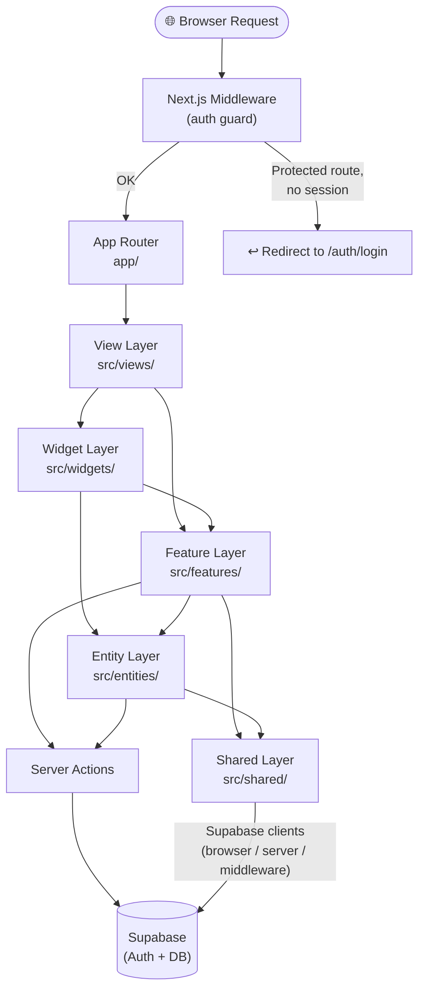
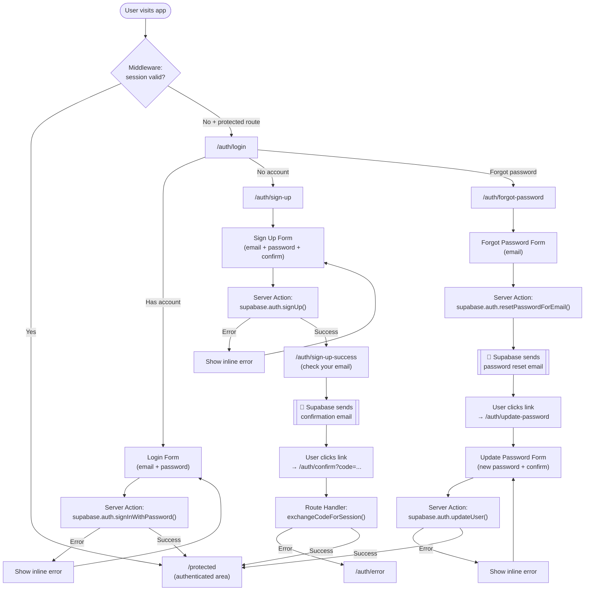

# Votum Ferri

A modern full-stack web application built with **Next.js 16 App Router**, **React 19**, and **Supabase** authentication. The project follows **Feature-Sliced Design (FSD)** architectural methodology and is set up with a focus on type safety, performance, and developer experience.

---

## Tech Stack

| Category | Technology |
|---|---|
| Framework | Next.js 16 (App Router) |
| UI Library | React 19 |
| Language | TypeScript 5 |
| Auth & Backend | Supabase (`@supabase/ssr`) |
| Styling | Tailwind CSS 4, Radix UI |
| Forms | React Hook Form + Zod |
| Theming | `next-themes` (dark/light mode) |
| Testing | Vitest + React Testing Library |
| Linting / Formatting | Biome |
| Compiler | React Compiler (experimental) |

---

## Architecture

The project uses **Feature-Sliced Design** with a custom `views` layer in place of the standard `pages` layer. Each layer has strict import rules: upper layers can import from lower layers, never the reverse.

```
app/          ← Next.js App Router entry points
src/
├── views/    ← Page-level compositions (one view per route)
├── widgets/  ← Composite, reusable UI blocks (Header, Footer, Layout)
├── features/ ← User-facing features with business logic (auth, theme-toggle)
├── entities/ ← Business entities with data models (user, session)
└── shared/   ← Low-level reusable code (UI kit, API clients, config, utils)
```

### General Architectural Flow



### Layer Responsibilities

| Layer | Responsibility |
|---|---|
| `views` | Assembles widgets and features into a full page layout for a given route |
| `widgets` | Composite blocks independent of specific business logic (e.g. `CommonLayout`) |
| `features` | Implements a specific user interaction: forms, server actions, validation schemas |
| `entities` | Defines data shapes and fetching logic for core domain objects (User, Session) |
| `shared` | Infrastructure: Supabase clients, UI primitives, route constants, utilities |

---

## Auth User Flow

Authentication is handled via **Supabase Auth** using Server Actions and the `@supabase/ssr` package. Email confirmation follows the **PKCE Authorization Code** flow.



---

## Project Structure

```
votum_ferri/
├── app/                        # Next.js App Router
│   ├── layout.tsx              # Root layout (fonts, ThemeProvider, CommonLayout)
│   ├── page.tsx                # Home page → HomeView
│   └── auth/
│       ├── confirm/route.ts    # Email confirmation route handler (PKCE + OTP)
│       ├── login/page.tsx
│       ├── sign-up/page.tsx
│       ├── sign-up-success/page.tsx
│       ├── forgot-password/page.tsx
│       ├── update-password/page.tsx
│       └── error/page.tsx
├── src/
│   ├── app/                    # App-level providers and config
│   │   ├── config/fonts.ts
│   │   └── providers/ThemeProvider.tsx
│   ├── views/
│   │   ├── home/
│   │   └── auth/               # login, sign-up, sign-up-success, forgot-password, …
│   ├── widgets/
│   │   ├── header/
│   │   ├── footer/
│   │   └── layout/             # CommonLayout (Header + <main> + Footer)
│   ├── features/
│   │   ├── auth/
│   │   │   ├── api/actions.ts  # Server Actions: signUp, login, forgotPassword, updatePassword
│   │   │   ├── lib/schemas.ts  # Zod validation schemas
│   │   │   └── ui/             # Form components (SignUpForm, LoginForm, …)
│   │   └── theme-toggle/
│   ├── entities/
│   │   ├── session/            # AuthSession type + getSession()
│   │   └── user/               # UserProfile type + getUserProfile()
│   └── shared/
│       ├── api/supabase/       # browser / server / middleware Supabase clients
│       ├── config/
│       │   ├── routes.ts       # Typed route constants (ROUTES)
│       │   └── env.ts          # Environment variable access
│       ├── lib/cn.ts           # clsx + tailwind-merge utility
│       └── ui/                 # Shared UI primitives (Button, Card, Input, …)
├── middleware.ts               # Auth guard for /protected routes
├── next.config.ts
├── biome.json
└── vitest.config.ts
```

---

## Getting Started

### Prerequisites

- Node.js 20+
- A [Supabase](https://supabase.com) project

### Environment Variables

Create a `.env.local` file in the project root:

```env
NEXT_PUBLIC_SUPABASE_URL=https://<your-project>.supabase.co
NEXT_PUBLIC_SUPABASE_ANON_KEY=<your-anon-key>
```

### Install & Run

```bash
npm install
npm run dev
```

Open [http://localhost:3000](http://localhost:3000) in your browser.

---

## Available Scripts

| Script | Description |
|---|---|
| `npm run dev` | Start development server (Turbopack) |
| `npm run build` | Production build |
| `npm run start` | Start production server |
| `npm run lint` | Lint with Biome |
| `npm run format` | Format with Biome |
| `npm run test` | Run tests with Vitest |
| `npm run test:watch` | Vitest in watch mode |
| `npm run test:coverage` | Generate coverage report |
