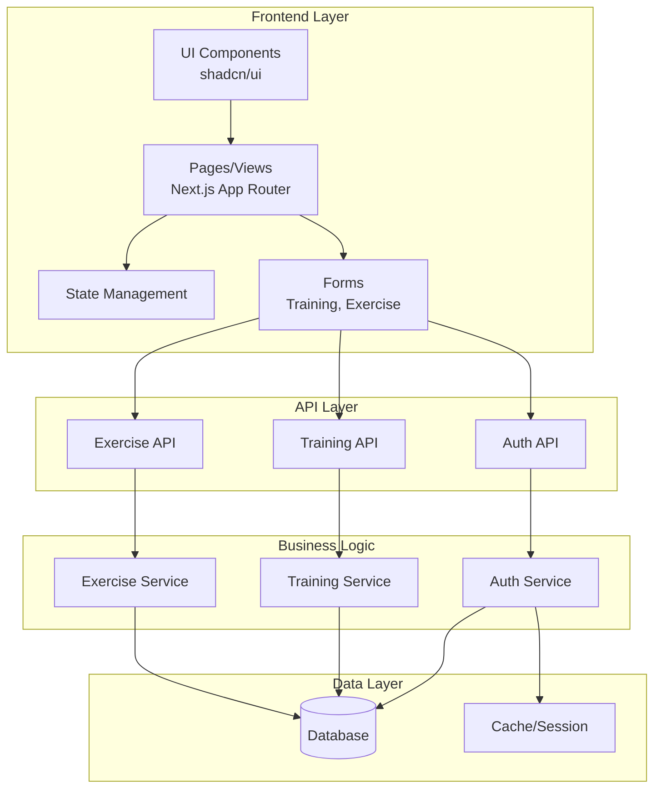
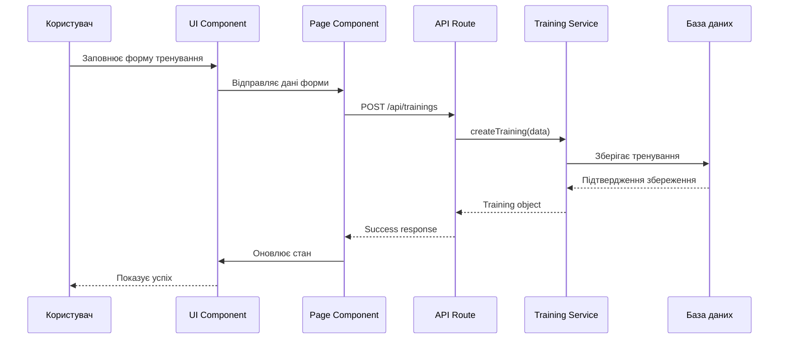
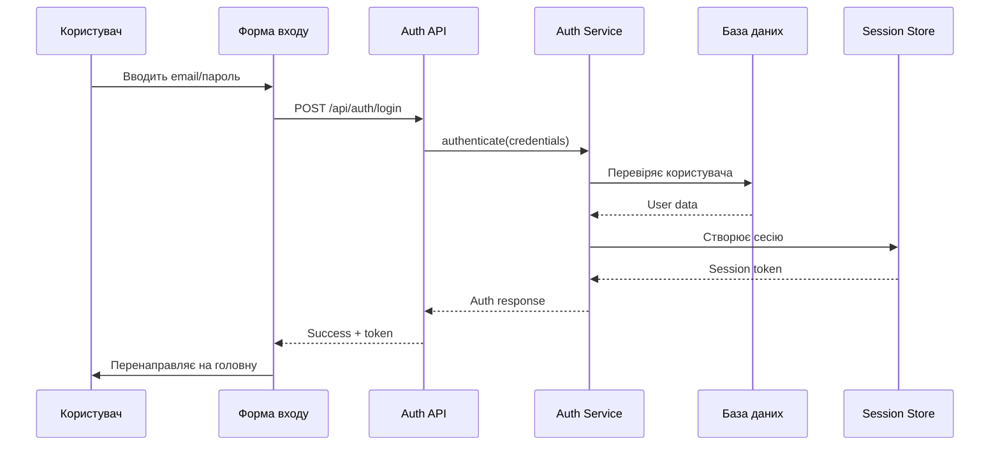
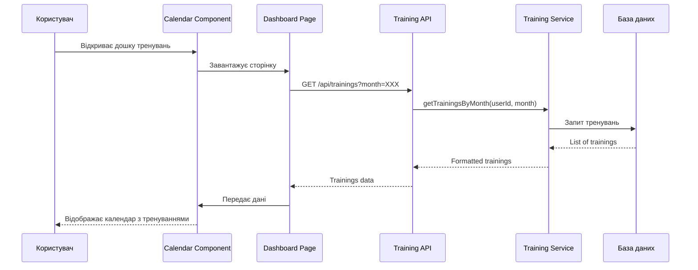
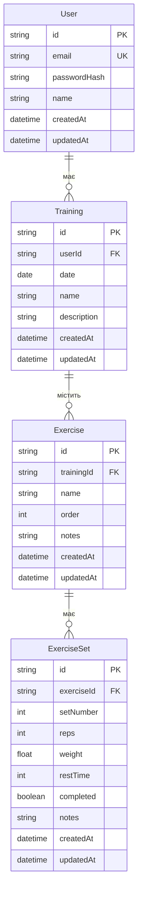
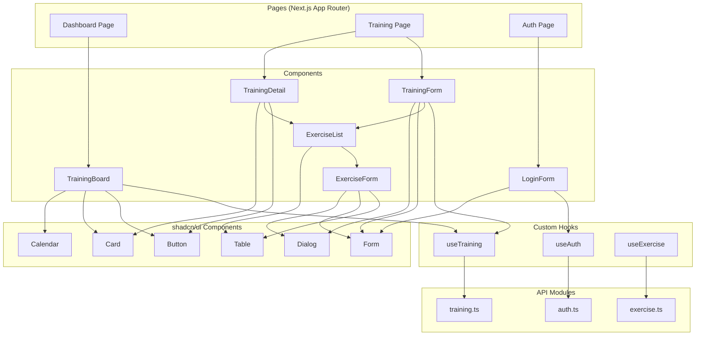
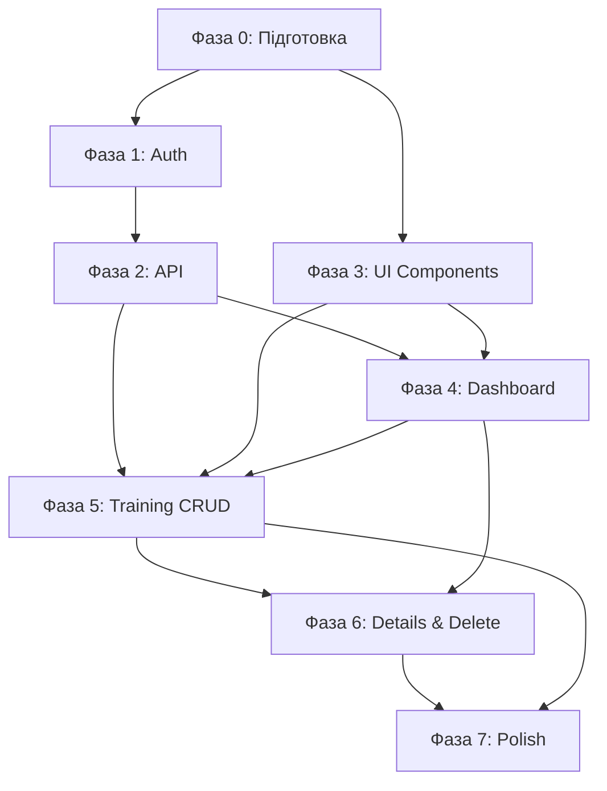

# Software Design Document (SDD)

## Трекер тренувань - votum_ferri

**Версія:** 1.0  
**Дата:** 2025-01-27  
**Статус:** В розробці

---

## 1. Вступ та загальний опис

### 1.1 Мета документа

Цей документ описує архітектуру, дизайн та технічні рішення для системи трекера тренувань **votum_ferri**. Документ призначений для розробників, архітекторів та зацікавлених сторін, що беруть участь у розробці та підтримці системи.

### 1.2 Область застосування

SDD охоплює:

- Високорівневу архітектуру системи
- Функціональні та нефункціональні вимоги
- Технічний стек та інструменти
- Структуру даних та моделі
- Детальний дизайн компонентів
- UI/UX специфікації
- Плани реалізації

### 1.3 Опис проекту

**votum_ferri** - це веб-додаток для відстеження тренувань, який дозволяє користувачам:

- Реєструватися та авторизуватися в системі
- Переглядати тренування в календарному форматі (дошка тренувань)
- Створювати нові тренування з детальним описом вправ
- Редагувати та видаляти існуючі тренування
- Відстежувати вправи з параметрами: кількість підходів, повторень та вага

Система розробляється на базі Next.js 16 з використанням React 19, TypeScript та бібліотеки компонентів shadcn/ui.

### 1.4 Термінологія та скорочення

| Термін               | Опис                                                         |
| -------------------- | ------------------------------------------------------------ |
| **Тренування**       | Запланована або виконана сесія фізичних вправ                |
| **Вправа**           | Конкретна фізична вправа (наприклад, присідання, жим лежачи) |
| **Підхід (Set)**     | Одна послідовність виконання вправи                          |
| **Повторення (Rep)** | Кількість разів виконання вправи в одному підході            |
| **Вага**             | Вага спорядження, що використовується під час вправи (кг)    |
| **Дошка тренувань**  | Календарне відображення всіх тренувань користувача           |
| **SDD**              | Software Design Document                                     |
| **UI**               | User Interface (інтерфейс користувача)                       |
| **UX**               | User Experience (користувацький досвід)                      |
| **API**              | Application Programming Interface                            |
| **CRUD**             | Create, Read, Update, Delete (операції з даними)             |
| **ER**               | Entity-Relationship (діаграма сутностей-зв'язків)            |

---

## 2. Функціональні вимоги

Цей розділ описує детальні функціональні вимоги системи трекера тренувань.

### 2.1 Реєстрація користувача

**FR-1.1: Реєстрація нового користувача**

Система повинна надавати можливість новим користувачам створити обліковий запис.

**Деталі:**

- Користувач повинен мати можливість ввести необхідні дані (email, пароль, можливо ім'я)
- Система повинна валідувати введені дані (формат email, складність пароля)
- Після успішної реєстрації користувач повинен мати доступ до системи
- Система повинна перевіряти унікальність email

**Приймальні критерії:**

- Форма реєстрації доступна незареєстрованим користувачам
- Валідація полів відбувається в реальному часі або при відправці форми
- Повідомлення про помилки показуються користувачу

### 2.2 Автентифікація

**FR-2.1: Вхід в систему**

Зареєстрований користувач повинен мати можливість увійти в систему.

**Деталі:**

- Користувач вводить email та пароль
- Система перевіряє облікові дані
- При успішній автентифікації створюється сесія користувача
- Користувач перенаправляється на головну сторінку (дошку тренувань)

**FR-2.2: Вихід з системи**

Авторизований користувач повинен мати можливість вийти з системи.

**Деталі:**

- Кнопка/пункт меню для виходу
- При виході сесія завершується
- Користувач перенаправляється на сторінку входу

**FR-2.3: Захист маршрутів**

Захищені сторінки повинні бути недоступні для неавторизованих користувачів.

**Деталі:**

- Неавторизовані користувачі перенаправляються на сторінку входу
- Після успішної автентифікації користувач повертається на запрошену сторінку

### 2.3 Дошка тренувань (календарне відображення)

**FR-3.1: Відображення тренувань у календарі**

Система повинна відображати всі тренування користувача в календарному форматі.

**Деталі:**

- Календарний вид показує дні місяця
- Дні з запланованими тренуваннями мають візуальну індикацію
- Користувач може переглядати різні місяці (навігація вперед/назад)
- При кліку на день з тренуваннями відображаються деталі тренувань цього дня
- Можливість перегляду минулих та майбутніх тренувань

**Приймальні критерії:**

- Календар відображає поточний місяць за замовчуванням
- Тренування відображаються з позначками/кольорами для різних типів
- Користувач може легко навігувати між місяцями

### 2.4 Створення тренувань

**FR-4.1: Створення нового тренування**

Авторизований користувач повинен мати можливість створити нове тренування.

**Деталі:**

- Користувач вибирає дату для тренування (за замовчуванням - поточна дата)
- Можливість додати назву/опис тренування (опціонально)
- Додавання вправ до тренування
- Для кожної вправи вказується:
  - Назва вправи
  - Кількість підходів (sets)
  - Кількість повторень (reps) для кожного підходу
  - Вага (weight) для кожного підходу
- Можливість додати кілька вправ до одного тренування
- Збереження тренування

**Приймальні критерії:**

- Форма створення тренування доступна з дошки тренувань
- Користувач може додавати/видаляти вправи в межах форми
- Валідація обов'язкових полів
- Після збереження тренування з'являється в календарі

### 2.5 Редагування тренувань

**FR-5.1: Редагування існуючого тренування**

Користувач повинен мати можливість редагувати створені ним тренування.

**Деталі:**

- Доступ до редагування з детального перегляду тренування
- Можливість змінити дату тренування
- Можливість змінити назву/опис
- Можливість редагувати існуючі вправи (змінити підходи, повторення, вагу)
- Можливість додати нові вправи
- Можливість видалити вправи з тренування
- Збереження змін

**Приймальні критерії:**

- Кнопка "Редагувати" доступна для тренувань користувача
- Форма редагування заповнена поточними даними тренування
- Зміни зберігаються після підтвердження

### 2.6 Видалення тренувань

**FR-6.1: Видалення тренування**

Користувач повинен мати можливість видалити тренування.

**Деталі:**

- Доступ до видалення з детального перегляду або зі списку тренувань
- Підтвердження видалення (діалог підтвердження)
- Після підтвердження тренування видаляється з системи
- Тренування більше не відображається в календарі

**Приймальні критерії:**

- Кнопка "Видалити" доступна для тренувань користувача
- Система запитує підтвердження перед видаленням
- Після видалення тренування повністю видаляється

### 2.7 Відстеження вправ

**FR-7.1: Відображення деталей вправ**

Система повинна відображати детальну інформацію про вправи в тренуванні.

**Деталі:**

- Кожна вправа показує назву
- Для кожної вправи відображається список підходів з параметрами:
  - Номер підходу
  - Кількість повторень
  - Вага
- Можливість перегляду історії виконання вправи (у майбутньому)

**FR-7.2: Структура даних вправи**

Кожна вправа містить:

- Назва вправи (обов'язкове поле)
- Список підходів, де кожен підхід містить:
  - Кількість повторень (reps) - число
  - Вага (weight) - число (кг)
- Кількість підходів - динамічна (користувач може додавати/видаляти)

**Приймальні критерії:**

- Вправи відображаються у читабельному форматі
- Параметри вправ чітко структуровані
- Можливість легко розрізнити різні підходи

### 2.8 Перегляд минулих тренувань

**FR-8.1: Історія тренувань**

Користувач повинен мати можливість переглядати всі свої минулі тренування.

**Деталі:**

- Доступ до історії через календар (навігація на минулі дати)
- Відображення всіх тренувань для вибраної дати
- Можливість перегляду деталей кожного минулого тренування
- Можливість редагування/видалення минулих тренувань

**Приймальні критерії:**

- Минулі тренування доступні для перегляду
- Інтерфейс дозволяє легко навігувати по історії

### 2.9 Взаємодія з даними

**FR-9.1: Збереження даних**

Всі зміни в тренуваннях повинні зберігатися постійно.

**FR-9.2: Ізоляція даних**

Кожен користувач бачить та має доступ тільки до своїх тренувань.

**Деталі:**

- Дані користувачів ізольовані
- Неможливий доступ до тренувань інших користувачів
- Автентифікація обов'язована для доступу до даних

### 2.10 Приймальні критерії загальні

- Система повинна працювати стабільно та швидко реагувати на дії користувача
- Інтерфейс повинен бути інтуїтивно зрозумілим
- Всі критичні операції (видалення, збереження) мають підтвердження або зворотний зв'язок
- Дані повинні зберігатися надійно та бути доступними при наступному вході

---

## 3. Архітектура системи

### 3.1 Високорівнева архітектура

Система будується за архітектурою клієнт-сервер з розділенням на frontend та backend компоненти.

```
┌─────────────────────────────────────────────────────────┐
│                    Користувач (Browser)                 │
└────────────────────────┬────────────────────────────────┘
                         │
                         │ HTTP/HTTPS
                         │
         ┌───────────────┴──────────────┐
         │                              │
┌────────┴────────┐            ┌────────┴────────┐
│   Frontend      │            │    Backend      │
│   (Next.js)     │            │   (TODO: TBD)   │
│                 │            │                 │
│ - React 19      │            │ - API Routes    │
│ - TypeScript    │            │ - Auth Logic    │
│ - shadcn/ui     │            │ - Business Logic│
│ - Tailwind CSS  │            │                 │
└─────────────────┘            └────────┬────────┘
                                        │
                                        │
                               ┌────────┴────────┐
                               │   База даних    │
                               │   (TODO: TBD)   │
                               └─────────────────┘
```

**Основні компоненти:**

1. **Frontend (Next.js 16)**

   - Клієнтська частина на React 19
   - Server-Side Rendering (SSR) та Static Site Generation (SSG)
   - API Routes для backend логіки
   - Інтерфейс користувача з shadcn/ui

2. **Backend (TODO: визначити пізніше)**

   - API endpoints для взаємодії з даними
   - Логіка автентифікації та авторизації
   - Бізнес-логіка тренувань та вправ

3. **База даних (TODO: визначити пізніше)**
   - Зберігання даних користувачів
   - Зберігання тренувань та вправ
   - Управління сесіями

### 3.2 Діаграма компонентів системи



### 3.3 Архітектурні патерни

#### 3.3.1 Frontend патерни

**Component-Based Architecture**

- Модульна архітектура на базі React компонентів
- Переповнення компонентів для повторного використання
- Розділення на Presentational та Container компоненти

**Server Components (Next.js 16)**

- Використання React Server Components для серверного рендерингу
- Client Components для інтерактивних елементів

**Composition Pattern**

- Використання композиції для побудови складних UI
- shadcn/ui компоненти як базові будівельні блоки

#### 3.3.2 Backend патерни (TODO: уточнити після вибору backend)

**RESTful API** (передбачувано)

- REST архітектура для API endpoints
- Стандартні HTTP методи (GET, POST, PUT, DELETE)

**Service Layer Pattern**

- Відокремлення бізнес-логіки в сервіси
- API endpoints як тонкий шар над сервісами

### 3.4 Потік даних між компонентами

#### 3.4.1 Потік створення тренування



#### 3.4.2 Потік автентифікації



#### 3.4.3 Потік відображення дошки тренувань



### 3.5 Модульна структура

```
votum_ferri/
├── src/
│   ├── app/                    # Next.js App Router
│   │   ├── (auth)/            # Auth routes (login, register)
│   │   ├── dashboard/         # Dashboard/Calendar page
│   │   ├── training/          # Training pages
│   │   └── api/               # API routes
│   │       ├── auth/          # Authentication endpoints
│   │       ├── trainings/     # Training CRUD endpoints
│   │       └── exercises/     # Exercise endpoints
│   ├── components/            # React components
│   │   ├── ui/               # shadcn/ui components
│   │   ├── training/         # Training-specific components
│   │   │   ├── TrainingBoard/ # Calendar/Dashboard
│   │   │   ├── TrainingForm/  # Create/Edit form
│   │   │   └── TrainingCard/  # Training display
│   │   ├── exercise/         # Exercise components
│   │   │   ├── ExerciseList/  # List of exercises
│   │   │   └── ExerciseForm/  # Exercise form
│   │   └── auth/             # Auth components
│   ├── lib/                   # Utilities & helpers
│   │   ├── db/               # Database client/ORM (TODO)
│   │   ├── auth/             # Auth utilities
│   │   └── utils/            # General utilities
│   ├── types/                 # TypeScript types
│   │   ├── training.ts
│   │   ├── exercise.ts
│   │   └── user.ts
│   └── hooks/                 # Custom React hooks
│       ├── useTraining.ts
│       └── useAuth.ts
├── docs/                      # Documentation
└── public/                    # Static assets
```

### 3.6 Залежності та інтеграції

**Внутрішні залежності:**

- Компоненти → Pages
- Pages → API Routes
- API Routes → Services/Business Logic
- Services → Database Layer

**Зовнішні залежності:**

- Next.js framework
- React library
- shadcn/ui components
- Tailwind CSS
- Database (TODO: визначити)
- Authentication provider (TODO: визначити)

---

## 4. Технічний стек

### 4.1 Frontend технології

#### 4.1.1 Next.js 16

**Версія:** 16.1.1  
**Призначення:** Основний framework для розробки

**Обґрунтування:**

- App Router для сучасного роутингу
- Server-Side Rendering (SSR) та Static Site Generation (SSG)
- Вбудована підтримка API routes
- Оптимізація продуктивності "з коробки"
- SEO-friendly архітектура

**Використання:**

- Маршрутизація (App Router)
- API endpoints
- Server Components
- Оптимізація зображень та шрифтів

#### 4.1.2 React 19

**Версія:** 19.2.3  
**Призначення:** UI бібліотека

**Обґрунтування:**

- Остання версія з покращеною продуктивністю
- Підтримка Server Components
- Покращена робота з формами та станом

**Використання:**

- Компоненти користувацького інтерфейсу
- Керування станом компонентів
- Списки та форми

#### 4.1.3 TypeScript 5

**Версія:** ^5  
**Призначення:** Типізація коду

**Обґрунтування:**

- Статична типізація для зменшення помилок
- Покращена підтримка IDE
- Кращий developer experience
- Документування через типи

**Використання:**

- Типізація всіх компонентів
- Типи для даних (training, exercise, user)
- Типи для API responses
- Типи для пропсів компонентів

#### 4.1.4 Tailwind CSS 4

**Версія:** ^4  
**Призначення:** Utility-first CSS framework

**Обґрунтування:**

- Швидка розробка UI
- Консистентний дизайн
- Підтримка темної теми
- Оптимізація розміру CSS

**Використання:**

- Стилізація компонентів
- Responsive design (mobile-first)
- Темна тема
- Кастомізація через конфігурацію

#### 4.1.5 shadcn/ui

**Призначення:** Бібліотека UI компонентів

**Обґрунтування:**

- Високоякісні, доступні компоненти
- Налаштування під проект
- Побудовано на Radix UI (accessibility)
- Інтеграція з Tailwind CSS
- Легке кастомізування

**Компоненти, що плануються до використання:**

- `Button` - кнопки
- `Card` - картки для відображення тренувань
- `Dialog` - модальні вікна для форм
- `Form` - форми з валідацією
- `Input` - поля вводу
- `Select` - випадаючі списки
- `Calendar` - календар для дошки тренувань
- `Table` - таблиці для списку вправ
- `Label` - мітки для форм
- `Badge` - бейджі для позначень

**Структура:**

- Компоненти копіюються в `src/components/ui/`
- Легко кастомізувати під дизайн-систему
- Використання TypeScript для типізації

### 4.2 Backend технології

**TODO: Визначити пізніше**

**Варіанти для розгляду:**

- Next.js API Routes (serverless functions)
- Standalone Node.js server (Express, Fastify)
- Backend as a Service (Supabase, Firebase)
- Serverless functions (Vercel Functions, AWS Lambda)

**Критерії вибору:**

- Простота інтеграції з Next.js
- Підтримка автентифікації
- Масштабованість
- Вартість хостингу
- Developer experience

### 4.3 База даних

**TODO: Визначити пізніше**

**Варіанти для розгляду:**

1. **PostgreSQL**

   - Реляційна БД
   - Надійність та ACID транзакції
   - Підтримка складних запитів
   - ORM: Prisma, Drizzle, TypeORM

2. **MongoDB**

   - NoSQL документна БД
   - Гнучкість схеми
   - Легка інтеграція з Node.js
   - ODM: Mongoose

3. **Supabase (PostgreSQL + Backend)**

   - PostgreSQL з готовим backend
   - Вбудована автентифікація
   - Realtime підтримка
   - REST API з коробки

4. **Firebase (Firestore)**
   - NoSQL cloud БД
   - Вбудована автентифікація
   - Realtime синхронізація
   - Легка інтеграція

**Критерії вибору:**

- Складність структури даних
- Потреба в транзакціях
- Масштабованість
- Вартість
- Зручність розробки

### 4.4 Автентифікація

**TODO: Визначити пізніше (залежить від backend та БД)**

**Варіанти для розгляду:**

- NextAuth.js (Auth.js) - універсальне рішення
- Supabase Auth - якщо використовується Supabase
- Firebase Auth - якщо використовується Firebase
- Custom JWT solution
- Session-based authentication

### 4.5 Інструменти розробки

#### 4.5.1 Biome

**Версія:** 2.2.0  
**Призначення:** Linting та formatting

**Обґрунтування:**

- Швидкий замість ESLint + Prettier
- Один інструмент для linting та formatting
- TypeScript підтримка
- Автоматичне форматування

**Використання:**

- Перевірка коду (`npm run lint`)
- Автоматичне форматування (`npm run format`)

#### 4.5.2 Babel React Compiler

**Версія:** 1.0.0  
**Призначення:** Компіляція React коду

**Обґрунтування:**

- Оптимізація React компонентів
- Автоматична оптимізація re-renders
- Покращена продуктивність

#### 4.5.3 Node.js

**Версія:** ^20 (передбачається)  
**Призначення:** Runtime середовище

**Обґрунтування:**

- LTS версія
- Підтримка сучасних можливостей JavaScript
- Сумісність з Next.js

### 4.6 Залежності проекту

**Поточні dependencies:**

```json
{
  "next": "16.1.1",
  "react": "19.2.3",
  "react-dom": "19.2.3"
}
```

**Поточні devDependencies:**

```json
{
  "@biomejs/biome": "2.2.0",
  "@tailwindcss/postcss": "^4",
  "@types/node": "^20",
  "@types/react": "^19",
  "@types/react-dom": "^19",
  "babel-plugin-react-compiler": "1.0.0",
  "tailwindcss": "^4",
  "typescript": "^5"
}
```

**Планові додаткові залежності:**

- shadcn/ui компоненти (будуть додані за потреби)
- Библиотека для роботи з датами (date-fns або dayjs)
- Форма валідація (react-hook-form + zod)
- Інші залежності залежать від вибору backend та БД

### 4.7 Середовища розробки

**Рекомендовані IDE:**

- VS Code з розширеннями:
  - ESLint/Biome
  - Prettier
  - TypeScript
  - Tailwind CSS IntelliSense

**Версійний контроль:**

- Git
- GitHub/GitLab (передбачається)

**Хостинг (передбачувано):**

- Vercel (оптимізовано для Next.js)
- Netlify
- Self-hosted (якщо потрібно)

### 4.8 Резюме технічного стеку

| Категорія      | Технологія     | Статус     |
| -------------- | -------------- | ---------- |
| Framework      | Next.js 16     | ✅ Вибрано |
| UI Library     | React 19       | ✅ Вибрано |
| Мова           | TypeScript 5   | ✅ Вибрано |
| Стилі          | Tailwind CSS 4 | ✅ Вибрано |
| UI Components  | shadcn/ui      | ✅ Вибрано |
| Linting        | Biome 2.2.0    | ✅ Вибрано |
| Backend        | TBD            | ⏳ TODO    |
| База даних     | TBD            | ⏳ TODO    |
| Автентифікація | TBD            | ⏳ TODO    |
| ORM/ODM        | TBD            | ⏳ TODO    |

---

## 5. Модель даних

### 5.1 Структура даних користувача

#### 5.1.1 TypeScript інтерфейс User

```typescript
interface User {
  id: string; // Унікальний ідентифікатор
  email: string; // Email (унікальний)
  passwordHash: string; // Хешований пароль (не передається в API)
  name?: string; // Ім'я користувача (опціонально)
  createdAt: Date; // Дата створення
  updatedAt: Date; // Дата останнього оновлення
}
```

#### 5.1.2 Public User (без чутливих даних)

```typescript
interface PublicUser {
  id: string;
  email: string;
  name?: string;
}
```

### 5.2 Структура даних тренування

#### 5.2.1 TypeScript інтерфейс Training

```typescript
interface Training {
  id: string; // Унікальний ідентифікатор
  userId: string; // ID користувача (foreign key)
  date: Date; // Дата тренування
  name?: string; // Назва тренування (опціонально)
  description?: string; // Опис тренування (опціонально)
  exercises: Exercise[]; // Список вправ
  createdAt: Date; // Дата створення
  updatedAt: Date; // Дата останнього оновлення
}
```

#### 5.2.2 Training DTO (Data Transfer Object)

```typescript
// Для створення нового тренування
interface CreateTrainingDTO {
  date: string; // ISO date string
  name?: string;
  description?: string;
  exercises: CreateExerciseDTO[];
}

// Для оновлення тренування
interface UpdateTrainingDTO {
  date?: string;
  name?: string;
  description?: string;
  exercises?: CreateExerciseDTO[];
}
```

### 5.3 Структура даних вправи

#### 5.3.1 TypeScript інтерфейс Exercise

```typescript
interface Exercise {
  id: string; // Унікальний ідентифікатор
  trainingId: string; // ID тренування (foreign key)
  name: string; // Назва вправи (обов'язково)
  sets: ExerciseSet[]; // Список підходів
  order: number; // Порядок вправи в тренуванні
  notes?: string; // Нотатки до вправи (опціонально)
  createdAt: Date; // Дата створення
  updatedAt: Date; // Дата останнього оновлення
}
```

#### 5.3.2 ExerciseSet (Підхід вправи)

```typescript
interface ExerciseSet {
  id: string; // Унікальний ідентифікатор
  exerciseId: string; // ID вправи (foreign key)
  setNumber: number; // Номер підходу (1, 2, 3, ...)
  reps: number; // Кількість повторень
  weight: number; // Вага (кг)
  restTime?: number; // Час відпочинку після підходу (секунди, опціонально)
  completed?: boolean; // Чи виконано підхід (опціонально)
  notes?: string; // Нотатки до підходу (опціонально)
}
```

#### 5.3.3 Exercise DTO

```typescript
// Для створення нової вправи
interface CreateExerciseDTO {
  name: string;
  sets: CreateExerciseSetDTO[];
  order: number;
  notes?: string;
}

interface CreateExerciseSetDTO {
  setNumber: number;
  reps: number;
  weight: number;
  restTime?: number;
  notes?: string;
}
```

### 5.4 Entity-Relationship діаграма



**Зв'язки:**

- User (1) → (N) Training: Один користувач може мати багато тренувань
- Training (1) → (N) Exercise: Одне тренування містить багато вправ
- Exercise (1) → (N) ExerciseSet: Одна вправа має багато підходів

**Обмеження:**

- `email` в User має бути унікальним (UNIQUE)
- `userId` в Training - зовнішній ключ на User.id
- `trainingId` в Exercise - зовнішній ключ на Training.id
- `exerciseId` в ExerciseSet - зовнішній ключ на Exercise.id
- При видаленні User - каскадне видалення Training (CASCADE)
- При видаленні Training - каскадне видалення Exercise (CASCADE)
- При видаленні Exercise - каскадне видалення ExerciseSet (CASCADE)

### 5.5 Індекси бази даних

**Планові індекси (TODO: уточнити після вибору БД):**

1. **User таблиця:**

   - PRIMARY KEY: `id`
   - UNIQUE INDEX: `email`
   - INDEX: `createdAt` (для сортування)

2. **Training таблиця:**

   - PRIMARY KEY: `id`
   - FOREIGN KEY INDEX: `userId`
   - COMPOSITE INDEX: `(userId, date)` (для швидкого пошуку тренувань користувача за датою)
   - INDEX: `date` (для сортування)

3. **Exercise таблиця:**

   - PRIMARY KEY: `id`
   - FOREIGN KEY INDEX: `trainingId`
   - INDEX: `(trainingId, order)` (для сортування вправ в тренуванні)

4. **ExerciseSet таблиця:**
   - PRIMARY KEY: `id`
   - FOREIGN KEY INDEX: `exerciseId`
   - INDEX: `(exerciseId, setNumber)` (для сортування підходів)

### 5.6 Типи для API responses

#### 5.6.1 Training Response

```typescript
interface TrainingResponse {
  id: string;
  userId: string;
  date: string; // ISO date string
  name?: string;
  description?: string;
  exercises: ExerciseResponse[];
  createdAt: string; // ISO datetime string
  updatedAt: string; // ISO datetime string
}
```

#### 5.6.2 Exercise Response

```typescript
interface ExerciseResponse {
  id: string;
  trainingId: string;
  name: string;
  sets: ExerciseSetResponse[];
  order: number;
  notes?: string;
  createdAt: string; // ISO datetime string
  updatedAt: string; // ISO datetime string
}
```

#### 5.6.3 ExerciseSet Response

```typescript
interface ExerciseSetResponse {
  id: string;
  exerciseId: string;
  setNumber: number;
  reps: number;
  weight: number;
  restTime?: number;
  completed?: boolean;
  notes?: string;
  createdAt: string; // ISO datetime string
  updatedAt: string; // ISO datetime string
}
```

### 5.7 Валідація даних

#### 5.7.1 Валідаційні правила (загальні)

**User:**

- `email`: обов'язкове поле, валідний email формат, унікальне
- `password`: обов'язкове поле, мінімум 8 символів
- `name`: опціональне, максимум 255 символів

**Training:**

- `date`: обов'язкове поле, валідна дата
- `name`: опціональне, максимум 255 символів
- `description`: опціональне, максимум 1000 символів
- `exercises`: масив вправ, мінімум 1 вправа

**Exercise:**

- `name`: обов'язкове поле, не порожнє, максимум 255 символів
- `sets`: масив підходів, мінімум 1 підхід
- `order`: обов'язкове поле, позитивне число
- `notes`: опціональне, максимум 500 символів

**ExerciseSet:**

- `setNumber`: обов'язкове поле, позитивне число, унікальне в межах вправи
- `reps`: обов'язкове поле, позитивне число (>= 1)
- `weight`: обов'язкове поле, невід'ємне число (>= 0)
- `restTime`: опціональне, невід'ємне число (секунди)
- `notes`: опціональне, максимум 500 символів

### 5.8 TODO: Схема бази даних

**TODO: Визначити точну схему БД після вибору бази даних**

**Розглянуті варіанти:**

- SQL схема (PostgreSQL, MySQL)
- NoSQL структура (MongoDB документи)
- Supabase (PostgreSQL з особливостями)
- Firebase Firestore (колекції та документи)

**Детальна схема буде додана після вибору:**

- Точні типи даних (VARCHAR, INTEGER, DECIMAL, DATE, TIMESTAMP)
- Обмеження (constraints)
- Тригери (якщо потрібно)
- Міграції
- ORM/ODM моделі (Prisma, Mongoose, Drizzle тощо)

---

## 6. UI/UX специфікації

### 6.1 Загальні принципи дизайну

#### 6.1.1 Design System

**Бібліотека компонентів:** shadcn/ui  
**Стилізація:** Tailwind CSS 4  
**Підхід:** Mobile-first, responsive design

**Основні принципи:**

- Консистентність інтерфейсу через використання shadcn/ui
- Доступність (accessibility) через Radix UI primitives
- Адаптивність для мобільних та десктопних пристроїв
- Підтримка темної теми
- Інтуїтивна навігація

#### 6.1.2 Кольорова схема

**Світла тема:**

- Фон: білий/сірий
- Текст: темний
- Акценти: брендові кольори (визначити пізніше)

**Темна тема:**

- Фон: чорний/темно-сірий
- Текст: світлий
- Акценти: адаптовані для темної теми

**Кольори shadcn/ui:**

- Використання стандартної палітри shadcn/ui
- Кастомізація через CSS змінні (Tailwind)

### 6.2 Схема навігації

```
┌─────────────────────────────────────────────────┐
│                  Header/Navbar                  │
│  [Logo]  [Dashboard]  [Trainings]  [Profile]    │
└─────────────────────────────────────────────────┘
                        │
        ┌───────────────┴───────────────┐
        │                               │
┌───────▼────────┐            ┌─────────▼─────────┐
│  Auth Pages    │            │  Protected Pages  │
│                │            │                   │
│ - /login       │            │ - /dashboard      │
│ - /register    │            │ - /training/:id   │
│                │            │ - /training/new   │
│                │            │ - /profile        │
└────────────────┘            └───────────────────┘
```

#### 6.2.1 Структура маршрутів

```
/                          # Redirect до /dashboard (якщо авторизований) або /login
/login                     # Сторінка входу
/register                  # Сторінка реєстрації
/dashboard                 # Дошка тренувань (календар)
/training/new              # Створення нового тренування
/training/[id]             # Деталі тренування
/training/[id]/edit        # Редагування тренування
/profile                   # Профіль користувача
```

#### 6.2.2 Навігаційні компоненти

**Header/Navbar:**

- Логотип/назва (ліворуч)
- Навігаційні посилання (Dashboard, Profile)
- Кнопка виходу (праворуч)
- Мобільна версія: hamburger меню

**Breadcrumbs (де потрібно):**

- Шлях: Dashboard > Training Details
- Використання shadcn/ui Breadcrumb компонента

### 6.3 Сторінки та інтерфейси

#### 6.3.1 Сторінка входу (/login)

**Компоненти:**

- `Card` (shadcn/ui) - контейнер форми
- `Form` (shadcn/ui) - форма входу
- `Input` (shadcn/ui) - поля email та пароль
- `Button` (shadcn/ui) - кнопка входу
- `Label` (shadcn/ui) - мітки полів

**Макет:**

```
┌─────────────────────────────────────┐
│                                     │
│      ┌───────────────────┐          │
│      │   Login Form      │          │
│      │                   │          │
│      │  Email: [____]    │          │
│      │  Password: [____] │          │
│      │                   │          │
│      │   [Login Button]  │          │
│      │                   │          │
│      │  Link to Register │          │
│      └───────────────────┘          │
│                                     │
└─────────────────────────────────────┘
```

**Функціональність:**

- Валідація полів (email формат, обов'язкові поля)
- Показ помилок валідації
- Показ помилок автентифікації
- Loading стан кнопки під час запиту
- Посилання на реєстрацію

#### 6.3.2 Сторінка реєстрації (/register)

**Компоненти:**

- Аналогічно до login
- Додаткове поле для імені (опціонально)
- Підтвердження пароля

**Макет:**

- Схожий до login, але з додатковими полями

#### 6.3.3 Дошка тренувань / Dashboard (/dashboard)

**Компоненти:**

- `Calendar` (shadcn/ui) - календарний компонент
- `Card` (shadcn/ui) - картки для днів з тренуваннями
- `Badge` (shadcn/ui) - індикатори кількості тренувань
- `Button` (shadcn/ui) - кнопка "Створити тренування"

**Макет:**

```
┌──────────────────────────────────────────────────┐
│  Header: [Logo]  [Dashboard]  [Profile]  [Logout]│
├──────────────────────────────────────────────────┤
│                                                  │
│  [< Prev Month]  [Month Year]  [Next Month >]    │
│                                                  │
│  ┌──────────────────────────────────────────┐    │
│  │  Calendar Grid                           │    │
│  │  ┌────┬────┬────┬────┬────┬────┬────┐    │    │
│  │  │ Su │ Mo │ Tu │ We │ Th │ Fr │ Sa │    │    │
│  │  ├────┼────┼────┼────┼────┼────┼────┤    │    │
│  │  │    │    │  1 │  2 │  3 │  4 │  5 │    │    │
│  │  │    │    │[2] │    │[1] │    │    │    │    │
│  │  │  6 │  7 │  8 │  9 │ 10 │ 11 │ 12 │    │    │
│  │  │    │[1] │    │    │    │[3] │    │    │    │
│  │  │ ...                              │    │    │
│  │  └──────────────────────────────────┘    │    │
│  └──────────────────────────────────────────┘    │
│                                                  │
│  [Create New Training Button]                    │
│                                                  │
└──────────────────────────────────────────────────┘
```

**Функціональність:**

- Календар відображає поточний місяць
- Дні з тренуваннями мають візуальну індикацію (Badge з кількістю)
- Клік на день з тренуваннями показує список тренувань цього дня
- Навігація між місяцями (кнопки Prev/Next)
- Вибір дати відкриває форму створення тренування
- Кнопка "Створити тренування" для швидкого створення

**Інтерактивність:**

- Hover ефекти на дні календаря
- Активний день (вибраний) - виділення
- Дні з тренуваннями - підсвітка/індикатор

#### 6.3.4 Створення тренування (/training/new)

**Компоненти:**

- `Dialog` (shadcn/ui) - модальне вікно (якщо відкривається з календаря)
- АБО окрема сторінка з `Card` контейнером
- `Form` (shadcn/ui) - форма тренування
- `Input` (shadcn/ui) - поля вводу
- `Button` (shadcn/ui) - кнопки дій
- `Calendar` (shadcn/ui) - вибір дати (date picker)
- `ExerciseList` - список вправ (custom component)
- `ExerciseForm` - форма додавання вправи (custom component)

**Макет (Модальне вікно):**

```
┌─────────────────────────────────────────────────┐
│  New Training                              [X]  │
├─────────────────────────────────────────────────┤
│                                                 │
│  Date: [Calendar Picker]         [Select Date]  │
│                                                 │
│  Name (optional): [________________]            │
│                                                 │
│  Description (optional):                        │
│  [________________________________]             │
│  [________________________________]             │
│                                                 │
│  Exercises:                                     │
│  ┌──────────────────────────────────────────┐   │
│  │ [Exercise 1: Squats]              [Edit] │   │
│  │   3 sets: 10x80kg, 8x90kg, 6x100kg       │   │
│  ├──────────────────────────────────────────┤   │
│  │ [Exercise 2: Bench Press]         [Edit] │   │
│  │   3 sets: 12x60kg, 10x70kg, 8x75kg       │   │
│  └──────────────────────────────────────────┘   │
│                                                 │
│  [+ Add Exercise]                               │
│                                                 │
│  [Cancel]                    [Save Training]    │
│                                                 │
└─────────────────────────────────────────────────┘
```

**Функціональність:**

- Вибір дати через Calendar компонент
- Додавання/видалення вправ
- Редагування вправ в межах форми
- Валідація обов'язкових полів (дата, хоча б одна вправа)
- Показ помилок валідації
- Loading стан при збереженні

#### 6.3.5 Форма додавання вправи (в межах форми тренування)

**Компоненти:**

- `Dialog` (shadcn/ui) - модальне вікно для додавання/редагування вправи
- `Form` (shadcn/ui) - форма вправи
- `Input` (shadcn/ui) - назва вправи
- `Table` (shadcn/ui) - таблиця підходів
- `Button` (shadcn/ui) - кнопки дій

**Макет:**

```
┌─────────────────────────────────────┐
│  Add Exercise                   [X] │
├─────────────────────────────────────┤
│                                     │
│  Exercise Name: [____________]      │
│                                     │
│  Sets:                              │
│  ┌────────────────────────────────┐ │
│  │ Set │ Reps │ Weight │ Actions  │ │
│  ├─────┼──────┼────────┼──────────┤ │
│  │  1  │ [10] │ [80kg] │ [Delete] │ │
│  │  2  │ [8]  │ [90kg] │ [Delete] │ │
│  │  3  │ [6]  │ [100kg]│ [Delete] │ │
│  └────────────────────────────────┘ │
│                                     │
│  [+ Add Set]                        │
│                                     │
│  Notes (optional):                  │
│  [____________________________]     │
│                                     │
│  [Cancel]            [Add Exercise] │
│                                     │
└─────────────────────────────────────┘
```

**Функціональність:**

- Додавання/видалення підходів
- Валідація полів (назва, reps > 0, weight >= 0)
- Автоматична нумерація підходів
- Збереження вправи та закриття діалогу

#### 6.3.6 Деталі тренування (/training/[id])

**Компоненти:**

- `Card` (shadcn/ui) - контейнер тренування
- `Table` (shadcn/ui) - таблиця вправ
- `Badge` (shadcn/ui) - бейджі для індикації
- `Button` (shadcn/ui) - кнопки редагування/видалення
- `Dialog` (shadcn/ui) - діалог підтвердження видалення

**Макет:**

```
┌────────────────────────────────────────────────┐
│  Header                                        │
├────────────────────────────────────────────────┤
│                                                │
│  Training: January 15, 2025                    │
│  Name: Upper Body Workout                      │
│                                                │
│  [Edit]  [Delete]                              │
│                                                │
│  Exercises:                                    │
│  ┌──────────────────────────────────────────┐  │
│  │ Exercise      │ Sets │ Details           │  │
│  ├──────────────────────────────────────────┤  │
│  │ Bench Press   │  3   │ 12x60, 10x70...   │  │
│  │ Squats        │  4   │ 10x80, 8x90...    │  │
│  │ Pull-ups      │  3   │ 8, 8, 6           │  │
│  └──────────────────────────────────────────┘  │
│                                                │
│  Description:                                  │
│  Focus on heavy lifting today                  │
│                                                │
└────────────────────────────────────────────────┘
```

**Функціональність:**

- Відображення всіх деталей тренування
- Список вправ з деталями підходів
- Кнопка редагування (перехід на /training/[id]/edit)
- Кнопка видалення з підтвердженням
- Опціонально: редагування inline (в майбутньому)

#### 6.3.7 Редагування тренування (/training/[id]/edit)

**Компоненти:**

- Аналогічно до створення тренування
- Форма заповнена поточними даними

**Функціональність:**

- Завантаження поточних даних
- Редагування всіх полів
- Додавання/видалення/редагування вправ
- Збереження змін
- Скасування змін (з підтвердженням якщо є незбережені зміни)

### 6.4 shadcn/ui компоненти - детальний опис використання

#### 6.4.1 Calendar

**Використання:**

- Dashboard: відображення місяця з тренуваннями
- Forms: вибір дати для тренування

**Кастомізація:**

- Підсвітка днів з тренуваннями
- Відображення індикаторів (Badge) на днях
- Обмеження вибору дати (тільки майбутні або всі)

#### 6.4.2 Dialog / Modal

**Використання:**

- Форма додавання/редагування вправи
- Діалог підтвердження видалення
- Інформаційні діалоги

**Кастомізація:**

- Різні розміри залежно від контенту
- Закриття по ESC або кліку поза діалогом
- Loading стани

#### 6.4.3 Form

**Використання:**

- Всі форми (login, register, training, exercise)
- Інтеграція з react-hook-form та zod для валідації

**Кастомізація:**

- Валідація в реальному часі
- Показ помилок
- Loading стани

#### 6.4.4 Card

**Використання:**

- Контейнери для форм
- Відображення тренувань
- Інформаційні блоки

**Кастомізація:**

- Різні розміри
- Hover ефекти
- Shadows та borders

#### 6.4.5 Table

**Використання:**

- Список вправ в тренуванні
- Список підходів в формі вправи

**Кастомізація:**

- Сортування (за потреби)
- Responsive design
- Дії (edit, delete) в рядках

#### 6.4.6 Button

**Використання:**

- Всі кнопки дій
- Навігація
- Підтвердження

**Варіанти:**

- Primary (зберегти, підтвердити)
- Secondary (скасувати)
- Destructive (видалити)
- Ghost (другорядні дії)
- Outline (альтернативні варіанти)

#### 6.4.7 Input

**Використання:**

- Текстові поля
- Числові поля (reps, weight)
- Email, password поля

**Кастомізація:**

- Різні типи (text, number, email, password)
- Placeholder текст
- Icons (за потреби)
- Валідація через Form компонент

#### 6.4.8 Select

**Використання:**

- Вибір категорій вправ (якщо буде)
- Вибір параметрів

**Кастомізація:**

- Пошук в опціях (за потреби)
- Мультиселект (якщо потрібно)

#### 6.4.9 Badge

**Використання:**

- Індикація кількості тренувань на день
- Статуси (опціонально)

**Кастомізація:**

- Різні кольори для різних типів
- Розміри

### 6.5 Responsive Design

#### 6.5.1 Mobile (< 768px)

**Особливості:**

- Гамбургер меню для навігації
- Календар адаптований під мобільний (compact view)
- Форми в повноекранному режимі або модальних вікнах
- Таблиці стають картками (card layout)
- Великі кнопки для легшого натискання

#### 6.5.2 Tablet (768px - 1024px)

**Особливості:**

- Гібридний підхід між mobile та desktop
- Календар може бути компактнішим
- Форми можуть бути в модальних вікнах

#### 6.5.3 Desktop (> 1024px)

**Особливості:**

- Повний функціонал
- Календар з більшим простором
- Форми можуть бути на окремих сторінках
- Більше інформації відображається одночасно

### 6.6 Темна тема

**Підтримка:**

- Автоматичне визначення теми системи
- Перемикач теми (опціонально)
- Усі компоненти shadcn/ui підтримують темну тему
- Кастомізація через CSS змінні

### 6.7 Доступність (Accessibility)

**Підтримка через shadcn/ui та Radix UI:**

- Keyboard navigation
- ARIA атрибути
- Screen reader support
- Focus management
- Color contrast (відповідає стандартам WCAG)

### 6.8 Інтерактивність та Feedback

**Loading стани:**

- Skeleton loaders для контенту
- Spinner для кнопок
- Disabled стани для форм

**Помилки:**

- Валідація форм з показом помилок
- Toast notifications для успіху/помилок (опціонально shadcn/ui Toast)
- Error boundaries для критичних помилок

**Успішні дії:**

- Візуальний feedback при збереженні
- Перенаправлення або оновлення даних
- Toast notifications (опціонально)

---

## 7. API специфікації

### 7.1 Загальні принципи API

**Тип API:** RESTful API  
**Формат даних:** JSON  
**Автентифікація:** TODO - визначити після вибору backend (JWT, Session, тощо)

**Базовий URL:** `/api`

**Статус коди HTTP:**

- `200 OK` - успішний запит
- `201 Created` - успішно створено ресурс
- `204 No Content` - успішне видалення
- `400 Bad Request` - невалідні дані
- `401 Unauthorized` - неавторизований користувач
- `403 Forbidden` - доступ заборонено
- `404 Not Found` - ресурс не знайдено
- `500 Internal Server Error` - серверна помилка

**Формат відповіді:**

```typescript
// Успішна відповідь
{
  "success": true,
  "data": { ... },
  "message"?: string
}

// Помилка
{
  "success": false,
  "error": {
    "code": string,
    "message": string,
    "details"?: any
  }
}
```

### 7.2 Endpoints для автентифікації

#### 7.2.1 POST /api/auth/register

**Призначення:** Реєстрація нового користувача

**Request Body:**

```typescript
{
  email: string;           // Обов'язкове, валідний email
  password: string;        // Обов'язкове, мінімум 8 символів
  name?: string;          // Опціональне
}
```

**Response (201 Created):**

```typescript
{
  "success": true,
  "data": {
    "user": {
      "id": string,
      "email": string,
      "name"?: string
    },
    "token"?: string      // TODO: залежить від типу автентифікації
  }
}
```

**Помилки:**

- `400` - невалідні дані (email вже існує, слабкий пароль)
- `500` - серверна помилка

---

#### 7.2.2 POST /api/auth/login

**Призначення:** Вхід в систему

**Request Body:**

```typescript
{
  email: string;
  password: string;
}
```

**Response (200 OK):**

```typescript
{
  "success": true,
  "data": {
    "user": {
      "id": string,
      "email": string,
      "name"?: string
    },
    "token"?: string      // TODO: залежить від типу автентифікації
  }
}
```

**Помилки:**

- `400` - невалідні дані
- `401` - невірний email або пароль
- `500` - серверна помилка

---

#### 7.2.3 POST /api/auth/logout

**Призначення:** Вихід з системи

**Headers:**

```
Authorization: Bearer <token>  // TODO: залежить від типу автентифікації
```

**Response (200 OK):**

```typescript
{
  "success": true,
  "message": "Successfully logged out"
}
```

**Помилки:**

- `401` - неавторизований

---

#### 7.2.4 GET /api/auth/me

**Призначення:** Отримання поточної інформації про користувача

**Headers:**

```
Authorization: Bearer <token>
```

**Response (200 OK):**

```typescript
{
  "success": true,
  "data": {
    "user": {
      "id": string,
      "email": string,
      "name"?: string,
      "createdAt": string,
      "updatedAt": string
    }
  }
}
```

**Помилки:**

- `401` - неавторизований

### 7.3 Endpoints для тренувань (CRUD)

#### 7.3.1 GET /api/trainings

**Призначення:** Отримання списку тренувань користувача

**Headers:**

```
Authorization: Bearer <token>
```

**Query Parameters:**

```
?month=2025-01         // Фільтр по місяцю (YYYY-MM)
?date=2025-01-15       // Фільтр по конкретній даті (YYYY-MM-DD)
?limit=50              // Ліміт результатів (опціонально)
?offset=0              // Зміщення для пагінації (опціонально)
```

**Response (200 OK):**

```typescript
{
  "success": true,
  "data": {
    "trainings": TrainingResponse[],
    "total"?: number      // Для пагінації
  }
}
```

**Помилки:**

- `401` - неавторизований

---

#### 7.3.2 GET /api/trainings/:id

**Призначення:** Отримання деталей конкретного тренування

**Headers:**

```
Authorization: Bearer <token>
```

**Response (200 OK):**

```typescript
{
  "success": true,
  "data": {
    "training": TrainingResponse
  }
}
```

**Помилки:**

- `401` - неавторизований
- `403` - тренування належить іншому користувачу
- `404` - тренування не знайдено

---

#### 7.3.3 POST /api/trainings

**Призначення:** Створення нового тренування

**Headers:**

```
Authorization: Bearer <token>
Content-Type: application/json
```

**Request Body:**

```typescript
CreateTrainingDTO {
  date: string;                  // ISO date string (YYYY-MM-DD)
  name?: string;
  description?: string;
  exercises: CreateExerciseDTO[];
}
```

**Response (201 Created):**

```typescript
{
  "success": true,
  "data": {
    "training": TrainingResponse
  }
}
```

**Помилки:**

- `400` - невалідні дані (відсутня дата, немає вправ, тощо)
- `401` - неавторизований

---

#### 7.3.4 PUT /api/trainings/:id

**Призначення:** Оновлення існуючого тренування

**Headers:**

```
Authorization: Bearer <token>
Content-Type: application/json
```

**Request Body:**

```typescript
UpdateTrainingDTO {
  date?: string;
  name?: string;
  description?: string;
  exercises?: CreateExerciseDTO[];
}
```

**Response (200 OK):**

```typescript
{
  "success": true,
  "data": {
    "training": TrainingResponse
  }
}
```

**Помилки:**

- `400` - невалідні дані
- `401` - неавторизований
- `403` - тренування належить іншому користувачу
- `404` - тренування не знайдено

---

#### 7.3.5 DELETE /api/trainings/:id

**Призначення:** Видалення тренування

**Headers:**

```
Authorization: Bearer <token>
```

**Response (204 No Content):**

```
(без тіла відповіді)
```

**Помилки:**

- `401` - неавторизований
- `403` - тренування належить іншому користувачу
- `404` - тренування не знайдено

### 7.4 Endpoints для вправ

**Примітка:** Вправи можуть оброблятися через Training endpoints (в складі тренування), або мати окремі endpoints. Залежить від архітектури backend.

#### 7.4.1 GET /api/trainings/:trainingId/exercises

**Призначення:** Отримання списку вправ для тренування

**Headers:**

```
Authorization: Bearer <token>
```

**Response (200 OK):**

```typescript
{
  "success": true,
  "data": {
    "exercises": ExerciseResponse[]
  }
}
```

**Помилки:**

- `401` - неавторизований
- `403` - тренування належить іншому користувачу
- `404` - тренування не знайдено

---

#### 7.4.2 GET /api/trainings/:trainingId/exercises/:id

**Призначення:** Отримання деталей вправи

**Headers:**

```
Authorization: Bearer <token>
```

**Response (200 OK):**

```typescript
{
  "success": true,
  "data": {
    "exercise": ExerciseResponse
  }
}
```

**Помилки:**

- `401` - неавторизований
- `403` - тренування належить іншому користувачу
- `404` - вправа не знайдена

---

#### 7.4.3 POST /api/trainings/:trainingId/exercises

**Призначення:** Додавання вправи до тренування

**Headers:**

```
Authorization: Bearer <token>
Content-Type: application/json
```

**Request Body:**

```typescript
CreateExerciseDTO {
  name: string;
  sets: CreateExerciseSetDTO[];
  order: number;
  notes?: string;
}
```

**Response (201 Created):**

```typescript
{
  "success": true,
  "data": {
    "exercise": ExerciseResponse
  }
}
```

**Помилки:**

- `400` - невалідні дані
- `401` - неавторизований
- `403` - тренування належить іншому користувачу
- `404` - тренування не знайдено

---

#### 7.4.4 PUT /api/trainings/:trainingId/exercises/:id

**Призначення:** Оновлення вправи

**Headers:**

```
Authorization: Bearer <token>
Content-Type: application/json
```

**Request Body:**

```typescript
CreateExerciseDTO; // Всі поля опціональні для оновлення
```

**Response (200 OK):**

```typescript
{
  "success": true,
  "data": {
    "exercise": ExerciseResponse
  }
}
```

**Помилки:**

- `400` - невалідні дані
- `401` - неавторизований
- `403` - тренування належить іншому користувачу
- `404` - вправа не знайдена

---

#### 7.4.5 DELETE /api/trainings/:trainingId/exercises/:id

**Призначення:** Видалення вправи з тренування

**Headers:**

```
Authorization: Bearer <token>
```

**Response (204 No Content):**

```
(без тіла відповіді)
```

**Помилки:**

- `401` - неавторизований
- `403` - тренування належить іншому користувачу
- `404` - вправа не знайдена

### 7.5 Авторизація та безпека

#### 7.5.1 Авторизація запитів

**TODO: Уточнити після вибору backend рішення**

**Варіанти:**

- JWT токени в заголовку `Authorization: Bearer <token>`
- Session cookies
- API keys (менш ймовірно для користувацьких endpoints)

#### 7.5.2 Перевірка прав доступу

- Користувач має доступ тільки до своїх тренувань
- Перевірка `userId` при кожному запиті
- `403 Forbidden` якщо спроба доступу до чужих даних

#### 7.5.3 Валідація даних

- Валідація на рівні API
- Перевірка обов'язкових полів
- Перевірка типів даних
- Перевірка обмежень (мінімум/максимум значень)

#### 7.5.4 Rate Limiting

**TODO: Розглянути після вибору backend**

- Захист від DDoS атак
- Обмеження кількості запитів з одного IP
- Обмеження на автентифікаційні endpoints

### 7.6 Error Handling

#### 7.6.1 Формат помилок

```typescript
{
  "success": false,
  "error": {
    "code": string,           // Код помилки (наприклад, "VALIDATION_ERROR")
    "message": string,        // Людсько-читабельне повідомлення
    "details"?: {             // Додаткові деталі
      "field"?: string,       // Поле з помилкою (для валідації)
      "errors"?: string[]     // Список помилок валідації
    }
  }
}
```

#### 7.6.2 Коди помилок

- `VALIDATION_ERROR` - помилка валідації
- `AUTHENTICATION_ERROR` - помилка автентифікації
- `AUTHORIZATION_ERROR` - помилка авторизації
- `NOT_FOUND` - ресурс не знайдено
- `DUPLICATE_ENTRY` - дублікат (наприклад, email вже існує)
- `SERVER_ERROR` - серверна помилка

### 7.7 TODO: Деталізація після вибору backend

**Після вибору backend рішення потрібно уточнити:**

- Точний формат автентифікації (JWT, Sessions, тощо)
- Middleware для авторизації
- Валідація через конкретні бібліотеки (zod, joi, тощо)
- ORM/ODM інтеграція
- База даних конкретні типи запитів
- Міграції бази даних
- Тестування API endpoints

---

## 8. Компоненти та модулі

### 8.1 Структура компонентів React

```
src/
├── components/
│   ├── ui/                        # shadcn/ui components
│   │   ├── button.tsx
│   │   ├── card.tsx
│   │   ├── dialog.tsx
│   │   ├── form.tsx
│   │   ├── input.tsx
│   │   ├── label.tsx
│   │   ├── calendar.tsx
│   │   ├── table.tsx
│   │   ├── select.tsx
│   │   ├── badge.tsx
│   │   └── ...
│   │
│   ├── auth/                      # Auth components
│   │   ├── login-form.tsx
│   │   ├── register-form.tsx
│   │   └── logout-button.tsx
│   │
│   ├── training/                  # Training components
│   │   ├── training-board/        # Calendar/Dashboard
│   │   │   ├── training-board.tsx
│   │   │   ├── calendar-view.tsx
│   │   │   └── training-day-card.tsx
│   │   │
│   │   ├── training-form/         # Create/Edit form
│   │   │   ├── training-form.tsx
│   │   │   ├── training-form-fields.tsx
│   │   │   └── training-form-actions.tsx
│   │   │
│   │   ├── training-detail/       # Training details
│   │   │   ├── training-detail.tsx
│   │   │   └── training-header.tsx
│   │   │
│   │   └── training-card/         # Training display card
│   │       └── training-card.tsx
│   │
│   ├── exercise/                  # Exercise components
│   │   ├── exercise-list/         # List of exercises
│   │   │   ├── exercise-list.tsx
│   │   │   └── exercise-list-item.tsx
│   │   │
│   │   ├── exercise-form/         # Exercise form
│   │   │   ├── exercise-form.tsx
│   │   │   ├── exercise-sets-table.tsx
│   │   │   └── exercise-set-row.tsx
│   │   │
│   │   └── exercise-card/         # Exercise display
│   │       └── exercise-card.tsx
│   │
│   └── layout/                    # Layout components
│       ├── header.tsx
│       ├── navbar.tsx
│       └── footer.tsx
```

### 8.2 Використання shadcn/ui компонентів

#### 8.2.1 Базові UI компоненти (shadcn/ui)

**Структура:**

- Компоненти копіюються в `src/components/ui/`
- Легко кастомізуються під дизайн-систему
- Використання TypeScript для типізації
- Інтеграція з Tailwind CSS

**Компоненти, що плануються до використання:**

1. **Button** (`src/components/ui/button.tsx`)

   - Використання: всі кнопки
   - Варіанти: default, destructive, outline, secondary, ghost, link
   - Розміри: sm, md, lg

2. **Card** (`src/components/ui/card.tsx`)

   - Використання: контейнери для форм, відображення тренувань
   - Компоненти: Card, CardHeader, CardTitle, CardDescription, CardContent, CardFooter

3. **Dialog** (`src/components/ui/dialog.tsx`)

   - Використання: модальні вікна для форм, підтвердження
   - Компоненти: Dialog, DialogTrigger, DialogContent, DialogHeader, DialogTitle, DialogDescription, DialogFooter

4. **Form** (`src/components/ui/form.tsx`)

   - Використання: всі форми
   - Інтеграція з react-hook-form та zod
   - Компоненти: Form, FormItem, FormLabel, FormControl, FormDescription, FormMessage

5. **Input** (`src/components/ui/input.tsx`)

   - Використання: текстові поля, числові поля
   - Типи: text, number, email, password
   - Інтеграція з Form компонентом

6. **Label** (`src/components/ui/label.tsx`)

   - Використання: мітки для полів форм
   - Інтеграція з Form компонентом

7. **Calendar** (`src/components/ui/calendar.tsx`)

   - Використання: календар для дошки тренувань, вибір дати
   - Інтеграція з date-fns або dayjs
   - Кастомізація для відображення тренувань

8. **Table** (`src/components/ui/table.tsx`)

   - Використання: список вправ, список підходів
   - Компоненти: Table, TableHeader, TableBody, TableFooter, TableHead, TableRow, TableCell

9. **Select** (`src/components/ui/select.tsx`)

   - Використання: випадаючі списки
   - Компоненти: Select, SelectTrigger, SelectContent, SelectItem, SelectValue

10. **Badge** (`src/components/ui/badge.tsx`)

    - Використання: індикація кількості тренувань, статуси
    - Варіанти: default, secondary, destructive, outline

11. **Toast** (`src/components/ui/toast.tsx`) - опціонально
    - Використання: сповіщення про успіх/помилки
    - Компоненти: Toast, ToastProvider, ToastViewport, ToastTitle, ToastDescription, ToastAction, ToastClose

### 8.3 Основні компоненти

#### 8.3.1 TrainingBoard (Calendar/Dashboard)

**Файл:** `src/components/training/training-board/training-board.tsx`

**Призначення:** Відображення дошки тренувань у форматі календаря

**Залежності:**

- shadcn/ui: `Calendar`, `Card`, `Badge`, `Button`
- Custom hooks: `useTraining`, `useAuth`

**Пропси:**

```typescript
interface TrainingBoardProps {
  initialMonth?: Date; // Початковий місяць (за замовчуванням - поточний)
  onTrainingClick?: (training: Training) => void;
  onDateSelect?: (date: Date) => void;
}
```

**Функціональність:**

- Відображення календаря з поточним місяцем
- Візуальна індикація днів з тренуваннями (Badge)
- Навігація між місяцями (кнопки Prev/Next)
- Клік на день з тренуваннями показує список тренувань
- Кнопка "Створити тренування"
- Завантаження даних тренувань через API

**Структура:**

```typescript
<TrainingBoard>
  <TrainingBoardHeader />
  <Calendar>
    {days.map((day) => (
      <TrainingDayCell
        day={day}
        trainings={day.trainings}
        onDayClick={handleDayClick}
      />
    ))}
  </Calendar>
  <TrainingBoardActions />
</TrainingBoard>
```

---

#### 8.3.2 TrainingForm (Create/Edit)

**Файл:** `src/components/training/training-form/training-form.tsx`

**Призначення:** Форма створення/редагування тренування

**Залежності:**

- shadcn/ui: `Dialog`, `Form`, `Input`, `Label`, `Calendar`, `Button`
- Custom: `ExerciseList`, `ExerciseForm`
- Hooks: `useForm` (react-hook-form), `useTraining`

**Пропси:**

```typescript
interface TrainingFormProps {
  training?: Training; // Якщо передано - режим редагування
  defaultDate?: Date; // Дата за замовчуванням
  open?: boolean; // Контроль відкриття (для Dialog)
  onOpenChange?: (open: boolean) => void;
  onSubmit?: (training: CreateTrainingDTO) => void;
  onCancel?: () => void;
}
```

**Функціональність:**

- Вибір дати через Calendar компонент
- Поля для назви та опису (опціонально)
- Додавання/видалення/редагування вправ
- Валідація форми (дата обов'язкова, хоча б одна вправа)
- Збереження тренування через API
- Показ помилок валідації
- Loading стан при збереженні

**Структура:**

```typescript
<TrainingForm>
  <Form>
    <FormField name="date">
      <Calendar />
    </FormField>
    <FormField name="name">
      <Input />
    </FormField>
    <FormField name="description">
      <Input />
    </FormField>
    <ExerciseList
      exercises={exercises}
      onAdd={handleAddExercise}
      onEdit={handleEditExercise}
      onRemove={handleRemoveExercise}
    />
    <FormActions>
      <Button type="cancel">Cancel</Button>
      <Button type="submit">Save</Button>
    </FormActions>
  </Form>
</TrainingForm>
```

---

#### 8.3.3 ExerciseList

**Файл:** `src/components/exercise/exercise-list/exercise-list.tsx`

**Призначення:** Список вправ в тренуванні

**Залежності:**

- shadcn/ui: `Table`, `Button`, `Card`
- Custom: `ExerciseCard`, `ExerciseForm`

**Пропси:**

```typescript
interface ExerciseListProps {
  exercises: Exercise[];
  onEdit?: (exercise: Exercise) => void;
  onRemove?: (exerciseId: string) => void;
  editable?: boolean; // Можливість редагування
}
```

**Функціональність:**

- Відображення списку вправ
- Детальний перегляд кожної вправи (назва, підходи)
- Редагування вправ (якщо editable)
- Видалення вправ (якщо editable)
- Сортування по порядку (order field)

**Структура:**

```typescript
<ExerciseList>
  <Table>
    <TableHeader>
      <TableRow>
        <TableHead>Exercise</TableHead>
        <TableHead>Sets</TableHead>
        <TableHead>Details</TableHead>
        {editable && <TableHead>Actions</TableHead>}
      </TableRow>
    </TableHeader>
    <TableBody>
      {exercises.map((exercise) => (
        <ExerciseListItem
          key={exercise.id}
          exercise={exercise}
          onEdit={onEdit}
          onRemove={onRemove}
        />
      ))}
    </TableBody>
  </Table>
</ExerciseList>
```

---

#### 8.3.4 ExerciseForm

**Файл:** `src/components/exercise/exercise-form/exercise-form.tsx`

**Призначення:** Форма додавання/редагування вправи

**Залежності:**

- shadcn/ui: `Dialog`, `Form`, `Input`, `Label`, `Table`, `Button`
- Custom: `ExerciseSetsTable`

**Пропси:**

```typescript
interface ExerciseFormProps {
  exercise?: Exercise; // Якщо передано - режим редагування
  open?: boolean; // Контроль відкриття (для Dialog)
  onOpenChange?: (open: boolean) => void;
  onSubmit?: (exercise: CreateExerciseDTO) => void;
  onCancel?: () => void;
}
```

**Функціональність:**

- Поле для назви вправи (обов'язкове)
- Додавання/видалення/редагування підходів
- Таблиця підходів з полями: Set Number, Reps, Weight
- Автоматична нумерація підходів
- Валідація (назва обов'язкова, хоча б один підхід)
- Опціональне поле для нотаток
- Збереження вправи

**Структура:**

```typescript
<ExerciseForm>
  <Dialog>
    <DialogContent>
      <Form>
        <FormField name="name">
          <Input />
        </FormField>
        <ExerciseSetsTable
          sets={sets}
          onAdd={handleAddSet}
          onRemove={handleRemoveSet}
          onUpdate={handleUpdateSet}
        />
        <FormField name="notes">
          <Input />
        </FormField>
        <DialogFooter>
          <Button type="cancel">Cancel</Button>
          <Button type="submit">Add Exercise</Button>
        </DialogFooter>
      </Form>
    </DialogContent>
  </Dialog>
</ExerciseForm>
```

---

#### 8.3.5 TrainingDetail

**Файл:** `src/components/training/training-detail/training-detail.tsx`

**Призначення:** Детальний перегляд тренування

**Залежності:**

- shadcn/ui: `Card`, `Button`, `Dialog`
- Custom: `ExerciseList`

**Пропси:**

```typescript
interface TrainingDetailProps {
  training: Training;
  onEdit?: () => void;
  onDelete?: () => void;
  editable?: boolean;
}
```

**Функціональність:**

- Відображення всіх деталей тренування
- Дата, назва, опис
- Список вправ з деталями
- Кнопка редагування
- Кнопка видалення з підтвердженням

---

#### 8.3.6 LoginForm / RegisterForm

**Файли:**

- `src/components/auth/login-form.tsx`
- `src/components/auth/register-form.tsx`

**Призначення:** Форми автентифікації

**Залежності:**

- shadcn/ui: `Card`, `Form`, `Input`, `Label`, `Button`
- Hooks: `useForm` (react-hook-form), `useAuth`

**Функціональність:**

- Валідація полів (email формат, пароль мінімум 8 символів)
- Показ помилок валідації
- Показ помилок автентифікації
- Loading стан при відправці
- Перенаправлення після успішної автентифікації

### 8.4 Модулі та сервіси

#### 8.4.1 Структура модулів

```
src/
├── lib/
│   ├── api/                      # API клиент
│   │   ├── client.ts             # HTTP client
│   │   ├── auth.ts               # Auth API
│   │   ├── training.ts           # Training API
│   │   └── exercise.ts           # Exercise API
│   │
│   ├── db/                       # Database client (TODO)
│   │   └── ...
│   │
│   ├── auth/                     # Auth utilities
│   │   ├── auth.ts               # Auth logic
│   │   └── session.ts            # Session management
│   │
│   └── utils/                    # General utilities
│       ├── date.ts               # Date utilities
│       └── validation.ts         # Validation helpers
│
├── hooks/                        # Custom React hooks
│   ├── useAuth.ts                # Auth hook
│   ├── useTraining.ts            # Training hook
│   └── useExercise.ts            # Exercise hook
│
└── types/                        # TypeScript types
    ├── training.ts
    ├── exercise.ts
    ├── user.ts
    └── api.ts
```

#### 8.4.2 API Client Module

**Файл:** `src/lib/api/client.ts`

**Призначення:** HTTP client для API запитів

**Функціональність:**

- Базовий HTTP client (fetch або axios)
- Додавання авторизаційних заголовків
- Обробка помилок
- Трансформація відповідей
- Retry логіка (за потреби)

---

#### 8.4.3 Auth Module

**Файл:** `src/lib/auth/auth.ts`

**Призначення:** Логіка автентифікації

**Функціональність:**

- Вхід (login)
- Реєстрація (register)
- Вихід (logout)
- Перевірка авторизації
- Отримання поточного користувача
- Збереження токену/сесії

---

#### 8.4.4 Training Module

**Файл:** `src/lib/api/training.ts`

**Призначення:** API для тренувань

**Функціональність:**

- Отримання списку тренувань
- Отримання деталей тренування
- Створення тренування
- Оновлення тренування
- Видалення тренування

---

#### 8.4.5 Custom Hooks

**useAuth** (`src/hooks/useAuth.ts`)

- Управління станом автентифікації
- Методи: login, register, logout, user

**useTraining** (`src/hooks/useTraining.ts`)

- Управління станом тренувань
- Методи: getTrainings, getTraining, createTraining, updateTraining, deleteTraining
- Кешування даних

**useExercise** (`src/hooks/useExercise.ts`)

- Управління станом вправ
- Методи: getExercises, createExercise, updateExercise, deleteExercise

### 8.5 Діаграма залежностей компонентів



### 8.6 Інтеграція компонентів

#### 8.6.1 Composition Pattern

Компоненти будуються через композицію shadcn/ui компонентів:

```typescript
// Приклад композиції
<TrainingForm>
  <Dialog>
    {" "}
    {/* shadcn/ui */}
    <DialogContent>
      {" "}
      {/* shadcn/ui */}
      <Form>
        {" "}
        {/* shadcn/ui */}
        <FormField>
          <Input /> {/* shadcn/ui */}
        </FormField>
        <ExerciseList>
          {" "}
          {/* Custom component */}
          <Table>
            {" "}
            {/* shadcn/ui */}
            ...
          </Table>
        </ExerciseList>
      </Form>
    </DialogContent>
  </Dialog>
</TrainingForm>
```

#### 8.6.2 Props Drilling vs Context

**Підхід:**

- Props drilling для локальних компонентів
- Context для глобального стану (auth, theme)
- Custom hooks для спільної логіки

### 8.7 TODO: Деталізація після вибору backend

**Після вибору backend рішення потрібно уточнити:**

- Точна структура API модулів
- Інтеграція з ORM/ODM (якщо потрібно)
- Структура database модулів
- Детальна реалізація custom hooks
- State management (якщо потрібен глобальний стан)

---

## 9. Безпека та автентифікація

### 9.1 Стратегія автентифікації

**TODO: Визначити після вибору backend рішення**

**Варіанти для розгляду:**

1. **JWT (JSON Web Tokens)**

   - Безсерверна автентифікація
   - Токени в заголовках або cookies
   - Refresh tokens для оновлення
   - Підхід: NextAuth.js, custom JWT

2. **Session-based Authentication**

   - Серверні сесії
   - Cookies для збереження сесії
   - Підхід: NextAuth.js sessions, custom sessions

3. **Backend as a Service Auth**

   - Supabase Auth - якщо використовується Supabase
   - Firebase Auth - якщо використовується Firebase
   - Вбудована автентифікація

4. **NextAuth.js (Auth.js)**
   - Універсальне рішення
   - Підтримка різних провайдерів
   - JWT та Session стратегії

**Критерії вибору:**

- Тип backend рішення
- Потреба в серверних сесіях
- Масштабованість
- Простота інтеграції
- Безпека

### 9.2 Управління сесіями

**TODO: Уточнити після вибору типу автентифікації**

#### 9.2.1 Збереження сесій

**JWT підхід:**

- Access token в localStorage або cookies
- Refresh token для оновлення
- Термін дії токенів

**Session підхід:**

- Session ID в cookies
- Сесія на сервері (в БД або cache)
- Термін дії сесії

#### 9.2.2 Оновлення сесій

**JWT:**

- Оновлення через refresh token
- Автоматичне оновлення перед закінченням

**Session:**

- Продовження сесії при активності
- Автоматичне закриття при неактивності

#### 9.2.3 Завершення сесій

- Вихід користувача (logout)
- Завершення при неактивності
- Завершення при закритті браузера (опціонально)

### 9.3 Захист маршрутів

#### 9.3.1 Protected Routes

**Next.js App Router:**

- Middleware для перевірки автентифікації
- Redirect на `/login` якщо неавторизований
- Збереження запрошеного URL для перенаправлення після входу

**Middleware (middleware.ts):**

```typescript
// Псевдокод
export function middleware(request: Request) {
  const isAuthenticated = checkAuth(request);
  const isProtectedRoute =
    request.url.startsWith("/dashboard") || request.url.startsWith("/training");

  if (isProtectedRoute && !isAuthenticated) {
    return redirect("/login?redirect=" + request.url);
  }
}
```

#### 9.3.2 API Routes Protection

**Захист API endpoints:**

- Перевірка авторизації в кожному API route
- Middleware для API routes
- Повернення `401 Unauthorized` якщо неавторизований
- Повернення `403 Forbidden` якщо немає прав доступу

**Приклад:**

```typescript
// Псевдокод
export async function GET(request: Request) {
  const user = await getCurrentUser(request);
  if (!user) {
    return Response.json({ error: "Unauthorized" }, { status: 401 });
  }
  // ... обробка запиту
}
```

### 9.4 Захист даних

#### 9.4.1 Ізоляція даних користувачів

**Принцип:**

- Кожен користувач бачить тільки свої тренування
- Перевірка `userId` при кожному запиті
- Заборона доступу до чужих даних

**Реалізація:**

- Всі запити до тренувань включають `userId` поточного користувача
- Перевірка прав доступу перед операціями
- `403 Forbidden` якщо спроба доступу до чужих даних

#### 9.4.2 Хешування паролів

**Принцип:**

- Паролі ніколи не зберігаються в plain text
- Використання secure hashing алгоритмів
- Salt для додаткової безпеки

**Алгоритми:**

- bcrypt (рекомендовано)
- Argon2 (більш сучасний)
- scrypt (альтернатива)

**TODO: Уточнити після вибору backend**

#### 9.4.3 Валідація даних

**Клієнтська валідація:**

- Валідація форм через react-hook-form + zod
- Перевірка обов'язкових полів
- Перевірка типів даних
- Перевірка обмежень (мінімум/максимум)

**Серверна валідація:**

- Валідація на рівні API (обов'язкова!)
- Перевірка всіх вхідних даних
- Захист від SQL injection (якщо SQL БД)
- Захист від XSS

#### 9.4.4 SQL Injection Protection

**TODO: Уточнити після вибору БД**

**Якщо SQL БД:**

- Використання параметризованих запитів
- ORM для автоматичного екранування
- Не використання raw SQL без параметрів

**Якщо NoSQL БД:**

- Використання ODM для автоматичного екранування
- Уникнення eval та функцій з небезпечним кодом

#### 9.4.5 XSS Protection

**Принцип:**

- Екранування HTML в виводі
- Використання React автоматичного екранування
- Sanitization при небезпечному контенті

**React захист:**

- React автоматично екранує текст в JSX
- Уникнення `dangerouslySetInnerHTML` без sanitization
- Використання бібліотек sanitization якщо потрібно

#### 9.4.6 CSRF Protection

**TODO: Уточнить після вибору backend**

**Якщо потрібно:**

- CSRF tokens для форм
- SameSite cookies
- Перевірка Origin header

### 9.5 HTTPS та Secure Cookies

#### 9.5.1 HTTPS

**Вимога:**

- Використання HTTPS в production
- Заборона HTTP в production
- Автоматичне перенаправлення HTTP → HTTPS

#### 9.5.2 Secure Cookies

**Якщо використовуються cookies:**

- `Secure` flag - тільки через HTTPS
- `HttpOnly` flag - недоступні через JavaScript
- `SameSite` flag - захист від CSRF
- `Path` та `Domain` для правильного scope

**Приклад:**

```
Set-Cookie: session=xxx; Secure; HttpOnly; SameSite=Strict; Path=/
```

### 9.6 Error Handling та Logging

#### 9.6.1 Безпечне обробка помилок

**Принцип:**

- Не розкривати чутливу інформацію в помилках
- Загальні повідомлення для користувачів
- Детальні логи для розробників (не для клієнтів)

**Приклад:**

```typescript
// ❌ Погано
{
  error: "Database connection failed: user=admin, password=xxx"
}

// ✅ Добре
{
  error: "Internal server error",
  code: "SERVER_ERROR"
}

// Логи (тільки на сервері)
console.error("Database connection failed", { error, userId });
```

#### 9.6.2 Logging

**TODO: Уточнити після вибору backend**

**Принципи:**

- Логування важливих подій (login, logout, помилки)
- НЕ логування чутливих даних (паролі, токени)
- Structured logging для легшого аналізу
- Ротація логів

### 9.7 Rate Limiting

**TODO: Уточнити після вибору backend**

**Призначення:**

- Захист від DDoS атак
- Обмеження кількості запитів з одного IP
- Обмеження на автентифікаційні endpoints

**Реалізація:**

- Middleware для rate limiting
- Ліміти на IP або user
- Повернення `429 Too Many Requests`

**Приклад лімітів:**

- Login: 5 спроб за 15 хвилин
- Register: 3 спроби за годину
- API: 100 запитів за хвилину

### 9.8 Data Privacy

#### 9.8.1 Збереження персональних даних

**Принцип:**

- Мінімізація збору даних (тільки необхідні)
- Захист персональних даних
- Відповідність GDPR (якщо потрібно)

**Дані, що зберігаються:**

- Email (для автентифікації)
- Ім'я (опціонально)
- Пароль (хешований)
- Тренування та вправи (персональні дані користувача)

#### 9.8.2 Право на видалення даних

**Функціональність:**

- Користувач може видалити свій акаунт
- Видалення всіх даних користувача (каскадне видалення)
- Підтвердження видалення

### 9.9 TODO: Деталізація після вибору backend

**Після вибору backend рішення потрібно уточнити:**

1. **Конкретну стратегію автентифікації:**

   - JWT, Session, або BaaS Auth
   - Конкретні бібліотеки (NextAuth.js, custom, тощо)
   - Точна реалізація

2. **Управління сесіями:**

   - Де зберігаються сесії (БД, cache, cookies)
   - Терміни дії сесій
   - Оновлення та завершення сесій

3. **Хешування паролів:**

   - Конкретний алгоритм (bcrypt, Argon2, тощо)
   - Параметри (salt rounds, тощо)

4. **Захист від атак:**

   - SQL Injection (якщо SQL БД)
   - CSRF protection (якщо потрібно)
   - Rate limiting (конкретна реалізація)

5. **HTTPS та Cookies:**

   - Конфігурація HTTPS
   - Параметри cookies

6. **Logging та Monitoring:**
   - Система логування
   - Monitoring та alerting
   - Error tracking (Sentry, тощо)

---

## 10. План реалізації

### 10.1 Послідовність реалізації

План реалізації розбито на фази з урахуванням залежностей між компонентами.

#### 10.1.1 Фаза 0: Підготовка та налаштування

**Мета:** Підготовка проекту та налаштування інструментів

**Задачі:**

1. ✅ Налаштування проекту (вже зроблено)

   - Next.js 16 налаштування
   - TypeScript конфігурація
   - Tailwind CSS налаштування
   - Biome налаштування

2. Налаштування shadcn/ui

   - Ініціалізація shadcn/ui
   - Налаштування компонентів
   - Кастомізація теми
   - Додавання базових компонентів (Button, Card, Input, тощо)

3. Структура проекту
   - Створення структури папок
   - Налаштування TypeScript paths
   - Створення базових типів (types/)

**Мілестоун:** Проект готовий до розробки компонентів

---

#### 10.1.2 Фаза 1: Базова інфраструктура та автентифікація

**Мета:** Створення базової інфраструктури та системи автентифікації

**Задачі:**

1. TODO: Визначити backend та БД

   - Вибір бази даних
   - Вибір backend рішення
   - Налаштування БД
   - Налаштування ORM/ODM (якщо потрібно)

2. TODO: Налаштування автентифікації

   - Вибір стратегії автентифікації (JWT/Session)
   - Налаштування NextAuth.js або custom solution
   - Реалізація login/register/logout
   - Middleware для protected routes

3. API Infrastructure

   - Створення API client
   - Базові API utilities
   - Error handling
   - TypeScript типи для API

4. Auth Components

   - LoginForm компонент (shadcn/ui Form)
   - RegisterForm компонент (shadcn/ui Form)
   - LogoutButton компонент
   - Auth pages (/login, /register)

5. Auth Hooks & Services
   - useAuth hook
   - Auth service/API
   - Session management

**Залежності:**

- Потребує визначення backend та БД
- Потребує shadcn/ui налаштування

**Мілестоун:** Автентифікація працює, користувачі можуть реєструватися та входити

---

#### 10.1.3 Фаза 2: Модель даних та API

**Мета:** Створення моделей даних та API endpoints

**Задачі:**

1. TODO: Database Schema

   - Створення таблиць/колекцій (User, Training, Exercise, ExerciseSet)
   - Міграції (якщо потрібно)
   - Індекси
   - Constraints та relationships

2. TypeScript Types

   - User types
   - Training types
   - Exercise types
   - ExerciseSet types
   - API response types
   - DTO types

3. API Endpoints - Training

   - GET /api/trainings (список тренувань)
   - GET /api/trainings/:id (деталі тренування)
   - POST /api/trainings (створення)
   - PUT /api/trainings/:id (оновлення)
   - DELETE /api/trainings/:id (видалення)

4. API Endpoints - Exercise

   - GET /api/trainings/:trainingId/exercises (список вправ)
   - GET /api/trainings/:trainingId/exercises/:id (деталі вправи)
   - POST /api/trainings/:trainingId/exercises (додавання)
   - PUT /api/trainings/:trainingId/exercises/:id (оновлення)
   - DELETE /api/trainings/:trainingId/exercises/:id (видалення)

5. API Services
   - Training API service
   - Exercise API service
   - Error handling
   - Валідація даних

**Залежності:**

- Потребує Фази 1 (автентифікація)
- Потребує визначення БД

**Мілестоун:** API endpoints працюють, дані зберігаються та отримуються

---

#### 10.1.4 Фаза 3: UI Компоненти - базові

**Мета:** Створення базових UI компонентів

**Задачі:**

1. Layout Components

   - Header/Navbar компонент
   - Footer компонент (якщо потрібно)
   - Layout wrapper

2. shadcn/ui Components Setup

   - Додавання потрібних компонентів
   - Кастомізація компонентів
   - Тестування компонентів

3. Exercise Components

   - ExerciseForm компонент (shadcn/ui Dialog + Form)
   - ExerciseList компонент (shadcn/ui Table)
   - ExerciseCard компонент (shadcn/ui Card)
   - ExerciseSetsTable компонент

4. Training Components - базові
   - TrainingCard компонент (shadcn/ui Card)
   - TrainingDetail компонент (shadcn/ui Card)

**Залежності:**

- Потребує shadcn/ui налаштування
- Потребує TypeScript типи

**Мілестоун:** Базові UI компоненти готові та протестовані

---

#### 10.1.5 Фаза 4: Training Board (Dashboard)

**Мета:** Реалізація дошки тренувань (календар)

**Задачі:**

1. Calendar Component

   - Інтеграція shadcn/ui Calendar
   - Кастомізація Calendar для відображення тренувань
   - Індикація днів з тренуваннями (Badge)
   - Навігація між місяцями

2. TrainingBoard Component

   - Створення TrainingBoard компонента
   - Інтеграція Calendar
   - Відображення тренувань на днях
   - Клік на день з тренуваннями

3. Training Hooks

   - useTraining hook
   - Завантаження тренувань за місяцем
   - Кешування даних

4. Dashboard Page
   - Створення /dashboard сторінки
   - Інтеграція TrainingBoard
   - Навігація

**Залежності:**

- Потребує Фази 3 (UI компоненти)
- Потребує Фази 2 (API)

**Мілестоун:** Дошка тренувань працює, тренування відображаються в календарі

---

#### 10.1.6 Фаза 5: Створення та редагування тренувань

**Мета:** Реалізація функціоналу створення та редагування тренувань

**Задачі:**

1. TrainingForm Component

   - Створення TrainingForm (shadcn/ui Dialog + Form)
   - Поля: дата (Calendar), назва, опис
   - Інтеграція ExerciseList
   - Валідація форми (react-hook-form + zod)
   - Loading стани

2. Training Pages

   - /training/new сторінка (створення)
   - /training/[id]/edit сторінка (редагування)
   - Інтеграція TrainingForm

3. Training CRUD Integration

   - Створення тренування через API
   - Оновлення тренування через API
   - Валідація даних
   - Error handling
   - Success feedback

4. Exercise Management in Form
   - Додавання вправ в форму
   - Редагування вправ в формі
   - Видалення вправ з форми
   - Валідація вправ

**Залежності:**

- Потребує Фази 4 (TrainingBoard)
- Потребує Фази 3 (UI компоненти)

**Мілестоун:** Користувачі можуть створювати та редагувати тренування

---

#### 10.1.7 Фаза 6: Деталі тренування та видалення

**Мета:** Реалізація перегляду деталей та видалення тренувань

**Задачі:**

1. TrainingDetail Component

   - Детальний перегляд тренування
   - Відображення всіх вправ
   - Дата, назва, опис

2. Training Detail Page

   - /training/[id] сторінка
   - Інтеграція TrainingDetail
   - Кнопка редагування
   - Кнопка видалення

3. Delete Functionality

   - Діалог підтвердження (shadcn/ui Dialog)
   - Видалення через API
   - Redirect після видалення
   - Error handling

4. Navigation Integration
   - Посилання з календаря на деталі
   - Посилання з деталей на редагування
   - Breadcrumbs (за потреби)

**Залежності:**

- Потребує Фази 5 (TrainingForm)
- Потребує Фази 4 (TrainingBoard)

**Мілестоун:** Користувачі можуть переглядати деталі та видаляти тренування

---

#### 10.1.8 Фаза 7: Поліпшення UX та фіналізація

**Мета:** Поліпшення користувацького досвіду та завершення базового функціоналу

**Задачі:**

1. Loading States

   - Skeleton loaders
   - Spinners
   - Disabled стани

2. Error Handling & Feedback

   - Toast notifications (shadcn/ui Toast, опціонально)
   - Error messages
   - Success messages
   - Error boundaries

3. Responsive Design

   - Mobile оптимізація
   - Tablet оптимізація
   - Desktop оптимізація
   - Тестування на різних пристроях

4. Темна тема

   - Перевірка підтримки темної теми
   - Кастомізація компонентів
   - Перемикач теми (опціонально)

5. Accessibility

   - Перевірка keyboard navigation
   - ARIA атрибути
   - Screen reader support
   - Color contrast

6. Performance Optimization

   - Code splitting
   - Image optimization
   - Lazy loading
   - Caching

7. Testing & Bug Fixes
   - Тестування функціоналу
   - Виправлення помилок
   - Рефакторинг за потреби

**Залежності:**

- Потребує всіх попередніх фаз

**Мілестоун:** Базова версія системи готова до використання

---

### 10.2 Залежності між компонентами



### 10.3 Мілестоуни

| Мілестоун                   | Опис                                                               | Фаза   |
| --------------------------- | ------------------------------------------------------------------ | ------ |
| **M1: Setup Complete**      | Проект налаштований, shadcn/ui готовий                             | Фаза 0 |
| **M2: Auth Working**        | Автентифікація працює, користувачі можуть реєструватися та входити | Фаза 1 |
| **M3: API Ready**           | API endpoints працюють, дані зберігаються та отримуються           | Фаза 2 |
| **M4: UI Components Ready** | Базові UI компоненти готові                                        | Фаза 3 |
| **M5: Dashboard Working**   | Дошка тренувань працює, тренування відображаються в календарі      | Фаза 4 |
| **M6: CRUD Complete**       | Користувачі можуть створювати та редагувати тренування             | Фаза 5 |
| **M7: Full Functionality**  | Користувачі можуть переглядати деталі та видаляти тренування       | Фаза 6 |
| **M8: Production Ready**    | Базова версія системи готова до використання                       | Фаза 7 |

### 10.4 Пріоритети реалізації

**Must Have (MVP):**

- Фаза 1: Автентифікація
- Фаза 2: API
- Фаза 3: UI Components (мінімум)
- Фаза 4: Dashboard (базова версія)
- Фаза 5: Створення та редагування тренувань
- Фаза 6: Деталі та видалення

**Should Have:**

- Фаза 7: Поліпшення UX (loading states, error handling)
- Responsive design
- Темна тема

**Nice to Have:**

- Фаза 7: Додаткові оптимізації
- Розширений UX
- Додаткові функції

### 10.5 TODO: Визначені рішення

**Перед початком реалізації потрібно визначити:**

1. **База даних:**

   - Яку БД використовувати (PostgreSQL, MongoDB, Supabase, Firebase, тощо)
   - Схема БД
   - ORM/ODM (Prisma, Mongoose, Drizzle, тощо)

2. **Backend:**

   - Яке backend рішення (Next.js API Routes, standalone server, BaaS, тощо)
   - Архітектура backend

3. **Автентифікація:**
   - Яку стратегію використовувати (JWT, Session, BaaS Auth)
   - Конкретне рішення (NextAuth.js, custom, тощо)

**Після визначення:**

- Оновити відповідні розділи SDD
- Деталізувати план реалізації
- Почати реалізацію

### 10.6 Наступні кроки

1. **Визначити базу даних та backend**

   - Обговорити вимоги
   - Обрати рішення
   - Налаштувати інфраструктуру

2. **Почати з Фази 0: Підготовка**

   - Налаштування shadcn/ui
   - Структура проекту

3. **Послідовно реалізувати фази**

   - Дотримуватися залежностей
   - Тестувати кожну фазу
   - Ітеративно покращувати

4. **Оновлювати SDD**
   - Додавати деталі по мірі реалізації
   - Заповнювати TODO розділи
   - Документувати рішення

---

## Додатки

_[Додаткові матеріали будуть додані за потреби]_
