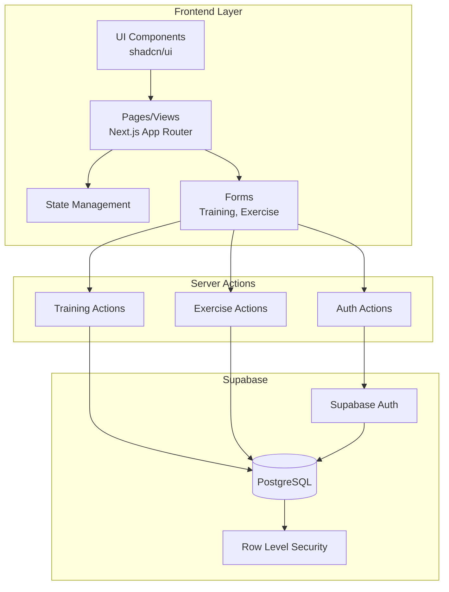
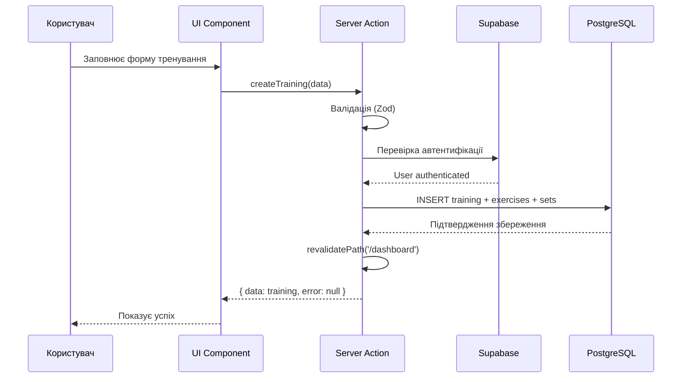
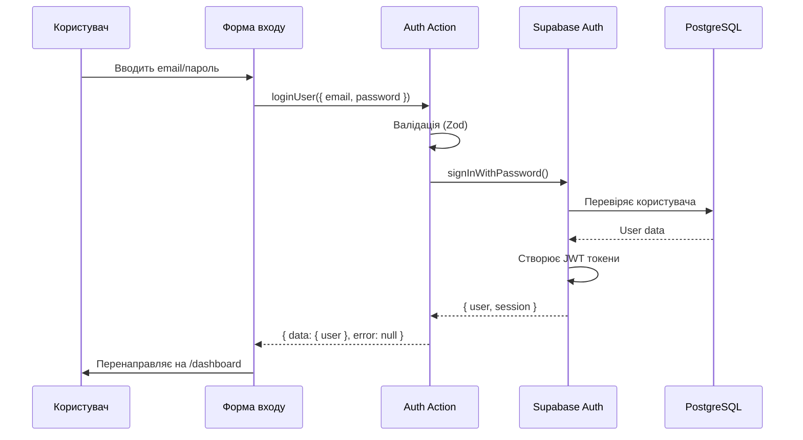
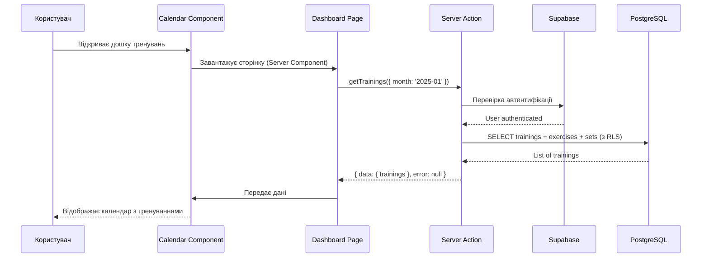
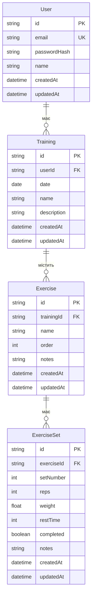
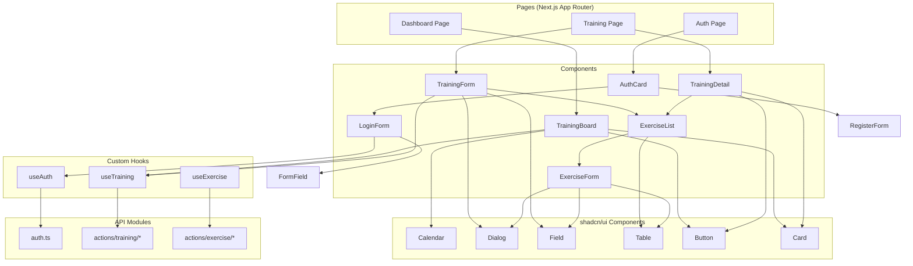
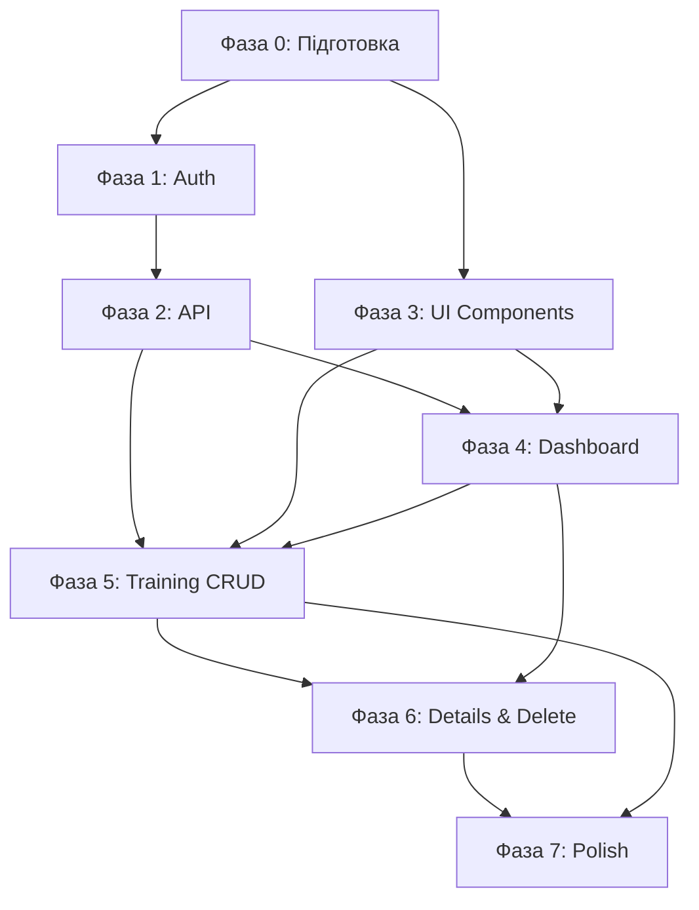

# Software Design Document (SDD)

## Трекер тренувань - votum_ferri

**Версія:** 1.6  
**Дата:** 2026-02-19  
**Статус:** В розробці

**Оновлення v1.6:**

- Фаза 3 (базові UI компоненти) реалізована: `layout`, `exercise`, `training`
- Базовий layout інтегровано напряму в `src/app/layout.tsx` (без окремого `LayoutWrapper`)
- Header оновлено: для неавторизованого користувача показуються `Login/Register`, для авторизованого — `Navbar` + `Logout`
- `Navbar` винесено в підмодуль `src/components/layout/navbar/*` з popover-based mobile navigation
- Для всіх компонентів поза `src/components/ui` використовується `default export`; реекспорт через `index.ts`

**Оновлення v1.5:**

- Реалізовано Phase 2 для доменів `training` та `exercise` у шарах `data -> services -> actions`
- Server Actions для `training` та `exercise` винесені в окремі директорії `src/actions/training/*` і `src/actions/exercise/*`
- Обробка помилок виконується локально в кожному action (без `error-response.ts`)
- Єдиний формат відповіді action через `src/actions/utils.ts`: `ok(...)` / `err(...)` або `redirect(...)`
- Додано Zod схеми для Phase 2: `src/schemas/training.ts`, `src/schemas/exercise.ts`
- Додано спільні API типи: `src/types/training-api.ts`

**Оновлення v1.4:**

- Auth flow розділено на шари `actions` і `services`
- Auth Server Actions винесені у `src/actions/auth/*` (замість одного `src/actions/auth.ts`)
- Утиліти відповідей розділено за призначенням: `src/services/utils.ts` (tuple response) та `src/actions/utils.ts` (action success/error response)
- Оновлено розділи API та модульної структури відповідно до фактичної реалізації

**Оновлення v1.3:**

- Оновлено структуру маршрутів: використання окремих сторінок /login та /register замість /auth?mode=
- Оновлено компоненти: AuthFormContainer замість AuthFormLayout (використання пропса isLogin замість query параметра)
- Оновлено константи маршрутів: ROUTE.LOGIN, ROUTE.REGISTER, ROUTE.DASHBOARD
- Оновлено всі відповідні розділи SDD з фактичною реалізацією структури проєкту

**Оновлення v1.2:**

- Реалізовано систему автентифікації (Phase 1 завершено)
- Реалізовано Server Actions для автентифікації з використанням FormData та useActionState
- Реалізовано компоненти автентифікації: AuthForm, AuthFormContainer, LogoutButton
- Реалізовано сторінки: /login, /register, /dashboard
- Додано UI компоненти: FormField, Separator, Sonner (Toaster)
- Оновлено всі відповідні розділи SDD з фактичною реалізацією

**Оновлення v1.1:**

- Визначено базу даних: Supabase (PostgreSQL)
- Визначено backend: Next.js Server Actions
- Визначено автентифікацію: Supabase Auth
- Оновлено всі відповідні розділи SDD

---

## Зміст

- [1. Вступ та загальний опис](#1-вступ-та-загальний-опис)
  - [1.1 Мета документа](#11-мета-документа)
  - [1.2 Область застосування](#12-область-застосування)
  - [1.3 Опис проекту](#13-опис-проекту)
  - [1.4 Термінологія та скорочення](#14-термінологія-та-скорочення)
- [2. Функціональні вимоги](#2-функціональні-вимоги)
  - [2.1 Реєстрація користувача](#21-реєстрація-користувача)
  - [2.2 Автентифікація](#22-автентифікація)
  - [2.3 Дошка тренувань (календарне відображення)](#23-дошка-тренувань-календарне-відображення)
  - [2.4 Створення тренувань](#24-створення-тренувань)
  - [2.5 Редагування тренувань](#25-редагування-тренувань)
  - [2.6 Видалення тренувань](#26-видалення-тренувань)
  - [2.7 Відстеження вправ](#27-відстеження-вправ)
  - [2.8 Перегляд минулих тренувань](#28-перегляд-минулих-тренувань)
  - [2.9 Взаємодія з даними](#29-взаємодія-з-даними)
  - [2.10 Приймальні критерії загальні](#210-приймальні-критерії-загальні)
- [3. Архітектура системи](#3-архітектура-системи)
  - [3.1 Високорівнева архітектура](#31-високорівнева-архітектура)
  - [3.2 Діаграма компонентів системи](#32-діаграма-компонентів-системи)
  - [3.3 Архітектурні патерни](#33-архітектурні-патерни)
  - [3.4 Потік даних між компонентами](#34-потік-даних-між-компонентами)
  - [3.5 Модульна структура](#35-модульна-структура)
  - [3.6 Залежності та інтеграції](#36-залежності-та-інтеграції)
- [4. Технічний стек](#4-технічний-стек)
  - [4.1 Frontend технології](#41-frontend-технології)
  - [4.2 Backend технології](#42-backend-технології)
  - [4.3 База даних](#43-база-даних)
  - [4.4 Автентифікація](#44-автентифікація)
  - [4.5 Інструменти розробки](#45-інструменти-розробки)
  - [4.6 Залежності проекту](#46-залежності-проекту)
  - [4.7 Середовища розробки](#47-середовища-розробки)
  - [4.8 Резюме технічного стеку](#48-резюме-технічного-стеку)
- [5. Модель даних](#5-модель-даних)
  - [5.1 Структура даних користувача](#51-структура-даних-користувача)
  - [5.2 Структура даних тренування](#52-структура-даних-тренування)
  - [5.3 Структура даних вправи](#53-структура-даних-вправи)
  - [5.4 Entity-Relationship діаграма](#54-entity-relationship-діаграма)
  - [5.5 Індекси бази даних](#55-індекси-бази-даних)
  - [5.6 Типи для API responses](#56-типи-для-api-responses)
  - [5.7 Валідація даних](#57-валідація-даних)
  - [5.8 TODO: Схема бази даних](#58-todo-схема-бази-даних)
- [6. UI/UX специфікації](#6-uiux-специфікації)
  - [6.1 Загальні принципи дизайну](#61-загальні-принципи-дизайну)
  - [6.2 Схема навігації](#62-схема-навігації)
  - [6.3 Сторінки та інтерфейси](#63-сторінки-та-інтерфейси)
  - [6.4 shadcn/ui компоненти - детальний опис використання](#64-shadcnui-компоненти---детальний-опис-використання)
  - [6.5 Responsive Design](#65-responsive-design)
  - [6.6 Темна тема](#66-темна-тема)
  - [6.7 Доступність (Accessibility)](#67-доступність-accessibility)
  - [6.8 Інтерактивність та Feedback](#68-інтерактивність-та-feedback)
- [7. API специфікації](#7-api-специфікації)
  - [7.1 Загальні принципи API](#71-загальні-принципи-api)
  - [7.2 Server Actions для автентифікації](#72-server-actions-для-автентифікації)
  - [7.3 Server Actions для тренувань (CRUD)](#73-server-actions-для-тренувань-crud)
  - [7.4 Server Actions для вправ](#74-server-actions-для-вправ)
  - [7.5 Авторизація та безпека](#75-авторизація-та-безпека)
  - [7.6 Error Handling](#76-error-handling)
  - [7.7 Деталізація Server Actions](#77-деталізація-server-actions)
- [8. Компоненти та модулі](#8-компоненти-та-модулі)
  - [8.1 Структура компонентів React](#81-структура-компонентів-react)
  - [8.2 Використання shadcn/ui компонентів](#82-використання-shadcnui-компонентів)
  - [8.3 Основні компоненти](#83-основні-компоненти)
  - [8.4 Модулі та сервіси](#84-модулі-та-сервіси)
  - [8.5 Діаграма залежностей компонентів](#85-діаграма-залежностей-компонентів)
  - [8.6 Інтеграція компонентів](#86-інтеграція-компонентів)
  - [8.7 Деталізація модулів](#87-деталізація-модулів)
- [9. Безпека та автентифікація](#9-безпека-та-автентифікація)
  - [9.1 Стратегія автентифікації](#91-стратегія-автентифікації)
  - [9.2 Управління сесіями](#92-управління-сесіями)
  - [9.3 Захист маршрутів](#93-захист-маршрутів)
  - [9.4 Захист даних](#94-захист-даних)
  - [9.5 HTTPS та Secure Cookies](#95-https-та-secure-cookies)
  - [9.6 Error Handling та Logging](#96-error-handling-та-logging)
  - [9.7 Rate Limiting](#97-rate-limiting)
  - [9.8 Data Privacy](#98-data-privacy)
  - [9.9 Деталізація безпеки](#99-деталізація-безпеки)
- [10. План реалізації](#10-план-реалізації)
  - [10.1 Послідовність реалізації](#101-послідовність-реалізації)
  - [10.2 Залежності між компонентами](#102-залежності-між-компонентами)
  - [10.3 Мілестоуни](#103-мілестоуни)
  - [10.4 Пріоритети реалізації](#104-пріоритети-реалізації)
  - [10.5 Визначені рішення](#105-визначені-рішення)
  - [10.6 Наступні кроки](#106-наступні-кроки)
- [Додатки](#додатки)

---

## 1. Вступ та загальний опис

### 1.1 Мета документа

Цей документ описує архітектуру, дизайн та технічні рішення для системи трекера тренувань **votum_ferri**. Документ призначений для розробників, архітекторів та зацікавлених сторін, що беруть участь у розробці та підтримці системи.

### 1.2 Область застосування

SDD охоплює:

- Високорівневу архітектуру системи
- Функціональні та нефункціональні вимоги
- Технічний стек та інструменти
- Структуру даних та моделі
- Детальний дизайн компонентів
- UI/UX специфікації
- Плани реалізації

### 1.3 Опис проекту

**votum_ferri** - це веб-додаток для відстеження тренувань, який дозволяє користувачам:

- Реєструватися та авторизуватися в системі
- Переглядати тренування в календарному форматі (дошка тренувань)
- Створювати нові тренування з детальним описом вправ
- Редагувати та видаляти існуючі тренування
- Відстежувати вправи з параметрами: кількість підходів, повторень та вага

Система розробляється на базі Next.js 16 з використанням React 19, TypeScript та бібліотеки компонентів shadcn/ui.

### 1.4 Термінологія та скорочення

| Термін               | Опис                                                         |
| -------------------- | ------------------------------------------------------------ |
| **Тренування**       | Запланована або виконана сесія фізичних вправ                |
| **Вправа**           | Конкретна фізична вправа (наприклад, присідання, жим лежачи) |
| **Підхід (Set)**     | Одна послідовність виконання вправи                          |
| **Повторення (Rep)** | Кількість разів виконання вправи в одному підході            |
| **Вага**             | Вага спорядження, що використовується під час вправи (кг)    |
| **Дошка тренувань**  | Календарне відображення всіх тренувань користувача           |
| **SDD**              | Software Design Document                                     |
| **UI**               | User Interface (інтерфейс користувача)                       |
| **UX**               | User Experience (користувацький досвід)                      |
| **API**              | Application Programming Interface                            |
| **CRUD**             | Create, Read, Update, Delete (операції з даними)             |
| **ER**               | Entity-Relationship (діаграма сутностей-зв'язків)            |

---

## 2. Функціональні вимоги

Цей розділ описує детальні функціональні вимоги системи трекера тренувань.

### 2.1 Реєстрація користувача

**FR-1.1: Реєстрація нового користувача**

Система повинна надавати можливість новим користувачам створити обліковий запис.

**Деталі:**

- Користувач повинен мати можливість ввести необхідні дані (email, пароль, можливо ім'я)
- Система повинна валідувати введені дані (формат email, складність пароля)
- Після успішної реєстрації користувач повинен мати доступ до системи
- Система повинна перевіряти унікальність email

**Приймальні критерії:**

- Форма реєстрації доступна незареєстрованим користувачам
- Валідація полів відбувається в реальному часі або при відправці форми
- Повідомлення про помилки показуються користувачу

### 2.2 Автентифікація

**FR-2.1: Вхід в систему**

Зареєстрований користувач повинен мати можливість увійти в систему.

**Деталі:**

- Користувач вводить email та пароль
- Система перевіряє облікові дані
- При успішній автентифікації створюється сесія користувача
- Користувач перенаправляється на головну сторінку (дошку тренувань)

**FR-2.2: Вихід з системи**

Авторизований користувач повинен мати можливість вийти з системи.

**Деталі:**

- Кнопка/пункт меню для виходу
- При виході сесія завершується
- Користувач перенаправляється на сторінку входу

**FR-2.3: Захист маршрутів**

Захищені сторінки повинні бути недоступні для неавторизованих користувачів.

**Деталі:**

- Неавторизовані користувачі перенаправляються на сторінку входу
- Після успішної автентифікації користувач повертається на запрошену сторінку

### 2.3 Дошка тренувань (календарне відображення)

**FR-3.1: Відображення тренувань у календарі**

Система повинна відображати всі тренування користувача в календарному форматі.

**Деталі:**

- Календарний вид показує дні місяця
- Дні з запланованими тренуваннями мають візуальну індикацію
- Користувач може переглядати різні місяці (навігація вперед/назад)
- При кліку на день з тренуваннями відображаються деталі тренувань цього дня
- Можливість перегляду минулих та майбутніх тренувань

**Приймальні критерії:**

- Календар відображає поточний місяць за замовчуванням
- Тренування відображаються з позначками/кольорами для різних типів
- Користувач може легко навігувати між місяцями

### 2.4 Створення тренувань

**FR-4.1: Створення нового тренування**

Авторизований користувач повинен мати можливість створити нове тренування.

**Деталі:**

- Користувач вибирає дату для тренування (за замовчуванням - поточна дата)
- Можливість додати назву/опис тренування (опціонально)
- Додавання вправ до тренування
- Для кожної вправи вказується:
  - Назва вправи
  - Кількість підходів (sets)
  - Кількість повторень (reps) для кожного підходу
  - Вага (weight) для кожного підходу
- Можливість додати кілька вправ до одного тренування
- Збереження тренування

**Приймальні критерії:**

- Форма створення тренування доступна з дошки тренувань
- Користувач може додавати/видаляти вправи в межах форми
- Валідація обов'язкових полів
- Після збереження тренування з'являється в календарі

### 2.5 Редагування тренувань

**FR-5.1: Редагування існуючого тренування**

Користувач повинен мати можливість редагувати створені ним тренування.

**Деталі:**

- Доступ до редагування з детального перегляду тренування
- Можливість змінити дату тренування
- Можливість змінити назву/опис
- Можливість редагувати існуючі вправи (змінити підходи, повторення, вагу)
- Можливість додати нові вправи
- Можливість видалити вправи з тренування
- Збереження змін

**Приймальні критерії:**

- Кнопка "Редагувати" доступна для тренувань користувача
- Форма редагування заповнена поточними даними тренування
- Зміни зберігаються після підтвердження

### 2.6 Видалення тренувань

**FR-6.1: Видалення тренування**

Користувач повинен мати можливість видалити тренування.

**Деталі:**

- Доступ до видалення з детального перегляду або зі списку тренувань
- Підтвердження видалення (діалог підтвердження)
- Після підтвердження тренування видаляється з системи
- Тренування більше не відображається в календарі

**Приймальні критерії:**

- Кнопка "Видалити" доступна для тренувань користувача
- Система запитує підтвердження перед видаленням
- Після видалення тренування повністю видаляється

### 2.7 Відстеження вправ

**FR-7.1: Відображення деталей вправ**

Система повинна відображати детальну інформацію про вправи в тренуванні.

**Деталі:**

- Кожна вправа показує назву
- Для кожної вправи відображається список підходів з параметрами:
  - Номер підходу
  - Кількість повторень
  - Вага
- Можливість перегляду історії виконання вправи (у майбутньому)

**FR-7.2: Структура даних вправи**

Кожна вправа містить:

- Назва вправи (обов'язкове поле)
- Список підходів, де кожен підхід містить:
  - Кількість повторень (reps) - число
  - Вага (weight) - число (кг)
- Кількість підходів - динамічна (користувач може додавати/видаляти)

**Приймальні критерії:**

- Вправи відображаються у читабельному форматі
- Параметри вправ чітко структуровані
- Можливість легко розрізнити різні підходи

### 2.8 Перегляд минулих тренувань

**FR-8.1: Історія тренувань**

Користувач повинен мати можливість переглядати всі свої минулі тренування.

**Деталі:**

- Доступ до історії через календар (навігація на минулі дати)
- Відображення всіх тренувань для вибраної дати
- Можливість перегляду деталей кожного минулого тренування
- Можливість редагування/видалення минулих тренувань

**Приймальні критерії:**

- Минулі тренування доступні для перегляду
- Інтерфейс дозволяє легко навігувати по історії

### 2.9 Взаємодія з даними

**FR-9.1: Збереження даних**

Всі зміни в тренуваннях повинні зберігатися постійно.

**FR-9.2: Ізоляція даних**

Кожен користувач бачить та має доступ тільки до своїх тренувань.

**Деталі:**

- Дані користувачів ізольовані
- Неможливий доступ до тренувань інших користувачів
- Автентифікація обов'язована для доступу до даних

### 2.10 Приймальні критерії загальні

- Система повинна працювати стабільно та швидко реагувати на дії користувача
- Інтерфейс повинен бути інтуїтивно зрозумілим
- Всі критичні операції (видалення, збереження) мають підтвердження або зворотний зв'язок
- Дані повинні зберігатися надійно та бути доступними при наступному вході

---

## 3. Архітектура системи

### 3.1 Високорівнева архітектура

Система будується за архітектурою клієнт-сервер з розділенням на frontend та backend компоненти.

```
┌─────────────────────────────────────────────────────────┐
│                    Користувач (Browser)                 │
└────────────────────────┬────────────────────────────────┘
                         │
                         │ HTTP/HTTPS
                         │
┌────────────────────────┴────────────────────────────────┐
│              Next.js Application                        │
│                                                         │
│  ┌──────────────────┐          ┌──────────────────┐     │
│  │  Client          │          │  Server          │     │
│  │  Components      │────────▶│  Actions         │     │
│  │  (React 19)      │          │  (Server         │     │
│  │                  │          │   Functions)     │     │
│  │ - shadcn/ui      │          │                  │     │
│  │ - Forms          │          │ - Auth Logic     │     │
│  │ - State          │          │ - Business Logic │     │
│  └──────────────────┘          └────────┬─────────┘     │
│                                         │               │
│                                         │ Supabase SDK  │
│                                         │               │
└─────────────────────────────────────────┼───────────────┘
                                          │
                                          │ HTTPS
                                          │
                                 ┌────────┴────────┐
                                 │   Supabase      │
                                 │                 │
                                 │ - PostgreSQL    │
                                 │ - Auth          │
                                 │ - Storage       │
                                 │ - Realtime      │
                                 └─────────────────┘
```

**Основні компоненти:**

1. **Frontend (Next.js 16)**
   - Клієнтська частина на React 19
   - Server-Side Rendering (SSR) та Static Site Generation (SSG)
   - Server Actions для backend логіки (замість API Routes)
   - Інтерфейс користувача з shadcn/ui

2. **Backend (Next.js Server Actions)**

- Server Actions в `src/actions/` для взаємодії з даними
  - Логіка автентифікації через Supabase Auth
  - Бізнес-логіка тренувань та вправ
  - Валідація через Zod
  - Автоматичне revalidation через `revalidatePath`

3. **База даних (Supabase)**
   - PostgreSQL для зберігання даних
   - Supabase Auth для управління користувачами та сесіями
   - Row Level Security (RLS) для безпеки даних
   - Realtime підписки (за потреби)

### 3.2 Діаграма компонентів системи


```mermaid
graph TB
    subgraph Frontend["Frontend Layer"]
        UI[UI Components<br/>shadcn/ui]
        Pages[Pages/Views<br/>Next.js App Router]
        State[State Management]
        Forms[Forms<br/>Training, Exercise]
    end

    subgraph Server["Server Actions"]
        AuthActions[Auth Actions]
        TrainingActions[Training Actions]
        ExerciseActions[Exercise Actions]
    end

    subgraph Supabase["Supabase"]
        SupabaseAuth[Supabase Auth]
        SupabaseDB[(PostgreSQL)]
        SupabaseRLS[Row Level Security]
    end

    UI --> Pages
    Pages --> State
    Pages --> Forms
    Forms --> AuthActions
    Forms --> TrainingActions
    Forms --> ExerciseActions

    AuthActions --> SupabaseAuth
    TrainingActions --> SupabaseDB
    ExerciseActions --> SupabaseDB

    SupabaseDB --> SupabaseRLS
    SupabaseAuth --> SupabaseDB
```

### 3.3 Архітектурні патерни

#### 3.3.1 Frontend патерни

**Component-Based Architecture**

- Модульна архітектура на базі React компонентів
- Переповнення компонентів для повторного використання
- Розділення на Presentational та Container компоненти

**Server Components (Next.js 16)**

- Використання React Server Components для серверного рендерингу
- Client Components для інтерактивних елементів

**Composition Pattern**

- Використання композиції для побудови складних UI
- shadcn/ui компоненти як базові будівельні блоки

#### 3.3.2 Backend патерни

**Server Actions Pattern**

- Server Actions замість REST API endpoints
- Прямі виклики функцій з Client Components
- Типобезпека між клієнтом та сервером
- Автоматична серіалізація/десеріалізація

**Action + Service Layer Pattern**

- Action layer відповідає за orchestration (redirect, повернення state для UI)
- Business logic винесена в service layer (`src/services/*`)
- Actions в окремих файлах за доменами (auth, training, exercise), `1 method = 1 file`
- Для всіх доменів використовується дворівневий контракт відповіді:
  - service: tuple `[error, data]`
  - action: `ok(data)` або `err(message, detailes)` через `src/actions/utils.ts`
- Валідація через Zod перед обробкою

### 3.4 Потік даних між компонентами

#### 3.4.1 Потік створення тренування


```mermaid
sequenceDiagram
    participant User as Користувач
    participant UI as UI Component
    participant Action as Server Action
    participant Supabase as Supabase
    participant DB as PostgreSQL

    User->>UI: Заповнює форму тренування
    UI->>Action: createTraining(data)
    Action->>Action: Валідація (Zod)
    Action->>Supabase: Перевірка автентифікації
    Supabase-->>Action: User authenticated
    Action->>DB: INSERT training + exercises + sets
    DB-->>Action: Підтвердження збереження
    Action->>Action: revalidatePath('/dashboard')
    Action-->>UI: { data: training, error: null }
    UI-->>User: Показує успіх
```

#### 3.4.2 Потік автентифікації


```mermaid
sequenceDiagram
    participant User as Користувач
    participant LoginForm as Форма входу
    participant AuthAction as Auth Action
    participant SupabaseAuth as Supabase Auth
    participant DB as PostgreSQL

    User->>LoginForm: Вводить email/пароль
    LoginForm->>AuthAction: loginUser({ email, password })
    AuthAction->>AuthAction: Валідація (Zod)
    AuthAction->>SupabaseAuth: signInWithPassword()
    SupabaseAuth->>DB: Перевіряє користувача
    DB-->>SupabaseAuth: User data
    SupabaseAuth->>SupabaseAuth: Створює JWT токени
    SupabaseAuth-->>AuthAction: { user, session }
    AuthAction-->>LoginForm: { data: { user }, error: null }
    LoginForm->>User: Перенаправляє на /dashboard
```

#### 3.4.3 Потік відображення дошки тренувань


```mermaid
sequenceDiagram
    participant User as Користувач
    participant Calendar as Calendar Component
    participant Page as Dashboard Page
    participant Action as Server Action
    participant Supabase as Supabase
    participant DB as PostgreSQL

    User->>Calendar: Відкриває дошку тренувань
    Calendar->>Page: Завантажує сторінку (Server Component)
    Page->>Action: getTrainings({ month: '2025-01' })
    Action->>Supabase: Перевірка автентифікації
    Supabase-->>Action: User authenticated
    Action->>DB: SELECT trainings + exercises + sets (з RLS)
    DB-->>Action: List of trainings
    Action-->>Page: { data: { trainings }, error: null }
    Page->>Calendar: Передає дані
    Calendar-->>User: Відображає календар з тренуваннями
```

### 3.5 Модульна структура

```
votum_ferri/
├── src/
│   ├── app/                    # Next.js App Router
│   │   ├── (auth)/             # Auth routes (login, register)
│   │   │   ├── login/
│   │   │   │   └── page.tsx
│   │   │   └── register/
│   │   │       └── page.tsx
│   │   ├── dashboard/          # Dashboard/Calendar page
│   │   ├── training/           # Training pages
│   │   └── middleware.ts       # Route protection
│   ├── actions/                # Server Actions
│   │   ├── auth/
│   │   │   ├── register-user.ts
│   │   │   ├── login-user.ts
│   │   │   ├── logout-user.ts
│   │   │   ├── get-current-user.ts
│   │   │   └── index.ts
│   │   ├── training/
│   │   │   ├── get-trainings.ts
│   │   │   ├── get-training.ts
│   │   │   ├── create-training.ts
│   │   │   ├── update-training.ts
│   │   │   ├── delete-training.ts
│   │   │   └── index.ts
│   │   ├── exercise/
│   │   │   ├── get-exercises.ts
│   │   │   ├── get-exercise.ts
│   │   │   ├── create-exercise.ts
│   │   │   ├── update-exercise.ts
│   │   │   ├── delete-exercise.ts
│   │   │   └── index.ts
│   │   └── utils.ts            # Action response helpers (ok/err)
│   ├── services/               # Business logic layer
│   │   ├── auth/
│   │   │   ├── register-user.ts
│   │   │   ├── login-user.ts
│   │   │   ├── logout-user.ts
│   │   │   ├── get-current-user.ts
│   │   │   └── index.ts
│   │   ├── training/
│   │   │   ├── *.ts            # one method per file
│   │   │   └── index.ts
│   │   ├── exercise/
│   │   │   ├── *.ts            # one method per file
│   │   │   └── index.ts
│   │   ├── utils.ts            # Service tuple response helpers
│   │   └── index.ts
│   ├── components/             # React components
│   │   ├── ui/                 # shadcn/ui components
│   │   ├── training/           # Training-specific components
│   │   │   ├── TrainingBoard/  # Calendar/Dashboard
│   │   │   ├── TrainingForm/   # Create/Edit form
│   │   │   └── TrainingCard/   # Training display
│   │   ├── exercise/           # Exercise components
│   │   │   ├── ExerciseList/   # List of exercises
│   │   │   └── ExerciseForm/   # Exercise form
│   │   └── auth/               # Auth components
│   │       ├── auth-form-container.tsx
│   │       ├── auth-form.tsx
│   │       ├── logout-button.tsx
│   │       ├── constants.ts
│   │       └── index.ts
│   ├── lib/                    # Utilities & helpers
│   │   ├── supabase/           # Supabase clients
│   │   │   ├── client.ts       # Browser client
│   │   │   ├── server.ts       # Server client
│   │   │   └── index.ts        # Export all Supabase clients (interface)
│   │   └── utils/              # General UI utilities
│   │       ├── cn.ts           # Class name utility
│   │       └── index.ts        # Export all utilities (interface)
│   ├── schemas/                # Zod validation schemas
│   │   ├── login.ts
│   │   ├── register.ts
│   │   ├── training.ts
│   │   ├── exercise.ts
│   │   └── index.ts            # Export all schemas (interface)
│   ├── types/                  # TypeScript types
│   │   ├── training.ts
│   │   ├── exercise.ts
│   │   ├── training-api.ts
│   │   ├── user.ts
│   │   └── index.ts            # Export all types (interface)
│   └── hooks/                 # Custom React hooks
│       ├── useTraining.ts
│       └── useAuth.ts
├── docs/                      # Documentation
└── public/                    # Static assets
```

**Конвенція експортів через index.ts (Barrel exports):**

Усі експорти з модулів проєкту мають відбуватися через файл `index.ts`, який слугує публічним інтерфейсом (interface) директорії. Це правило застосовується до таких категорій:

- `lib/utils` — загальні UI-утиліти (наприклад, `cn`)
- `actions` — Server Actions (barrel для доменів, наприклад `actions/auth/index.ts`)
- `services` — бізнес-логіка та допоміжні утиліти сервісного шару
- `lib/supabase` — Supabase клієнти (client, server)
- `schemas` — Zod валідаційні схеми
- `types` — TypeScript типи та інтерфейси
- `components/*` — React-компоненти (ui, auth, training, exercise, layout)
- Інші директорії з множинними експортованими сутностями

**Правила:**

- Імпорти виконуються через публічний інтерфейс модуля (barrel або root-файл), а не через випадкові внутрішні шляхи
- Файл `index.ts` реекспортує потрібні сутності з внутрішніх модулів
- Такий підхід забезпечує єдину точку входу та спрощує рефакторинг

```typescript
// ✅ Правильно — через index.ts
import { cn } from "@/lib/utils";
import { createBrowserClient, createServerClient } from "@/lib/supabase";
import type { User, Training, Exercise } from "@/types";
import { AuthFormContainer } from "@/components/auth";

// ❌ Неправильно — прямі шляхи до файлів
import { cn } from "@/lib/utils/cn";
import { createBrowserClient } from "@/lib/supabase/client";
import type { User } from "@/types/user";
```

### 3.6 Залежності та інтеграції

**Внутрішні залежності:**

- Client Components → Server Actions
- Server Actions → Supabase клієнт
- Supabase клієнт → Supabase (PostgreSQL + Auth)
- Pages → Server Components → Server Actions
- Forms → Server Actions (через form actions)

**Зовнішні залежності:**

- **Next.js 16** - framework та Server Actions
- **React 19** - UI бібліотека
- **shadcn/ui** - UI компоненти
- **Tailwind CSS 4** - стилізація
- **Supabase** - база даних (PostgreSQL) та автентифікація
- **@supabase/supabase-js** - Supabase JavaScript клієнт
- **@supabase/ssr** - Supabase для Next.js SSR
- **zod** - валідація даних
- **react-hook-form** - управління формами
- **date-fns** - робота з датами

---

## 4. Технічний стек

### 4.1 Frontend технології

#### 4.1.1 Next.js 16

**Версія:** 16.1.1  
**Призначення:** Основний framework для розробки

**Обґрунтування:**

- App Router для сучасного роутингу
- Server-Side Rendering (SSR) та Static Site Generation (SSG)
- Server Actions для backend логіки
- Оптимізація продуктивності "з коробки"
- SEO-friendly архітектура

**Використання:**

- Маршрутизація (App Router)
- Server Actions для backend логіки
- Server Components для серверного рендерингу
- Оптимізація зображень та шрифтів

#### 4.1.2 React 19

**Версія:** 19.2.3  
**Призначення:** UI бібліотека

**Обґрунтування:**

- Остання версія з покращеною продуктивністю
- Підтримка Server Components
- Покращена робота з формами та станом

**Використання:**

- Компоненти користувацького інтерфейсу
- Керування станом компонентів
- Списки та форми

#### 4.1.3 TypeScript 5

**Версія:** ^5  
**Призначення:** Типізація коду

**Обґрунтування:**

- Статична типізація для зменшення помилок
- Покращена підтримка IDE
- Кращий developer experience
- Документування через типи

**Використання:**

- Типізація всіх компонентів
- Типи для даних (training, exercise, user)
- Типи для API responses
- Типи для пропсів компонентів

#### 4.1.4 Tailwind CSS 4

**Версія:** ^4  
**Призначення:** Utility-first CSS framework

**Обґрунтування:**

- Швидка розробка UI
- Консистентний дизайн
- Підтримка темної теми
- Оптимізація розміру CSS

**Використання:**

- Стилізація компонентів
- Responsive design (mobile-first)
- Темна тема
- Кастомізація через конфігурацію

#### 4.1.5 shadcn/ui

**Призначення:** Бібліотека UI компонентів

**Обґрунтування:**

- Високоякісні, доступні компоненти
- Налаштування під проект
- Побудовано на Radix UI (accessibility)
- Інтеграція з Tailwind CSS
- Легке кастомізування

**Компоненти, що плануються до використання:**

- `Button` - кнопки
- `Card` - картки для відображення тренувань
- `Dialog` - модальні вікна для форм
- `Field` - поля форм з валідацією
- `Input` - поля вводу
- `Select` - випадаючі списки
- `Calendar` - календар для дошки тренувань
- `Table` - таблиці для списку вправ
- `Label` - мітки для форм
- `Badge` - бейджі для позначень

**Структура:**

- Компоненти копіюються в `src/components/ui/`
- Легко кастомізувати під дизайн-систему
- Використання TypeScript для типізації

### 4.2 Backend технології

**Вибір:** Next.js Server Actions (Server Functions)

**Обґрунтування:**

- Нативна інтеграція з Next.js 16 App Router
- Типобезпечні функції з TypeScript
- Автоматична оптимізація та кешування
- Простота розробки без окремих API routes
- Пряма інтеграція з React компонентами
- Менше boilerplate коду

**Архітектура:**

- Server Actions виконуються на сервері
- Викликаються напряму з Client Components
- Автоматична серіалізація/десеріалізація даних
- Вбудована обробка помилок
- Підтримка `useFormState` та `useFormStatus` hooks

**Структура:**

```
src/actions/
├── auth/
│   ├── register-user.ts
│   ├── login-user.ts
│   ├── logout-user.ts
│   ├── get-current-user.ts
│   └── index.ts
├── training/
│   ├── get-trainings.ts
│   ├── get-training.ts
│   ├── create-training.ts
│   ├── update-training.ts
│   ├── delete-training.ts
│   └── index.ts
├── exercise/
│   ├── get-exercises.ts
│   ├── get-exercise.ts
│   ├── create-exercise.ts
│   ├── update-exercise.ts
│   ├── delete-exercise.ts
│   └── index.ts
└── utils.ts
```

**Переваги:**

- Типобезпека між клієнтом та сервером
- Менше HTTP запитів (прямі виклики функцій)
- Кращий developer experience
- Автоматичне кешування та revalidation

### 4.3 База даних

**Вибір:** Supabase (PostgreSQL)

**Версія:** Остання стабільна версія  
**Призначення:** База даних та Backend as a Service

**Обґрунтування:**

- PostgreSQL з повною підтримкою SQL
- Вбудована автентифікація (Supabase Auth)
- Row Level Security (RLS) для безпеки даних
- Realtime підписки на зміни
- Автоматичне створення REST API
- Безкоштовний tier для розробки
- Проста інтеграція з Next.js
- TypeScript підтримка з автогенерацією типів

**Структура БД:**

- PostgreSQL реляційна база даних
- Таблиці: `profiles`, `trainings`, `exercises`, `exercise_sets`
- Зв'язки через foreign keys
- Каскадне видалення
- Індекси для оптимізації запитів

**Клієнт:**

- `@supabase/supabase-js` - основний клієнт (встановлено)
- `@supabase/ssr` - для Next.js Server Components та Server Actions (встановлено)
- Створення клієнтів для браузера (`src/lib/supabase/client.ts`) та сервера (`src/lib/supabase/server.ts`)

**Змінні середовища:**

- `NEXT_PUBLIC_SUPABASE_URL` - URL проекту Supabase
- `NEXT_PUBLIC_SUPABASE_PUBLISHABLE_KEY` - Publishable API key (використовується для клієнтського коду)
- `SUPABASE_SECRET_KEY` - Secret API key (використовується тільки для серверних операцій з повними правами)

**Примітка:** Supabase переходить на нову систему API ключів (publishable/secret замість legacy anon/service_role). Використовуються нові ключі для кращої безпеки та сумісності з майбутніми версіями.

**Безпека:**

- Row Level Security (RLS) policies
- Автоматична ізоляція даних користувачів
- Безпека на рівні БД, а не тільки на рівні додатку

**Міграції:**

- SQL міграції через Supabase Dashboard
- Версійний контроль міграцій
- Автоматичне застосування змін

### 4.4 Автентифікація

**Вибір:** Supabase Auth

**Обґрунтування:**

- Вбудована в Supabase
- Підтримка email/password автентифікації
- JWT токени з автоматичним оновленням
- Безпечне зберігання сесій
- Middleware для захисту маршрутів
- Проста інтеграція з Next.js

**Функціональність:**

- Реєстрація користувачів
- Вхід/вихід
- Управління сесіями
- Оновлення профілю
- Захист маршрутів через middleware

**Реалізація:**

- Server Actions для auth операцій
- Supabase Auth клієнт для сервера та клієнта
- Cookies для збереження сесії
- Middleware для перевірки автентифікації

**Безпека:**

- Хешування паролів (bcrypt) - автоматично в Supabase
- Secure cookies
- HTTPS only в production
- Захист від CSRF через SameSite cookies

### 4.5 Інструменти розробки

#### 4.5.1 Biome

**Версія:** 2.2.0  
**Призначення:** Linting та formatting

**Обґрунтування:**

- Швидкий замість ESLint + Prettier
- Один інструмент для linting та formatting
- TypeScript підтримка
- Автоматичне форматування

**Використання:**

- Перевірка коду (`npm run lint`)
- Автоматичне форматування (`npm run format`)

#### 4.5.2 Babel React Compiler

**Версія:** 1.0.0  
**Призначення:** Компіляція React коду

**Обґрунтування:**

- Оптимізація React компонентів
- Автоматична оптимізація re-renders
- Покращена продуктивність

#### 4.5.3 Node.js

**Версія:** ^20 (передбачається)  
**Призначення:** Runtime середовище

**Обґрунтування:**

- LTS версія
- Підтримка сучасних можливостей JavaScript
- Сумісність з Next.js

### 4.6 Залежності проекту

**Поточні dependencies:**

```json
{
  "next": "16.1.1",
  "react": "19.2.3",
  "react-dom": "19.2.3"
}
```

**Поточні devDependencies:**

```json
{
  "@biomejs/biome": "2.2.0",
  "@tailwindcss/postcss": "^4",
  "@types/node": "^20",
  "@types/react": "^19",
  "@types/react-dom": "^19",
  "babel-plugin-react-compiler": "1.0.0",
  "tailwindcss": "^4",
  "typescript": "^5"
}
```

**Встановлені залежності:**

- ✅ `@supabase/supabase-js` - Supabase клієнт (встановлено)
- ✅ `@supabase/ssr` - Supabase для Next.js SSR (встановлено)

**Планові додаткові залежності:**

- `zod` - валідація даних
- `react-hook-form` - управління формами
- `@hookform/resolvers` - інтеграція zod з react-hook-form
- `date-fns` - робота з датами
- shadcn/ui компоненти (будуть додані за потреби)

### 4.7 Середовища розробки

**Рекомендовані IDE:**

- VS Code з розширеннями:
  - ESLint/Biome
  - Prettier
  - TypeScript
  - Tailwind CSS IntelliSense

**Версійний контроль:**

- Git
- GitHub/GitLab (передбачається)

**Хостинг (передбачувано):**

- Vercel (оптимізовано для Next.js)
- Netlify
- Self-hosted (якщо потрібно)

### 4.8 Резюме технічного стеку

| Категорія      | Технологія             | Статус     |
| -------------- | ---------------------- | ---------- |
| Framework      | Next.js 16             | ✅ Вибрано |
| UI Library     | React 19               | ✅ Вибрано |
| Мова           | TypeScript 5           | ✅ Вибрано |
| Стилі          | Tailwind CSS 4         | ✅ Вибрано |
| UI Components  | shadcn/ui              | ✅ Вибрано |
| Linting        | Biome 2.2.0            | ✅ Вибрано |
| Backend        | Next.js Server Actions | ✅ Вибрано |
| База даних     | Supabase (PostgreSQL)  | ✅ Вибрано |
| Автентифікація | Supabase Auth          | ✅ Вибрано |
| Валідація      | Zod                    | ✅ Вибрано |
| Форми          | react-hook-form        | ✅ Вибрано |

---

## 5. Модель даних

### 5.1 Структура даних користувача

#### 5.1.1 TypeScript інтерфейс User

```typescript
interface User {
  id: string; // Унікальний ідентифікатор
  email: string; // Email (унікальний)
  passwordHash: string; // Хешований пароль (не передається в API)
  name?: string; // Ім'я користувача (опціонально)
  createdAt: Date; // Дата створення
  updatedAt: Date; // Дата останнього оновлення
}
```

#### 5.1.2 Public User (без чутливих даних)

```typescript
interface PublicUser {
  id: string;
  email: string;
  name?: string;
}
```

### 5.2 Структура даних тренування

#### 5.2.1 TypeScript інтерфейс Training

```typescript
interface Training {
  id: string; // Унікальний ідентифікатор
  userId: string; // ID користувача (foreign key)
  date: Date; // Дата тренування
  name?: string; // Назва тренування (опціонально)
  description?: string; // Опис тренування (опціонально)
  exercises: Exercise[]; // Список вправ
  createdAt: Date; // Дата створення
  updatedAt: Date; // Дата останнього оновлення
}
```

#### 5.2.2 Training DTO (Data Transfer Object)

```typescript
// Для створення нового тренування
interface CreateTrainingDTO {
  date: string; // ISO date string
  name?: string;
  description?: string;
  exercises: CreateExerciseDTO[];
}

// Для оновлення тренування
interface UpdateTrainingDTO {
  date?: string;
  name?: string;
  description?: string;
  exercises?: CreateExerciseDTO[];
}
```

### 5.3 Структура даних вправи

#### 5.3.1 TypeScript інтерфейс Exercise

```typescript
interface Exercise {
  id: string; // Унікальний ідентифікатор
  trainingId: string; // ID тренування (foreign key)
  name: string; // Назва вправи (обов'язково)
  sets: ExerciseSet[]; // Список підходів
  order: number; // Порядок вправи в тренуванні
  notes?: string; // Нотатки до вправи (опціонально)
  createdAt: Date; // Дата створення
  updatedAt: Date; // Дата останнього оновлення
}
```

#### 5.3.2 ExerciseSet (Підхід вправи)

```typescript
interface ExerciseSet {
  id: string; // Унікальний ідентифікатор
  exerciseId: string; // ID вправи (foreign key)
  setNumber: number; // Номер підходу (1, 2, 3, ...)
  reps: number; // Кількість повторень
  weight: number; // Вага (кг)
  restTime?: number; // Час відпочинку після підходу (секунди, опціонально)
  completed?: boolean; // Чи виконано підхід (опціонально)
  notes?: string; // Нотатки до підходу (опціонально)
}
```

#### 5.3.3 Exercise DTO

```typescript
// Для створення нової вправи
interface CreateExerciseDTO {
  name: string;
  sets: CreateExerciseSetDTO[];
  order: number;
  notes?: string;
}

interface CreateExerciseSetDTO {
  setNumber: number;
  reps: number;
  weight: number;
  restTime?: number;
  notes?: string;
}
```

### 5.4 Entity-Relationship діаграма


```mermaid
erDiagram
    User ||--o{ Training : "має"
    Training ||--o{ Exercise : "містить"
    Exercise ||--o{ ExerciseSet : "має"

    User {
        string id PK
        string email UK
        string passwordHash
        string name
        datetime createdAt
        datetime updatedAt
    }

    Training {
        string id PK
        string userId FK
        date date
        string name
        string description
        datetime createdAt
        datetime updatedAt
    }

    Exercise {
        string id PK
        string trainingId FK
        string name
        int order
        string notes
        datetime createdAt
        datetime updatedAt
    }

    ExerciseSet {
        string id PK
        string exerciseId FK
        int setNumber
        int reps
        float weight
        int restTime
        boolean completed
        string notes
        datetime createdAt
        datetime updatedAt
    }
```

**Зв'язки:**

- User (1) → (N) Training: Один користувач може мати багато тренувань
- Training (1) → (N) Exercise: Одне тренування містить багато вправ
- Exercise (1) → (N) ExerciseSet: Одна вправа має багато підходів

**Обмеження:**

- `email` в User має бути унікальним (UNIQUE)
- `userId` в Training - зовнішній ключ на User.id
- `trainingId` в Exercise - зовнішній ключ на Training.id
- `exerciseId` в ExerciseSet - зовнішній ключ на Exercise.id
- При видаленні User - каскадне видалення Training (CASCADE)
- При видаленні Training - каскадне видалення Exercise (CASCADE)
- При видаленні Exercise - каскадне видалення ExerciseSet (CASCADE)

### 5.5 Індекси бази даних

**Реалізовані індекси для Supabase PostgreSQL:**

1. **profiles таблиця:**
   - PRIMARY KEY: `id` (UUID)
   - UNIQUE INDEX: `email` (якщо потрібно)
   - Автоматичні індекси через foreign key на `auth.users`

2. **trainings таблиця:**
   - PRIMARY KEY: `id` (UUID)
   - FOREIGN KEY INDEX: `user_id` (автоматично)
   - COMPOSITE INDEX: `trainings_user_id_date_idx` на `(user_id, date)` - для швидкого пошуку тренувань користувача за датою

3. **exercises таблиця:**
   - PRIMARY KEY: `id` (UUID)
   - FOREIGN KEY INDEX: `training_id` (автоматично)
   - COMPOSITE INDEX: `exercises_training_id_order_idx` на `(training_id, order_number)` - для сортування вправ в тренуванні

4. **exercise_sets таблиця:**
   - PRIMARY KEY: `id` (UUID)
   - FOREIGN KEY INDEX: `exercise_id` (автоматично)
   - COMPOSITE INDEX: `exercise_sets_exercise_id_set_number_idx` на `(exercise_id, set_number)` - для сортування підходів

**SQL для створення індексів:**

```sql
CREATE INDEX trainings_user_id_date_idx ON public.trainings(user_id, date);
CREATE INDEX exercises_training_id_order_idx ON public.exercises(training_id, order_number);
CREATE INDEX exercise_sets_exercise_id_set_number_idx ON public.exercise_sets(exercise_id, set_number);
```

### 5.6 Типи для API responses

#### 5.6.1 Training Response

```typescript
interface TrainingResponse {
  id: string;
  userId: string;
  date: string; // ISO date string
  name?: string;
  description?: string;
  exercises: ExerciseResponse[];
  createdAt: string; // ISO datetime string
  updatedAt: string; // ISO datetime string
}
```

#### 5.6.2 Exercise Response

```typescript
interface ExerciseResponse {
  id: string;
  trainingId: string;
  name: string;
  sets: ExerciseSetResponse[];
  order: number;
  notes?: string;
  createdAt: string; // ISO datetime string
  updatedAt: string; // ISO datetime string
}
```

#### 5.6.3 ExerciseSet Response

```typescript
interface ExerciseSetResponse {
  id: string;
  exerciseId: string;
  setNumber: number;
  reps: number;
  weight: number;
  restTime?: number;
  completed?: boolean;
  notes?: string;
  createdAt: string; // ISO datetime string
  updatedAt: string; // ISO datetime string
}
```

### 5.7 Валідація даних

#### 5.7.1 Валідаційні схеми (Zod)

**Директорія:** `src/schemas/`

Валідація даних виконується через Zod схеми, які використовуються як на клієнті (через react-hook-form), так і на сервері (в Server Actions).

**Схеми автентифікації:**

1. **LOGIN_SCHEMA** - валідація для входу:

```typescript
z.object({
  email: z.email("Invalid email format"),
  password: z.string().min(1, "Password is required"),
});
```

2. **REGISTER_SCHEMA** - валідація для реєстрації (без confirmPassword):

```typescript
z.object({
  email: z.email("Invalid email format"),
  password: z.string().min(8, "Password must be at least 8 characters"),
  name: z.string().max(255, "Name must be at most 255 characters").optional(),
});
```

3. **REGISTER_SCHEMA_WITH_CONFIRM_PASSWORD** - валідація для реєстрації з підтвердженням пароля (використовується на клієнті):

```typescript
z.object({
  email: z.email("Invalid email format"),
  password: z.string().min(8, "Password must be at least 8 characters"),
  confirmPassword: z.string().min(1, "Please confirm your password"),
  name: z.string().max(255, "Name must be at most 255 characters").optional(),
}).refine((data) => data.password === data.confirmPassword, {
  message: "Passwords do not match",
  path: ["confirmPassword"],
});
```

**Файли схем:**

- `src/schemas/login.ts` → `LOGIN_SCHEMA`
- `src/schemas/register.ts` → `REGISTER_SCHEMA`
- `src/schemas/register-with-confirm-password.ts` → `REGISTER_SCHEMA_WITH_CONFIRM_PASSWORD`
- `src/schemas/index.ts` → централізований експорт схем

**Константи полів:**

**Файл:** `src/constants/authFieldNames.ts`

```typescript
export const AUTH_FIELD_NAME = {
  NAME: "name",
  EMAIL: "email",
  PASSWORD: "password",
  CONFIRM_PASSWORD: "confirmPassword",
} as const;
```

**Валідаційні правила (загальні):**

**User (Автентифікація):**

- `email`: обов'язкове поле, валідний email формат, унікальне (перевіряється в БД)
- `password`: обов'язкове поле, мінімум 8 символів (для реєстрації)
- `name`: опціональне, максимум 255 символів
- `confirmPassword`: обов'язкове для реєстрації, має співпадати з `password`

**Training:**

- `date`: обов'язкове поле, валідна дата
- `name`: опціональне, максимум 255 символів
- `description`: опціональне, максимум 1000 символів
- `exercises`: масив вправ, мінімум 1 вправа

**Exercise:**

- `name`: обов'язкове поле, не порожнє, максимум 255 символів
- `sets`: масив підходів, мінімум 1 підхід
- `order`: обов'язкове поле, позитивне число
- `notes`: опціональне, максимум 500 символів

**ExerciseSet:**

- `setNumber`: обов'язкове поле, позитивне число, унікальне в межах вправи
- `reps`: обов'язкове поле, позитивне число (>= 1)
- `weight`: обов'язкове поле, невід'ємне число (>= 0)
- `restTime`: опціональне, невід'ємне число (секунди)
- `notes`: опціональне, максимум 500 символів

### 5.8 Схема бази даних

**База даних:** Supabase (PostgreSQL)

**Структура таблиць:**

#### 5.8.1 Таблиця profiles

**Призначення:** Додаткові дані профілю користувача (основні дані в `auth.users`)

```sql
CREATE TABLE public.profiles (
  id UUID REFERENCES auth.users(id) PRIMARY KEY,
  email TEXT,
  name TEXT,
  created_at TIMESTAMP WITH TIME ZONE DEFAULT NOW(),
  updated_at TIMESTAMP WITH TIME ZONE DEFAULT NOW()
);
```

**Типи даних:**

- `id`: UUID (PRIMARY KEY, FK на auth.users)
- `email`: TEXT (унікальний)
- `name`: TEXT (опціонально)
- `created_at`: TIMESTAMP WITH TIME ZONE
- `updated_at`: TIMESTAMP WITH TIME ZONE

#### 5.8.2 Таблиця trainings

```sql
CREATE TABLE public.trainings (
  id UUID DEFAULT gen_random_uuid() PRIMARY KEY,
  user_id UUID REFERENCES auth.users(id) ON DELETE CASCADE NOT NULL,
  date DATE NOT NULL,
  name TEXT,
  description TEXT,
  created_at TIMESTAMP WITH TIME ZONE DEFAULT NOW(),
  updated_at TIMESTAMP WITH TIME ZONE DEFAULT NOW()
);
```

**Типи даних:**

- `id`: UUID (PRIMARY KEY)
- `user_id`: UUID (FOREIGN KEY на auth.users, CASCADE DELETE)
- `date`: DATE (обов'язкове)
- `name`: TEXT (опціонально, максимум 255 символів)
- `description`: TEXT (опціонально, максимум 1000 символів)
- `created_at`: TIMESTAMP WITH TIME ZONE
- `updated_at`: TIMESTAMP WITH TIME ZONE

#### 5.8.3 Таблиця exercises

```sql
CREATE TABLE public.exercises (
  id UUID DEFAULT gen_random_uuid() PRIMARY KEY,
  training_id UUID REFERENCES public.trainings(id) ON DELETE CASCADE NOT NULL,
  name TEXT NOT NULL,
  order_number INTEGER NOT NULL,
  notes TEXT,
  created_at TIMESTAMP WITH TIME ZONE DEFAULT NOW(),
  updated_at TIMESTAMP WITH TIME ZONE DEFAULT NOW()
);
```

**Типи даних:**

- `id`: UUID (PRIMARY KEY)
- `training_id`: UUID (FOREIGN KEY на trainings, CASCADE DELETE)
- `name`: TEXT (обов'язкове, максимум 255 символів)
- `order_number`: INTEGER (обов'язкове, для сортування)
- `notes`: TEXT (опціонально, максимум 500 символів)
- `created_at`: TIMESTAMP WITH TIME ZONE
- `updated_at`: TIMESTAMP WITH TIME ZONE

#### 5.8.4 Таблиця exercise_sets

```sql
CREATE TABLE public.exercise_sets (
  id UUID DEFAULT gen_random_uuid() PRIMARY KEY,
  exercise_id UUID REFERENCES public.exercises(id) ON DELETE CASCADE NOT NULL,
  set_number INTEGER NOT NULL,
  reps INTEGER NOT NULL,
  weight DECIMAL(10, 2) NOT NULL,
  rest_time INTEGER,
  completed BOOLEAN DEFAULT false,
  notes TEXT,
  created_at TIMESTAMP WITH TIME ZONE DEFAULT NOW(),
  updated_at TIMESTAMP WITH TIME ZONE DEFAULT NOW()
);
```

**Типи даних:**

- `id`: UUID (PRIMARY KEY)
- `exercise_id`: UUID (FOREIGN KEY на exercises, CASCADE DELETE)
- `set_number`: INTEGER (обов'язкове, унікальне в межах вправи)
- `reps`: INTEGER (обов'язкове, >= 1)
- `weight`: DECIMAL(10, 2) (обов'язкове, >= 0)
- `rest_time`: INTEGER (опціонально, секунди)
- `completed`: BOOLEAN (опціонально, за замовчуванням false)
- `notes`: TEXT (опціонально, максимум 500 символів)
- `created_at`: TIMESTAMP WITH TIME ZONE
- `updated_at`: TIMESTAMP WITH TIME ZONE

#### 5.8.5 Індекси

```sql
-- Composite index для швидкого пошуку тренувань користувача за датою
CREATE INDEX trainings_user_id_date_idx ON public.trainings(user_id, date);

-- Index для сортування вправ в тренуванні
CREATE INDEX exercises_training_id_order_idx ON public.exercises(training_id, order_number);

-- Index для сортування підходів
CREATE INDEX exercise_sets_exercise_id_set_number_idx ON public.exercise_sets(exercise_id, set_number);
```

#### 5.8.6 Row Level Security (RLS)

**Включення RLS:**

```sql
ALTER TABLE public.profiles ENABLE ROW LEVEL SECURITY;
ALTER TABLE public.trainings ENABLE ROW LEVEL SECURITY;
ALTER TABLE public.exercises ENABLE ROW LEVEL SECURITY;
ALTER TABLE public.exercise_sets ENABLE ROW LEVEL SECURITY;
```

**Policies:**

- Користувачі можуть переглядати/створювати/оновлювати/видаляти тільки свої дані
- RLS автоматично фільтрує запити по `user_id` поточного користувача
- Детальні policies описані в розділі 9.4.1

#### 5.8.7 Міграції

- SQL міграції виконуються через Supabase Dashboard або CLI
- Версійний контроль міграцій через Git
- Автоматичне застосування при деплої

---

## 6. UI/UX специфікації

### 6.1 Загальні принципи дизайну

#### 6.1.1 Design System

**Бібліотека компонентів:** shadcn/ui  
**Стилізація:** Tailwind CSS 4  
**Підхід:** Mobile-first, responsive design

**Основні принципи:**

- Консистентність інтерфейсу через використання shadcn/ui
- Доступність (accessibility) через Radix UI primitives
- Адаптивність для мобільних та десктопних пристроїв
- Підтримка темної теми
- Інтуїтивна навігація

#### 6.1.2 Кольорова схема

**Світла тема:**

- Фон: білий/сірий
- Текст: темний
- Акценти: брендові кольори (визначити пізніше)

**Темна тема:**

- Фон: чорний/темно-сірий
- Текст: світлий
- Акценти: адаптовані для темної теми

**Кольори shadcn/ui:**

- Використання стандартної палітри shadcn/ui
- Кастомізація через CSS змінні (Tailwind)

### 6.2 Схема навігації

```
┌─────────────────────────────────────────────────┐
│                  Header/Navbar                  │
│  [Logo]  [Dashboard]  [Trainings]  [Profile]    │
└─────────────────────────────────────────────────┘
                        │
        ┌───────────────┴───────────────┐
        │                               │
┌───────▼────────┐            ┌─────────▼─────────┐
│  Auth Pages    │            │  Protected Pages  │
│                │            │                   │
│ - /login       │            │ - /dashboard      │
│ - /register    │            │ - /training/:id   │
│                │            │ - /training/new   │
│                │            │ - /profile        │
└────────────────┘            └───────────────────┘
```

#### 6.2.1 Структура маршрутів

**Файл:** `src/constants/routes.ts`

```typescript
export const ROUTE = {
  LOGIN: "/login",
  REGISTER: "/register",
  DASHBOARD: "/dashboard",
} as const;
```

**Реалізовані маршрути:**

```
/                          # Головна сторінка (Next.js default template)
/login                     # Сторінка входу
/register                  # Сторінка реєстрації
/dashboard                 # Дошка тренувань (захищена, перевірка через getCurrentUser)
```

**Планові маршрути (Phase 2+):**

```
/training/new              # Створення нового тренування
/training/[id]             # Деталі тренування
/training/[id]/edit        # Редагування тренування
/profile                   # Профіль користувача
```

#### 6.2.2 Навігаційні компоненти

**Header/Navbar:**

- Логотип/назва (ліворуч)
- Для неавторизованого користувача: кнопки `Login/Register` (з блокуванням переходу на поточний роут)
- Для авторизованого користувача: `Navbar` (Dashboard, Profile) + `LogoutButton`
- Мобільна версія навігації: popover menu через hamburger кнопку

**Breadcrumbs (де потрібно):**

- Шлях: Dashboard > Training Details
- Використання shadcn/ui Breadcrumb компонента

### 6.3 Сторінки та інтерфейси

#### 6.3.1 Сторінка входу (/login)

**Файл:** `src/app/(auth)/login/page.tsx`

**Реалізація:** Використовує компонент `AuthFormContainer` з пропсом `isLogin={true}`.

**Компоненти:**

- `AuthFormContainer` - обгортка форми з заголовком, описом та футером
- `AuthForm` - уніфікована форма автентифікації (вхід/реєстрація)
- `FormField` (shadcn/ui) - поля форми
- `Button` (shadcn/ui) - кнопка відправки

**Структура:**

```typescript
// src/app/(auth)/login/page.tsx
import { AuthFormContainer } from "@/components/auth";

export default function LoginPage() {
  return <AuthFormContainer isLogin />;
}
```

**AuthFormContainer** визначає режим через пропс `isLogin`:

```typescript
const {
  title,
  description,
  footerText,
  footerLinkText,
  footerLinkHref,
  formData,
} = isLogin ? LOGIN_FORM_DATA : REGISTER_FORM_DATA;
```

**Маршрут:**

- `/login` - сторінка входу

**Макет (Login mode):**

```
┌─────────────────────────────────────┐
│                                     │
│      ┌───────────────────┐          │
│      │   Sign in         │          │
│      │   (description)   │          │
│      │                   │          │
│      │  EMAIL: [____]    │          │
│      │  PASSWORD: [____] │          │
│      │                   │          │
│      │   [Sign in Button]│          │
│      │                   │          │
│      │  Don't have an    │          │
│      │  account? Sign up │          │
│      └───────────────────┘          │
│                                     │
└─────────────────────────────────────┘
```

**Макет (Register mode):**

```
┌─────────────────────────────────────┐
│                                     │
│      ┌───────────────────┐          │
│      │ Create an account │          │
│      │   (description)   │          │
│      │                   │          │
│      │  Name: [____]     │          │
│      │  EMAIL: [____]    │          │
│      │  PASSWORD: [____] │          │
│      │  Confirm Password:│          │
│      │  [____]           │          │
│      │                   │          │
│      │ [Create account]  │          │
│      │                   │          │
│      │  Already have an  │          │
│      │  account? Sign in │          │
│      └───────────────────┘          │
│                                     │
└─────────────────────────────────────┘
```

**Функціональність:**

- Динамічна конфігурація форми залежно від режиму (login/register)
- Валідація полів через Zod схеми:
  - Login: email, password
  - Register: name (optional), email, password, confirmPassword
- Показ помилок валідації через `FormField`
- Показ помилок автентифікації через Sonner toast
- Loading стан кнопки (`isPending`) під час запиту
- Автоматичне перенаправлення на `/dashboard` після успішної автентифікації
- Посилання на реєстрацію (у футері `AuthCard`)

#### 6.3.2 Сторінка реєстрації (/register)

**Файл:** `src/app/(auth)/register/page.tsx`

**Реалізація:** Використовує компонент `AuthFormContainer` без пропса `isLogin` (за замовчуванням `isLogin={false}`).

**Структура:**

```typescript
// src/app/(auth)/register/page.tsx
import { AuthFormContainer } from "@/components/auth";

export default function RegisterPage() {
  return <AuthFormContainer />;
}
```

**Маршрут:** `/register`

**Поля форми (REGISTER_FIELDS_DATA):**

- Name (опціонально) - `name`
- EMAIL - `email`
- PASSWORD - `password`
- Confirm Password - `confirmPassword`

**Валідація:**

- Використовується `REGISTER_SCHEMA` з перевіркою через Zod
- Перевірка унікальності email через Supabase Auth
- Показ помилок через `FormField` та Sonner toast

**Примітка:** Див. розділ 6.3.1 для деталей про структуру та функціональність, оскільки використовується той самий компонент `AuthFormContainer`.

#### 6.3.3 Дошка тренувань / Dashboard (/dashboard)

**Файл:** `src/app/dashboard/page.tsx`

**Статус:** ✅ **РЕАЛІЗОВАНО** (оновлено під Phase 3 базові UI компоненти)

**Компоненти:**

- `getCurrentUser` (Server Action) - перевірка авторизації
- `getTrainings` (Server Action) - завантаження списку тренувань
- `TrainingCard` - відображення тренування карткою

**Реалізація:**

```typescript
export default async function DashboardPage() {
  const result = await getCurrentUser();
  const user = result.data;
  const trainingsResult = await getTrainings({ limit: 6 });
  const trainings = trainingsResult.data?.trainings ?? [];

  return (
    <section className="space-y-8">
      <div className="space-y-2">
        <h1 className="text-3xl font-semibold">Dashboard</h1>
        <p className="text-muted-foreground">
          Welcome, {user.name || user.email}!
        </p>
      </div>

      <div className="grid gap-4 md:grid-cols-2 xl:grid-cols-3">
        {trainings.map((training) => (
          <TrainingCard key={training.id} training={training} />
        ))}
      </div>
    </section>
  );
}
```

**Функціональність (поточна реалізація):**

- ✅ Захист маршруту - перевірка авторизації через `getCurrentUser`
- ✅ Перенаправлення неавторизованих користувачів на `/login`
- ✅ Відображення привітання з ім'ям/email користувача
- ✅ Відображення останніх тренувань картками (`TrainingCard`)
- ✅ Header містить auth-aware navigation і logout-кнопку

**Планові функції (Phase 4):**

- Календар відображає поточний місяць
- Дні з тренуваннями мають візуальну індикацію (Badge з кількістю)
- Клік на день з тренуваннями показує список тренувань цього дня
- Навігація між місяцями (кнопки Prev/Next)
- Вибір дати відкриває форму створення тренування
- Кнопка "Створити тренування" для швидкого створення

**Макет (поточна реалізація):**

```
┌──────────────────────────────────────────────────┐
│  Header (Logo + Auth-aware controls)             │
├──────────────────────────────────────────────────┤
│                                                  │
│  Dashboard title + welcome                        │
│  Grid of TrainingCard components                  │
│                                                  │
└──────────────────────────────────────────────────┘
```

#### 6.3.4 Створення тренування (/training/new)

**Компоненти:**

- `Dialog` (shadcn/ui) - модальне вікно (якщо відкривається з календаря)
- АБО окрема сторінка з `Card` контейнером
- `Form` (shadcn/ui) - форма тренування
- `Input` (shadcn/ui) - поля вводу
- `Button` (shadcn/ui) - кнопки дій
- `Calendar` (shadcn/ui) - вибір дати (date picker)
- `ExerciseList` - список вправ (custom component)
- `ExerciseForm` - форма додавання вправи (custom component)

**Макет (Модальне вікно):**

```
┌─────────────────────────────────────────────────┐
│  New Training                              [X]  │
├─────────────────────────────────────────────────┤
│                                                 │
│  Date: [Calendar Picker]         [Select Date]  │
│                                                 │
│  Name (optional): [________________]            │
│                                                 │
│  Description (optional):                        │
│  [________________________________]             │
│  [________________________________]             │
│                                                 │
│  Exercises:                                     │
│  ┌──────────────────────────────────────────┐   │
│  │ [Exercise 1: Squats]              [Edit] │   │
│  │   3 sets: 10x80kg, 8x90kg, 6x100kg       │   │
│  ├──────────────────────────────────────────┤   │
│  │ [Exercise 2: Bench Press]         [Edit] │   │
│  │   3 sets: 12x60kg, 10x70kg, 8x75kg       │   │
│  └──────────────────────────────────────────┘   │
│                                                 │
│  [+ Add Exercise]                               │
│                                                 │
│  [Cancel]                    [Save Training]    │
│                                                 │
└─────────────────────────────────────────────────┘
```

**Функціональність:**

- Вибір дати через Calendar компонент
- Додавання/видалення вправ
- Редагування вправ в межах форми
- Валідація обов'язкових полів (дата, хоча б одна вправа)
- Показ помилок валідації
- Loading стан при збереженні

#### 6.3.5 Форма додавання вправи (в межах форми тренування)

**Компоненти:**

- `Dialog` (shadcn/ui) - модальне вікно для додавання/редагування вправи
- `Form` (shadcn/ui) - форма вправи
- `Input` (shadcn/ui) - назва вправи
- `Table` (shadcn/ui) - таблиця підходів
- `Button` (shadcn/ui) - кнопки дій

**Макет:**

```
┌─────────────────────────────────────┐
│  Add Exercise                   [X] │
├─────────────────────────────────────┤
│                                     │
│  Exercise Name: [____________]      │
│                                     │
│  Sets:                              │
│  ┌────────────────────────────────┐ │
│  │ Set │ Reps │ Weight │ Actions  │ │
│  ├─────┼──────┼────────┼──────────┤ │
│  │  1  │ [10] │ [80kg] │ [Delete] │ │
│  │  2  │ [8]  │ [90kg] │ [Delete] │ │
│  │  3  │ [6]  │ [100kg]│ [Delete] │ │
│  └────────────────────────────────┘ │
│                                     │
│  [+ Add Set]                        │
│                                     │
│  Notes (optional):                  │
│  [____________________________]     │
│                                     │
│  [Cancel]            [Add Exercise] │
│                                     │
└─────────────────────────────────────┘
```

**Функціональність:**

- Додавання/видалення підходів
- Валідація полів (назва, reps > 0, weight >= 0)
- Автоматична нумерація підходів
- Збереження вправи та закриття діалогу

#### 6.3.6 Деталі тренування (/training/[id])

**Компоненти:**

- `Card` (shadcn/ui) - контейнер тренування
- `Table` (shadcn/ui) - таблиця вправ
- `Badge` (shadcn/ui) - бейджі для індикації
- `Button` (shadcn/ui) - кнопки редагування/видалення
- `Dialog` (shadcn/ui) - діалог підтвердження видалення

**Макет:**

```
┌────────────────────────────────────────────────┐
│  Header                                        │
├────────────────────────────────────────────────┤
│                                                │
│  Training: January 15, 2025                    │
│  Name: Upper Body Workout                      │
│                                                │
│  [Edit]  [Delete]                              │
│                                                │
│  Exercises:                                    │
│  ┌──────────────────────────────────────────┐  │
│  │ Exercise      │ Sets │ Details           │  │
│  ├──────────────────────────────────────────┤  │
│  │ Bench Press   │  3   │ 12x60, 10x70...   │  │
│  │ Squats        │  4   │ 10x80, 8x90...    │  │
│  │ Pull-ups      │  3   │ 8, 8, 6           │  │
│  └──────────────────────────────────────────┘  │
│                                                │
│  Description:                                  │
│  Focus on heavy lifting today                  │
│                                                │
└────────────────────────────────────────────────┘
```

**Функціональність:**

- Відображення всіх деталей тренування
- Список вправ з деталями підходів
- Кнопка редагування (перехід на /training/[id]/edit)
- Кнопка видалення з підтвердженням
- Опціонально: редагування inline (в майбутньому)

#### 6.3.7 Редагування тренування (/training/[id]/edit)

**Компоненти:**

- Аналогічно до створення тренування
- Форма заповнена поточними даними

**Функціональність:**

- Завантаження поточних даних
- Редагування всіх полів
- Додавання/видалення/редагування вправ
- Збереження змін
- Скасування змін (з підтвердженням якщо є незбережені зміни)

### 6.4 shadcn/ui компоненти - детальний опис використання

#### 6.4.1 Calendar

**Використання:**

- Dashboard: відображення місяця з тренуваннями
- Forms: вибір дати для тренування

**Кастомізація:**

- Підсвітка днів з тренуваннями
- Відображення індикаторів (Badge) на днях
- Обмеження вибору дати (тільки майбутні або всі)

#### 6.4.2 Dialog / Modal

**Використання:**

- Форма додавання/редагування вправи
- Діалог підтвердження видалення
- Інформаційні діалоги

**Кастомізація:**

- Різні розміри залежно від контенту
- Закриття по ESC або кліку поза діалогом
- Loading стани

#### 6.4.3 Field

**Використання:**

- Всі форми (login, register, training, exercise)
- Інтеграція з react-hook-form через Controller та zod для валідації

**Компоненти:**

- `Field` - контейнер для поля форми
- `FieldLabel` - мітка поля
- `FieldError` - відображення помилок валідації
- `FieldGroup` - групування полів форми
- `FieldDescription` - опис поля (опціонально)

**Кастомізація:**

- Валідація в реальному часі через `data-invalid` атрибут
- Показ помилок через `FieldError` з масивом помилок
- Підтримка `aria-invalid` для доступності
- Loading стани

#### 6.4.4 Card

**Використання:**

- Контейнери для форм
- Відображення тренувань
- Інформаційні блоки

**Кастомізація:**

- Різні розміри
- Hover ефекти
- Shadows та borders

#### 6.4.5 Table

**Використання:**

- Список вправ в тренуванні
- Список підходів в формі вправи

**Кастомізація:**

- Сортування (за потреби)
- Responsive design
- Дії (edit, delete) в рядках

#### 6.4.6 Button

**Використання:**

- Всі кнопки дій
- Навігація
- Підтвердження

**Варіанти:**

- Primary (зберегти, підтвердити)
- Secondary (скасувати)
- Destructive (видалити)
- Ghost (другорядні дії)
- Outline (альтернативні варіанти)

#### 6.4.7 Input

**Використання:**

- Текстові поля
- Числові поля (reps, weight)
- Email, password поля

**Кастомізація:**

- Різні типи (text, number, email, password)
- Placeholder текст
- Icons (за потреби)
- Валідація через Field компонент з react-hook-form Controller

#### 6.4.8 Select

**Використання:**

- Вибір категорій вправ (якщо буде)
- Вибір параметрів

**Кастомізація:**

- Пошук в опціях (за потреби)
- Мультиселект (якщо потрібно)

#### 6.4.9 Badge

**Використання:**

- Індикація кількості тренувань на день
- Статуси (опціонально)

**Кастомізація:**

- Різні кольори для різних типів
- Розміри

### 6.5 Responsive Design

#### 6.5.1 Mobile (< 768px)

**Особливості:**

- Гамбургер меню для навігації
- Календар адаптований під мобільний (compact view)
- Форми в повноекранному режимі або модальних вікнах
- Таблиці стають картками (card layout)
- Великі кнопки для легшого натискання

#### 6.5.2 Tablet (768px - 1024px)

**Особливості:**

- Гібридний підхід між mobile та desktop
- Календар може бути компактнішим
- Форми можуть бути в модальних вікнах

#### 6.5.3 Desktop (> 1024px)

**Особливості:**

- Повний функціонал
- Календар з більшим простором
- Форми можуть бути на окремих сторінках
- Більше інформації відображається одночасно

### 6.6 Темна тема

**Підтримка:**

- Автоматичне визначення теми системи
- Перемикач теми (опціонально)
- Усі компоненти shadcn/ui підтримують темну тему
- Кастомізація через CSS змінні

### 6.7 Доступність (Accessibility)

**Підтримка через shadcn/ui та Radix UI:**

- Keyboard navigation
- ARIA атрибути
- Screen reader support
- Focus management
- Color contrast (відповідає стандартам WCAG)

### 6.8 Інтерактивність та Feedback

**Loading стани:**

- Skeleton loaders для контенту
- Spinner для кнопок
- Disabled стани для форм

**Помилки:**

- Валідація форм з показом помилок
- Toast notifications для успіху/помилок (опціонально shadcn/ui Toast)
- Error boundaries для критичних помилок

**Успішні дії:**

- Візуальний feedback при збереженні
- Перенаправлення або оновлення даних
- Toast notifications (опціонально)

---

## 7. API специфікації

### 7.1 Загальні принципи Server Actions

**Тип API:** Next.js Server Actions  
**Формат даних:** FormData (для форм) або TypeScript типи (автоматична серіалізація)  
**Автентифікація:** Supabase Auth (JWT токени в cookies)

**Структура:**

- Server Actions знаходяться в `src/actions/`
- Кожна action - це async функція з міткою `'use server'`
- Викликаються напряму з Client Components через `useActionState` hook
- Автоматична типобезпека між клієнтом та сервером

**Формат відповіді:**

Actions і services використовують два формати відповіді:

```typescript
// Service layer (`src/services/utils.ts`)
type ServiceResponse<E extends { reason: string }, R> = [E, null] | [null, R];

// Action layer (`src/actions/utils.ts`)
type ActionSuccessResponse<TData> = {
  data: TData;
  error: null;
};

type ActionErrorResponse<TDetails> = {
  data: null;
  error: {
    message?: string;
    detailes?: TDetails;
  };
};
```

**Використання на клієнті:**

Server Actions викликаються через React `useActionState` hook:

```typescript
const [{ error }, formAction, isPending] = useActionState(serverAction, {
  data: null,
  error: { message: "", detailes: null },
});
```

**Переваги Server Actions:**

- Типобезпека - TypeScript перевіряє типи на етапі компіляції
- Менше boilerplate - не потрібні HTTP endpoints
- Автоматична серіалізація - Next.js обробляє передачу даних
- Інтеграція з React Hook Form через `Controller` компонент
- Автоматичне revalidation - `revalidatePath` та `revalidateTag`
- Оптимістичні оновлення через `useActionState`

### 7.2 Server Actions для автентифікації

**Файли:** `src/actions/auth/*.ts`

#### 7.2.1 registerUser

**Призначення:** Реєстрація нового користувача

**Сигнатура:**

```typescript
async function registerUser(
  _: unknown,
  formData: FormData,
): Promise<{
  data: null;
  error: {
    message?: string;
    detailes?: unknown;
  };
} | void>;
```

**Вхідні дані (FormData):**

- `email`: string - обов'язкове, валідний email формат
- `password`: string - обов'язкове, мінімум 8 символів
- `name`: string | null - опціональне, максимум 255 символів
- `confirmPassword`: string - обов'язкове для валідації на клієнті

**Валідація:**

- Використовується `REGISTER_SCHEMA` з `@/schemas`
- `email`: обов'язкове, валідний email формат
- `password`: обов'язкове, мінімум 8 символів
- `name`: опціональне, максимум 255 символів

**Повертає:**

- При успіху виконує redirect на `/dashboard`
- При помилці повертає `ActionErrorResponse` у форматі `{ data: null, error: { message, detailes } }` через `err()` з `src/actions/utils.ts`

**Примітки:**

- Викликає `registerUserService(formData)`
- Мапить service error reasons (`VALIDATION_ERROR`, `EMAIL_ALREADY_EXISTS`, тощо) у user-friendly повідомлення

---

#### 7.2.2 loginUser

**Призначення:** Вхід в систему

**Сигнатура:**

```typescript
async function loginUser(
  _: unknown,
  formData: FormData,
): Promise<{
  data: null;
  error: {
    message?: string;
    detailes?: unknown;
  };
} | void>;
```

**Вхідні дані (FormData):**

- `email`: string - обов'язкове, валідний email формат
- `password`: string - обов'язкове

**Валідація:**

- Використовується `LOGIN_SCHEMA` з `@/schemas`
- `email`: обов'язкове, валідний email формат
- `password`: обов'язкове

**Повертає:**

- При успіху виконує redirect на `/dashboard`
- При помилці повертає `ActionErrorResponse` у форматі `{ data: null, error: { message, detailes } }` через `err()`

**Примітки:**

- Викликає `loginUserService(formData)`
- Мапить service error reasons (`VALIDATION_ERROR`, `AUTH_ERROR`, `USER_NOT_FOUND`, `UNKNOWN_ERROR`)

---

#### 7.2.3 logoutUser

**Призначення:** Вихід з системи

**Сигнатура:**

```typescript
async function logoutUser(): Promise<{
  data: null;
  error: {
    message?: string;
    detailes?: unknown;
  };
} | void>;
```

**Повертає:**

- При успіху виконує redirect на `/`
- При помилці повертає `ActionErrorResponse` у форматі `{ data: null, error: { message, detailes } }` через `err()`

**Примітки:**

- Викликає `logoutUserService()`
- Викликається через `useActionState` з клієнтського компонента

---

#### 7.2.4 getCurrentUser

**Призначення:** Отримання поточної інформації про користувача

**Сигнатура:**

```typescript
async function getCurrentUser(): Promise<
  | { data: PublicUser; error: null }
  | { data: null; error: { message?: string; detailes?: unknown } }
  | never
>;
```

**Повертає:**

- Повертає `ok(PublicUser)`, якщо користувач авторизований
- На помилки `AUTH_ERROR | UNAUTHORIZED | PROFILE_ERROR` виконує redirect на `/login`
- На `UNKNOWN_ERROR` повертає `err("An unknown error occurred...")`

**Примітки:**

- Викликає `getCurrentUserService()`
- Викликає `getCurrentUserService()` і локально мапить `reason` через `switch`

### 7.3 Server Actions для тренувань (CRUD)

**Файли:** `src/actions/training/*.ts`

#### 7.3.1 getTrainings

**Призначення:** Отримання списку тренувань користувача

**Сигнатура:**

```typescript
async function getTrainings(params?: {
  month?: string; // Фільтр по місяцю (YYYY-MM)
  date?: string; // Фільтр по конкретній даті (YYYY-MM-DD)
  limit?: number; // Ліміт результатів
  offset?: number; // Зміщення для пагінації
}): Promise<{
  data: { trainings: TrainingResponse[]; total?: number } | null;
  error: { message?: string; detailes?: unknown } | null;
}>;
```

**Повертає:**

- `data.trainings` - масив тренувань з вправами та підходами
- `data.total` - загальна кількість (для пагінації)
- `error` - помилка авторизації або запиту

---

#### 7.3.2 getTraining

**Призначення:** Отримання деталей конкретного тренування

**Сигнатура:**

```typescript
async function getTraining(id: string): Promise<{
  data: { training: TrainingResponse } | null;
  error: { message?: string; detailes?: unknown } | null;
}>;
```

**Повертає:**

- `data.training` - детальна інформація про тренування з вправами
- `error` - помилка (неавторизований, не знайдено, доступ заборонено)

---

#### 7.3.3 createTraining

**Призначення:** Створення нового тренування

**Сигнатура:**

```typescript
async function createTraining(data: CreateTrainingDTO): Promise<{
  data: { training: TrainingResponse } | null;
  error: { message?: string; detailes?: unknown } | null;
}>;
```

**Валідація:**

- `date`: обов'язкове, валідна дата (ISO string)
- `name`: опціональне, максимум 255 символів
- `description`: опціональне, максимум 1000 символів
- `exercises`: обов'язкове, мінімум 1 вправа

**Повертає:**

- `data.training` - створене тренування
- `error` - помилка валідації або авторизації

**Примітка:** Автоматично викликає `revalidatePath('/dashboard')` після успішного створення

---

#### 7.3.4 updateTraining

**Призначення:** Оновлення існуючого тренування

**Сигнатура:**

```typescript
async function updateTraining(
  id: string,
  data: UpdateTrainingDTO,
): Promise<{
  data: { training: TrainingResponse } | null;
  error: { message?: string; detailes?: unknown } | null;
}>;
```

**Валідація:**

- Всі поля опціональні
- Якщо передано `exercises`, вони повністю замінюють існуючі

**Повертає:**

- `data.training` - оновлене тренування
- `error` - помилка (неавторизований, не знайдено, доступ заборонено)

**Примітка:** Автоматично викликає `revalidatePath` для відповідних сторінок

---

#### 7.3.5 deleteTraining

**Призначення:** Видалення тренування

**Сигнатура:**

```typescript
async function deleteTraining(id: string): Promise<{
  data: { success: boolean } | null;
  error: { message?: string; detailes?: unknown } | null;
}>;
```

**Повертає:**

- `data.success` - успішне видалення
- `error` - помилка (неавторизований, не знайдено, доступ заборонено)

**Примітка:** Каскадне видалення вправ та підходів через foreign keys. Автоматично викликає `revalidatePath('/dashboard')`

### 7.4 Server Actions для вправ

**Файли:** `src/actions/exercise/*.ts`

**Примітка:** Вправи обробляються через окремі Server Actions, але зазвичай створюються/оновлюються разом з тренуванням через `createTraining` та `updateTraining`. Окремі actions для вправ використовуються для додавання/видалення вправ до існуючого тренування.

#### 7.4.1 getExercises

**Призначення:** Отримання списку вправ для тренування

**Сигнатура:**

```typescript
async function getExercises(trainingId: string): Promise<{
  data: { exercises: ExerciseResponse[] } | null;
  error: { message?: string; detailes?: unknown } | null;
}>;
```

**Повертає:**

- `data.exercises` - масив вправ з підходами, відсортований по `order`
- `error` - помилка (неавторизований, тренування не знайдено, доступ заборонено)

---

#### 7.4.2 getExercise

**Призначення:** Отримання деталей вправи

**Сигнатура:**

```typescript
async function getExercise(
  trainingId: string,
  exerciseId: string,
): Promise<{
  data: { exercise: ExerciseResponse } | null;
  error: { message?: string; detailes?: unknown } | null;
}>;
```

**Повертає:**

- `data.exercise` - детальна інформація про вправу з підходами
- `error` - помилка (неавторизований, не знайдено, доступ заборонено)

---

#### 7.4.3 createExercise

**Призначення:** Додавання вправи до існуючого тренування

**Сигнатура:**

```typescript
async function createExercise(
  trainingId: string,
  data: CreateExerciseDTO,
): Promise<{
  data: { exercise: ExerciseResponse } | null;
  error: { message?: string; detailes?: unknown } | null;
}>;
```

**Валідація:**

- `name`: обов'язкове, не порожнє, максимум 255 символів
- `sets`: обов'язкове, мінімум 1 підхід
- `order`: обов'язкове, позитивне число

**Повертає:**

- `data.exercise` - створена вправа
- `error` - помилка валідації або авторизації

---

#### 7.4.4 updateExercise

**Призначення:** Оновлення вправи

**Сигнатура:**

```typescript
async function updateExercise(
  trainingId: string,
  exerciseId: string,
  data: Partial<CreateExerciseDTO>,
): Promise<{
  data: { exercise: ExerciseResponse } | null;
  error: { message?: string; detailes?: unknown } | null;
}>;
```

**Валідація:**

- Всі поля опціональні
- Якщо передано `sets`, вони повністю замінюють існуючі

**Повертає:**

- `data.exercise` - оновлена вправа
- `error` - помилка (неавторизований, не знайдено, доступ заборонено)

---

#### 7.4.5 deleteExercise

**Призначення:** Видалення вправи з тренування

**Сигнатура:**

```typescript
async function deleteExercise(
  trainingId: string,
  exerciseId: string,
): Promise<{
  data: { success: boolean } | null;
  error: { message?: string; detailes?: unknown } | null;
}>;
```

**Повертає:**

- `data.success` - успішне видалення
- `error` - помилка (неавторизований, не знайдено, доступ заборонено)

**Примітка:** Каскадне видалення підходів через foreign keys

### 7.5 Авторизація та безпека

#### 7.5.1 Авторизація Server Actions

**Реалізація:**

- Кожна Server Action перевіряє автентифікацію через Supabase Auth
- Використання `createClient()` з `@supabase/ssr` для отримання поточного користувача
- Якщо користувач неавторизований, повертається `error` з кодом `UNAUTHORIZED`

**Приклад:**

```typescript
"use server";

import { createClient } from "@/lib/supabase/server";

export async function getTrainings() {
  const supabase = await createClient();
  const {
    data: { user },
    error: authError,
  } = await supabase.auth.getUser();

  if (authError || !user) {
    return {
      data: null,
      error: { code: "UNAUTHORIZED", message: "Not authenticated" },
    };
  }

  // ... логіка отримання тренувань
}
```

#### 7.5.2 Перевірка прав доступу

**Реалізація:**

- Row Level Security (RLS) в Supabase забезпечує безпеку на рівні БД
- Додаткова перевірка `userId` в Server Actions для подвійного захисту
- Перевірка належності тренування користувачу перед операціями

**RLS Policies:**

- Автоматична фільтрація по `user_id` через RLS
- Неможливий доступ до чужих даних навіть при прямому SQL запиті
- `403 Forbidden` через RLS якщо спроба доступу до чужих даних

#### 7.5.3 Валідація даних

**Реалізація:**

- Валідація через Zod схеми в Server Actions
- Перевірка обов'язкових полів
- Перевірка типів даних
- Перевірка обмежень (мінімум/максимум значень, формати)

**Приклад:**

```typescript
import { z } from 'zod'

const createTrainingSchema = z.object({
  date: z.string().regex(/^\d{4}-\d{2}-\d{2}$/),
  name: z.string().max(255).optional(),
  exercises: z.array(z.object({...})).min(1)
})

export async function createTraining(data: unknown) {
  const validated = createTrainingSchema.safeParse(data)
  if (!validated.success) {
    return { data: null, error: { code: 'VALIDATION_ERROR', message: 'Invalid data', details: validated.error } }
  }
  // ... логіка створення
}
```

#### 7.5.4 Rate Limiting

**Реалізація:**

- Supabase має вбудований rate limiting
- Додатковий rate limiting можна додати через middleware (за потреби)
- Обмеження на автентифікаційні actions (login, register)

### 7.6 Error Handling

#### 7.6.1 Формат помилок

```typescript
{
  "success": false,
  "error": {
    "code": string,           // Код помилки (наприклад, "VALIDATION_ERROR")
    "message": string,        // Людсько-читабельне повідомлення
    "details"?: {             // Додаткові деталі
      "field"?: string,       // Поле з помилкою (для валідації)
      "errors"?: string[]     // Список помилок валідації
    }
  }
}
```

#### 7.6.2 Коди помилок

- `VALIDATION_ERROR` - помилка валідації
- `AUTHENTICATION_ERROR` - помилка автентифікації
- `AUTHORIZATION_ERROR` - помилка авторизації
- `NOT_FOUND` - ресурс не знайдено
- `DUPLICATE_ENTRY` - дублікат (наприклад, email вже існує)
- `SERVER_ERROR` - серверна помилка

### 7.7 Деталізація Server Actions

**Визначені рішення:**

- **Автентифікація:** Supabase Auth (JWT токени в cookies)
- **Middleware:** Next.js middleware з Supabase для захисту маршрутів
- **Валідація:** Zod для валідації даних в Server Actions
- **База даних:** Supabase PostgreSQL з прямими SQL запитами через Supabase клієнт
- **Міграції:** SQL міграції через Supabase Dashboard або CLI
- **Тестування:** Unit тести для Server Actions, інтеграційні тести для повного flow

**Структура Server Actions:**

```
src/actions/
├── auth/
│   ├── register-user.ts
│   ├── login-user.ts
│   ├── logout-user.ts
│   ├── get-current-user.ts
│   └── index.ts
├── training/
│   ├── get-trainings.ts
│   ├── get-training.ts
│   ├── create-training.ts
│   ├── update-training.ts
│   ├── delete-training.ts
│   └── index.ts
├── exercise/
│   ├── get-exercises.ts
│   ├── get-exercise.ts
│   ├── create-exercise.ts
│   ├── update-exercise.ts
│   ├── delete-exercise.ts
│   └── index.ts
└── utils.ts
```

**Паттерни використання:**

- Кожен action самостійно обробляє помилки через `switch(reason)` (без окремого `error-response.ts`)
- Actions повертають уніфікований формат через `ok(...)` / `err(...)` або виконують `redirect(...)` якщо відповідь не потрібна
- Автоматична перевірка автентифікації в кожній action
- Валідація через Zod перед обробкою
- `revalidatePath` для оновлення кешу після змін
- Обробка помилок з детальними повідомленнями

---

## 8. Компоненти та модулі

### 8.1 Структура компонентів React

**Загальне правило:** Всі папки компонентів мають містити `index.ts` або `index.tsx` для централізованого експорту. Імпорти завжди відбуваються через папку компонентів, а не через прямі шляхи до файлів. Для всіх компонентів, крім `src/components/ui`, використовується `default export`.

```
src/
├── components/
│   ├── ui/                        # shadcn/ui components
│   │   ├── button.tsx
│   │   ├── card.tsx
│   │   ├── dialog.tsx
│   │   ├── field.tsx
│   │   ├── form-field.tsx         # Reusable form field component with react-hook-form integration
│   │   ├── input.tsx
│   │   ├── label.tsx
│   │   ├── calendar.tsx
│   │   ├── table.tsx
│   │   ├── select.tsx
│   │   ├── badge.tsx
│   │   ├── separator.tsx          # Separator component
│   │   ├── sonner.tsx             # Toaster component (Sonner)
│   │   ├── index.tsx              # Centralized exports for all UI components
│   │   └── ...
│   │
│   ├── auth/                      # Auth components
│   │   ├── auth-form.tsx          # Unified auth form (login/register)
│   │   ├── auth-form-container.tsx   # Container wrapper for auth forms
│   │   ├── logout-button.tsx
│   │   ├── constants.ts           # Form fields and content constants
│   │   └── index.ts               # Centralized exports for all auth components
│   │
│   ├── training/                  # Training components
│   │   ├── training-board/        # Calendar/Dashboard
│   │   │   ├── training-board.tsx
│   │   │   ├── calendar-view.tsx
│   │   │   └── training-day-card.tsx
│   │   │
│   │   ├── training-form/         # Create/Edit form
│   │   │   ├── training-form.tsx
│   │   │   ├── training-form-fields.tsx
│   │   │   └── training-form-actions.tsx
│   │   │
│   │   ├── training-detail/       # Training details
│   │   │   ├── training-detail.tsx
│   │   │   └── training-header.tsx
│   │   │
│   │   └── training-card/         # Training display card
│   │       └── training-card.tsx
│   │
│   ├── exercise/                  # Exercise components
│   │   ├── exercise-list/         # List of exercises
│   │   │   ├── exercise-list.tsx
│   │   │   └── exercise-list-item.tsx
│   │   │
│   │   ├── exercise-form/         # Exercise form
│   │   │   ├── exercise-form.tsx
│   │   │   ├── exercise-sets-table.tsx
│   │   │   └── exercise-set-row.tsx
│   │   │
│   │   └── exercise-card/         # Exercise display
│   │       └── exercise-card.tsx
│   │
│   └── layout/                    # Layout components
│       ├── header.tsx
│       ├── footer.tsx
│       ├── auth-links.tsx
│       ├── navbar/
│       │   ├── navbar.tsx
│       │   ├── navbar-button.tsx
│       │   ├── constants.ts
│       │   └── index.ts
│       └── index.ts               # Centralized exports for all layout components
```

**Правило централізованих експортів:**

Відповідно до загальної конвенції проєкту (див. розділ 3.5), усі папки компонентів мають містити файл `index.ts` або `index.tsx` для централізованого експорту. Файл `index` слугує інтерфейсом модуля. Імпорти завжди відбуваються через папку компонентів, а не через прямі шляхи до файлів.

Для non-`ui` компонентів реекспорти в `index.ts` виконуються з `default export`:

```typescript
export { default as AuthFormContainer } from "./auth-form-container";
export { default as LogoutButton } from "./logout-button";
```

**Приклади правильних імпортів:**

```typescript
// ✅ Правильно - через централізований експорт
import { AuthFormContainer, LogoutButton } from "@/components/auth";
import { Button, Input, FieldGroup, FormField, Toaster } from "@/components/ui";
import { TrainingCard, TrainingForm } from "@/components/training";
import { ExerciseList, ExerciseForm } from "@/components/exercise";

// ❌ Неправильно - прямі шляхи до файлів
import { AuthFormContainer } from "@/components/auth/auth-form-container";
import { Button } from "@/components/ui/button";
import { TrainingCard } from "@/components/training/training-card/training-card";
```

**Правила:**

- Кожна папка компонентів має містити `index.ts` або `index.tsx`
- Всі компоненти з папки експортуються через цей файл
- Імпорти завжди використовують шлях до папки, не до конкретного файлу
- Це правило застосовується для всіх рівнів вкладеності (навіть для підпапок)

### 8.2 Використання shadcn/ui компонентів

#### 8.2.1 Базові UI компоненти (shadcn/ui)

**Структура:**

- Компоненти копіюються в `src/components/ui/`
- Легко кастомізуються під дизайн-систему
- Використання TypeScript для типізації
- Інтеграція з Tailwind CSS

**Компоненти, що плануються до використання:**

1. **Button** (`src/components/ui/button.tsx`)
   - Використання: всі кнопки
   - Варіанти: default, destructive, outline, secondary, ghost, link
   - Розміри: sm, md, lg

2. **Card** (`src/components/ui/card.tsx`)
   - Використання: контейнери для форм, відображення тренувань
   - Компоненти: Card, CardHeader, CardTitle, CardDescription, CardContent, CardFooter

3. **Dialog** (`src/components/ui/dialog.tsx`)
   - Використання: модальні вікна для форм, підтвердження
   - Компоненти: Dialog, DialogTrigger, DialogContent, DialogHeader, DialogTitle, DialogDescription, DialogFooter

4. **Field** (`src/components/ui/field.tsx`)
   - Використання: всі форми
   - Інтеграція з react-hook-form через Controller та zod
   - Компоненти: Field, FieldLabel, FieldError, FieldGroup, FieldDescription, FieldContent, FieldTitle, FieldSet, FieldLegend, FieldSeparator
   - Примітка: для простих текстових полів рекомендується використовувати `FormField` компонент, який інкапсулює Field, FieldLabel, Input та FieldError

5. **Input** (`src/components/ui/input.tsx`)
   - Використання: текстові поля, числові поля
   - Типи: text, number, email, password
   - Інтеграція з Field компонентом через Controller

6. **Label** (`src/components/ui/label.tsx`)
   - Використання: мітки для полів форм
   - Інтеграція з Field компонентом через FieldLabel

7. **Calendar** (`src/components/ui/calendar.tsx`)
   - Використання: календар для дошки тренувань, вибір дати
   - Інтеграція з date-fns або dayjs
   - Кастомізація для відображення тренувань

8. **Table** (`src/components/ui/table.tsx`)
   - Використання: список вправ, список підходів
   - Компоненти: Table, TableHeader, TableBody, TableFooter, TableHead, TableRow, TableCell

9. **Select** (`src/components/ui/select.tsx`)
   - Використання: випадаючі списки
   - Компоненти: Select, SelectTrigger, SelectContent, SelectItem, SelectValue

10. **Badge** (`src/components/ui/badge.tsx`)
    - Використання: індикація кількості тренувань, статуси
    - Варіанти: default, secondary, destructive, outline

11. **FormField** (`src/components/ui/form-field.tsx`)
    - Використання: переісний компонент для полів форм з інтеграцією react-hook-form
    - Інтеграція з Controller (react-hook-form) для автоматичної валідації та відображення помилок
    - Компоненти: FormField (обгортка над Field, FieldLabel, Input, FieldError)
    - Підтримка TypeScript generics для типобезпеки з будь-якою формою
    - Підтримка різних типів полів: text, email, password, number тощо

12. **Separator** (`src/components/ui/separator.tsx`)
    - Використання: розділювач контенту
    - Компоненти: Separator
    - Орієнтація: horizontal (за замовчуванням) або vertical

13. **Toaster** (`src/components/ui/sonner.tsx`)
    - Використання: система сповіщень (toast notifications)
    - Бібліотека: Sonner
    - Компоненти: Toaster (провайдер для toast)
    - Використання: `toast.success()`, `toast.error()`, `toast.info()` тощо
    - Інтеграція: додається в `layout.tsx` для глобального доступу

### 8.3 Основні компоненти

#### 8.3.1 TrainingBoard (Calendar/Dashboard)

**Файл:** `src/components/training/training-board/training-board.tsx`

**Призначення:** Відображення дошки тренувань у форматі календаря

**Залежності:**

- shadcn/ui: `Calendar`, `Card`, `Badge`, `Button`
- Custom hooks: `useTraining`, `useAuth`

**Пропси:**

```typescript
interface TrainingBoardProps {
  initialMonth?: Date; // Початковий місяць (за замовчуванням - поточний)
  onTrainingClick?: (training: Training) => void;
  onDateSelect?: (date: Date) => void;
}
```

**Функціональність:**

- Відображення календаря з поточним місяцем
- Візуальна індикація днів з тренуваннями (Badge)
- Навігація між місяцями (кнопки Prev/Next)
- Клік на день з тренуваннями показує список тренувань
- Кнопка "Створити тренування"
- Завантаження даних тренувань через API

**Структура:**

```typescript
<TrainingBoard>
  <TrainingBoardHeader />
  <Calendar>
    {days.map((day) => (
      <TrainingDayCell
        day={day}
        trainings={day.trainings}
        onDayClick={handleDayClick}
      />
    ))}
  </Calendar>
  <TrainingBoardActions />
</TrainingBoard>
```

---

#### 8.3.2 TrainingForm (Create/Edit)

**Файл:** `src/components/training/training-form/training-form.tsx`

**Призначення:** Форма створення/редагування тренування

**Залежності:**

- shadcn/ui: `Dialog`, `Field`, `FieldGroup`, `FieldLabel`, `FieldError`, `Input`, `Calendar`, `Button`
- Custom: `ExerciseList`, `ExerciseForm`
- Hooks: `useForm`, `Controller` (react-hook-form), `useTraining`

**Пропси:**

```typescript
interface TrainingFormProps {
  training?: Training; // Якщо передано - режим редагування
  defaultDate?: Date; // Дата за замовчуванням
  open?: boolean; // Контроль відкриття (для Dialog)
  onOpenChange?: (open: boolean) => void;
  onSubmit?: (training: CreateTrainingDTO) => void;
  onCancel?: () => void;
}
```

**Функціональність:**

- Вибір дати через Calendar компонент
- Поля для назви та опису (опціонально)
- Додавання/видалення/редагування вправ
- Валідація форми (дата обов'язкова, хоча б одна вправа)
- Збереження тренування через API
- Показ помилок валідації
- Loading стан при збереженні

**Структура:**

```typescript
<TrainingForm>
  <form onSubmit={form.handleSubmit(onSubmit)}>
    <FieldGroup>
      <Controller
        name="date"
        control={form.control}
        render={({ field, fieldState }) => (
          <Field data-invalid={fieldState.invalid}>
            <FieldLabel htmlFor={field.name}>Date</FieldLabel>
            <Calendar {...field} />
            {fieldState.invalid && <FieldError errors={[fieldState.error]} />}
          </Field>
        )}
      />
      <Controller
        name="name"
        control={form.control}
        render={({ field, fieldState }) => (
          <Field data-invalid={fieldState.invalid}>
            <FieldLabel htmlFor={field.name}>Name</FieldLabel>
            <Input {...field} aria-invalid={fieldState.invalid} />
            {fieldState.invalid && <FieldError errors={[fieldState.error]} />}
          </Field>
        )}
      />
      <Controller
        name="description"
        control={form.control}
        render={({ field, fieldState }) => (
          <Field data-invalid={fieldState.invalid}>
            <FieldLabel htmlFor={field.name}>Description</FieldLabel>
            <Input {...field} aria-invalid={fieldState.invalid} />
            {fieldState.invalid && <FieldError errors={[fieldState.error]} />}
          </Field>
        )}
      />
      <ExerciseList
        exercises={exercises}
        onAdd={handleAddExercise}
        onEdit={handleEditExercise}
        onRemove={handleRemoveExercise}
      />
      <Button type="cancel">Cancel</Button>
      <Button type="submit">Save</Button>
    </FieldGroup>
  </form>
</TrainingForm>
```

---

#### 8.3.3 ExerciseList

**Файл:** `src/components/exercise/exercise-list/exercise-list.tsx`

**Призначення:** Список вправ в тренуванні

**Залежності:**

- shadcn/ui: `Table`, `Button`, `Card`
- Custom: `ExerciseCard`, `ExerciseForm`

**Пропси:**

```typescript
interface ExerciseListProps {
  exercises: Exercise[];
  onEdit?: (exercise: Exercise) => void;
  onRemove?: (exerciseId: string) => void;
  editable?: boolean; // Можливість редагування
}
```

**Функціональність:**

- Відображення списку вправ
- Детальний перегляд кожної вправи (назва, підходи)
- Редагування вправ (якщо editable)
- Видалення вправ (якщо editable)
- Сортування по порядку (order field)

**Структура:**

```typescript
<ExerciseList>
  <Table>
    <TableHeader>
      <TableRow>
        <TableHead>Exercise</TableHead>
        <TableHead>Sets</TableHead>
        <TableHead>Details</TableHead>
        {editable && <TableHead>Actions</TableHead>}
      </TableRow>
    </TableHeader>
    <TableBody>
      {exercises.map((exercise) => (
        <ExerciseListItem
          key={exercise.id}
          exercise={exercise}
          onEdit={onEdit}
          onRemove={onRemove}
        />
      ))}
    </TableBody>
  </Table>
</ExerciseList>
```

---

#### 8.3.4 ExerciseForm

**Файл:** `src/components/exercise/exercise-form/exercise-form.tsx`

**Призначення:** Форма додавання/редагування вправи

**Залежності:**

- shadcn/ui: `Dialog`, `Field`, `FieldGroup`, `FieldLabel`, `FieldError`, `Input`, `Table`, `Button`
- Custom: `ExerciseSetsTable`
- Hooks: `useForm`, `Controller` (react-hook-form)

**Пропси:**

```typescript
interface ExerciseFormProps {
  exercise?: Exercise; // Якщо передано - режим редагування
  open?: boolean; // Контроль відкриття (для Dialog)
  onOpenChange?: (open: boolean) => void;
  onSubmit?: (exercise: CreateExerciseDTO) => void;
  onCancel?: () => void;
}
```

**Функціональність:**

- Поле для назви вправи (обов'язкове)
- Додавання/видалення/редагування підходів
- Таблиця підходів з полями: Set Number, Reps, Weight
- Автоматична нумерація підходів
- Валідація (назва обов'язкова, хоча б один підхід)
- Опціональне поле для нотаток
- Збереження вправи

**Структура:**

```typescript
<ExerciseForm>
  <Dialog>
    <DialogContent>
      <form onSubmit={form.handleSubmit(onSubmit)}>
        <FieldGroup>
          <Controller
            name="name"
            control={form.control}
            render={({ field, fieldState }) => (
              <Field data-invalid={fieldState.invalid}>
                <FieldLabel htmlFor={field.name}>Exercise Name</FieldLabel>
                <Input {...field} aria-invalid={fieldState.invalid} />
                {fieldState.invalid && (
                  <FieldError errors={[fieldState.error]} />
                )}
              </Field>
            )}
          />
          <ExerciseSetsTable
            sets={sets}
            onAdd={handleAddSet}
            onRemove={handleRemoveSet}
            onUpdate={handleUpdateSet}
          />
          <Controller
            name="notes"
            control={form.control}
            render={({ field, fieldState }) => (
              <Field data-invalid={fieldState.invalid}>
                <FieldLabel htmlFor={field.name}>Notes</FieldLabel>
                <Input {...field} aria-invalid={fieldState.invalid} />
                {fieldState.invalid && (
                  <FieldError errors={[fieldState.error]} />
                )}
              </Field>
            )}
          />
          <DialogFooter>
            <Button type="cancel">Cancel</Button>
            <Button type="submit">Add Exercise</Button>
          </DialogFooter>
        </FieldGroup>
      </form>
    </DialogContent>
  </Dialog>
</ExerciseForm>
```

---

#### 8.3.5 TrainingDetail

**Файл:** `src/components/training/training-detail/training-detail.tsx`

**Призначення:** Детальний перегляд тренування

**Залежності:**

- shadcn/ui: `Card`, `Button`, `Dialog`
- Custom: `ExerciseList`

**Пропси:**

```typescript
interface TrainingDetailProps {
  training: Training;
  onEdit?: () => void;
  onDelete?: () => void;
  editable?: boolean;
}
```

**Функціональність:**

- Відображення всіх деталей тренування
- Дата, назва, опис
- Список вправ з деталями
- Кнопка редагування
- Кнопка видалення з підтвердженням

---

#### 8.3.6 AuthCard

**Файл:**

- `src/components/auth/auth-card.tsx`

**Призначення:** Переісний компонент-обгортка для форм автентифікації

**Залежності:**

- Next.js: `Link`

**Пропси:**

- `title` - заголовок форми
- `description` - опис форми
- `children` - вміст форми (LoginForm або RegisterForm)
- `footerText` - текст перед посиланням у футері
- `footerLinkText` - текст посилання у футері
- `footerLinkHref` - URL посилання у футері

**Функціональність:**

- Відображення заголовка та опису форми
- Обгортка форми зі стилізацією (border, shadow, padding)
- Футер з посиланням на альтернативну сторінку (login/register)

---

#### 8.3.7 AuthForm

**Файл:** `src/components/auth/auth-form.tsx`

**Призначення:** Уніфікована форма автентифікації (вхід/реєстрація)

**Залежності:**

- shadcn/ui: `Button`, `FieldGroup`, `FormField`
- Hooks: `useForm` (react-hook-form), `useActionState` (React)
- Server Actions: `loginUser`, `registerUser` з `@/actions/auth`
- Sonner: `toast` для відображення помилок
- Validation: `LOGIN_SCHEMA`, `REGISTER_SCHEMA_WITH_CONFIRM_PASSWORD` з `@/schemas`
- Constants: `LOGIN_FIELDS_DATA`, `REGISTER_FIELDS_DATA` з `./constants`
- Routes: `DASHBOARD_PATH` з `@/constants/routes`

**Пропси:**

```typescript
interface AuthFormProps {
  isLogin: boolean; // Режим: true для входу, false для реєстрації
  buttonText: string; // Текст кнопки відправки
}
```

**Функціональність:**

- Динамічна конфігурація полів залежно від режиму (login/register)
- Валідація полів через Zod схеми:
  - Login: email, password
  - Register: name (optional), email, password, confirmPassword
- Показ помилок валідації через `FormField` компонент
- Показ помилок автентифікації через Sonner toast
- Loading стан (`isPending`) при відправці форми
- Перенаправлення на `/dashboard` після успішної автентифікації
- Використання `startTransition` для оптимізації оновлень

**Примітка:** Компонент не містить обгортку, заголовок, опис та футер. Це забезпечує компонент `AuthFormContainer`, який використовується на сторінках `/login` та `/register` для обгортки форми.

### 8.4 Модулі та сервіси

#### 8.4.1 Структура модулів

```
src/
├── actions/
│   ├── auth/
│   │   ├── register-user.ts
│   │   ├── login-user.ts
│   │   ├── logout-user.ts
│   │   ├── get-current-user.ts
│   │   └── index.ts
│   └── utils.ts
│
├── services/
│   ├── auth/
│   │   ├── register-user.ts
│   │   ├── login-user.ts
│   │   ├── logout-user.ts
│   │   ├── get-current-user.ts
│   │   └── index.ts
│   ├── utils.ts
│   └── index.ts
│
├── lib/
│   ├── supabase/                 # Supabase clients
│   │   ├── client.ts             # Browser client
│   │   └── server.ts             # Server client
│   │
│   └── utils/                    # General UI utilities
│       ├── cn.ts                 # Class name utility (clsx + tailwind-merge)
│       └── index.ts              # Export all utilities (centralized exports)
│
├── hooks/                        # Custom React hooks
│   ├── useAuth.ts                # Auth hook
│   ├── useTraining.ts            # Training hook
│   └── useExercise.ts            # Exercise hook
│
└── types/                        # TypeScript types
    ├── training.ts
    ├── exercise.ts
    ├── training-api.ts
    ├── user.ts
    └── supabase.ts               # Supabase generated types
```

#### 8.4.2 Supabase Client Module

**Файл:** `src/lib/supabase/client.ts`

**Призначення:** Supabase клієнт для браузера

**Функціональність:**

- Створення браузерного клієнта через `createBrowserClient`
- Використання в Client Components
- Автоматичне управління cookies

**Файл:** `src/lib/supabase/server.ts`

**Призначення:** Supabase клієнт для сервера

**Функціональність:**

- Створення серверного клієнта через `createServerClient`
- Використання в Server Actions та Server Components
- Управління cookies через Next.js cookies API

---

#### 8.4.3 Auth Module (Actions + Services)

**Файли:** `src/actions/auth/*.ts`, `src/services/auth/*.ts`

**Призначення:** Server Actions для автентифікації

**Функціональність:**

- `registerUser` - реєстрація нового користувача
- `loginUser` - вхід в систему
- `logoutUser` - вихід з системи
- `getCurrentUser` - отримання поточного користувача

**Реалізація:**

- Action layer (`src/actions/auth/*`) керує redirect та формує state для UI
- Service layer (`src/services/auth/*`) містить бізнес-логіку та інтеграцію з `src/data/auth/*`
- Валідація через Zod у service layer
- Формат відповідей:
  - services: tuple `[error, data]` через `src/services/utils.ts`
  - actions: `{ data, error }` через `ok(...)` / `err(...)` (`src/actions/utils.ts`)

---

#### 8.4.4 Training Module (Server Actions)

**Файли:** `src/actions/training/*.ts`

**Призначення:** Server Actions для тренувань

**Функціональність:**

- `getTrainings` - отримання списку тренувань (з фільтрами)
- `getTraining` - отримання деталей тренування
- `createTraining` - створення тренування з вправами та підходами
- `updateTraining` - оновлення тренування
- `deleteTraining` - видалення тренування

**Реалізація:**

- Data layer (`src/data/training/*`, `src/data/exercise/*`) виконує доступ до БД
- Service layer (`src/services/training/*`) містить бізнес-логіку і валідацію
- Action layer (`src/actions/training/*`) виконує orchestration (`ok/err/redirect`, `revalidatePath`)
- Перевірка прав доступу через RLS та додаткова перевірка в коді

---

#### 8.4.5 UI Components Module

**Структура:** `src/components/ui/`

**Принципи організації:**

- Кожен UI компонент - це окремий файл (shadcn/ui компоненти)
- Дотримується загального правила централізованих експортів (див. розділ 8.1)
- Навіть компоненти всередині `components/ui/`, які імпортують один одного, мають використовувати `@/components/ui`

**Приклад структури:**

```
src/components/ui/
├── button.tsx
├── card.tsx
├── field.tsx
├── input.tsx
├── label.tsx
├── calendar.tsx
├── table.tsx
├── select.tsx
├── badge.tsx
├── form-field.tsx      # Reusable form field component with react-hook-form integration
└── index.tsx           # Centralized exports for all UI components
```

**Файл:** `src/components/ui/index.tsx`

**Приклад експортів:**

```typescript
// src/components/ui/index.tsx
export { Button, buttonVariants } from "./button";
export { Input } from "./input";
export {
  Field,
  FieldLabel,
  FieldError,
  FieldGroup,
  FieldDescription,
} from "./field";
export { Label } from "./label";
export { FormField } from "./form-field";
// ... інші компоненти
```

---

#### 8.4.6 Auth Components Module

**Структура:** `src/components/auth/`

**Принципи організації:**

- Дотримується загального правила централізованих експортів (див. розділ 8.1)

**Компоненти:**

- `AuthForm` - уніфікована форма автентифікації (вхід/реєстрація)
- `AuthFormContainer` - компонент-обгортка для форм автентифікації з UI
- `LogoutButton` - кнопка виходу з системи
- `constants.ts` - константи для форм (поля, контент)

**Файл:** `src/components/auth/index.ts`

**Приклад експортів:**

```typescript
// src/components/auth/index.ts
export { default as AuthFormContainer } from "./auth-form-container";
export { default as LogoutButton } from "./logout-button";
```

**Деталі компонентів:**

**AuthForm** (`src/components/auth/auth-form.tsx`):

- Уніфікований компонент для входу та реєстрації
- Приймає пропси для конфігурації форми (поля, дії)
- Використовує `react-hook-form` з `zodResolver` для валідації
- Використовує `useActionState` для виклику Server Actions
- Показує помилки через Sonner toast
- Перенаправляє на `/dashboard` після успішної автентифікації
- Використовує `FormField` компонент для полів форми

**AuthFormContainer** (`src/components/auth/auth-form-container.tsx`):

- Обгортка для `AuthForm` з UI елементами
- Визначає режим (login/register) через пропс `isLogin: boolean`
- Відображає заголовок, опис та футер з посиланням
- Використовує константи з `constants.ts` для контенту (LOGIN_FORM_DATA, REGISTER_FORM_DATA)
- Використовує `useTransition` для оптимізації навігації між сторінками

**LogoutButton** (`src/components/auth/logout-button.tsx`):

- Кнопка виходу з системи
- Використовує `useActionState` для виклику `logoutUser`
- Показує loading стан під час виходу

**constants.ts** (`src/components/auth/constants.ts`):

- `CONTENT_DATA` - контент для різних режимів (login/register)
- `LOGIN_FIELDS_DATA` - конфігурація полів для форми входу
- `REGISTER_FIELDS_DATA` - конфігурація полів для форми реєстрації

---

#### 8.4.7 Utilities Module

**Структура:** `src/lib/utils/`, `src/services/utils.ts`, `src/actions/utils.ts`

**Принципи організації:**

- `src/lib/utils/` містить загальні UI-утиліти (наприклад, `cn`)
- `src/services/utils.ts` містить helper-и `ok/err` для tuple response сервісів
- `src/actions/utils.ts` містить helper-и `ok/err` для уніфікованої відповіді action (`{ data, error }`)

**Приклад структури:**

```
src/lib/utils/
├── cn.ts
└── index.ts

src/services/utils.ts
src/actions/utils.ts
```

**Файл:** `src/lib/utils/cn.ts`

**Призначення:** Утиліта для об'єднання та обробки CSS класів

**Функціональність:**

- Об'єднання класів через `clsx`
- Мердж Tailwind класів через `tailwind-merge`
- Використовується в усіх shadcn/ui компонентах

**Приклад використання:**

```typescript
import { cn } from "@/lib/utils";

// В компоненті
<div className={cn("base-class", condition && "conditional-class")} />;
```

**Файл:** `src/lib/utils/index.ts`

**Призначення:** Централізований експорт загальних UI-утиліт

**Правила:**

- Всі загальні UI-утиліти мають експортуватися через `index.ts`
- Імпорти для className helpers використовують `@/lib/utils`

**Приклад:**

```typescript
// src/lib/utils/index.ts
export { cn } from "./cn";
```

---

#### 8.4.6 Custom Hooks

**useAuth** (`src/hooks/useAuth.ts`)

- Управління станом автентифікації
- Методи: login, register, logout, user

**useTraining** (`src/hooks/useTraining.ts`)

- Управління станом тренувань
- Методи: getTrainings, getTraining, createTraining, updateTraining, deleteTraining
- Кешування даних

**useExercise** (`src/hooks/useExercise.ts`)

- Управління станом вправ
- Методи: getExercises, createExercise, updateExercise, deleteExercise

### 8.5 Діаграма залежностей компонентів


```mermaid
graph TB
    subgraph Pages["Pages (Next.js App Router)"]
        DashboardPage["Dashboard Page"]
        TrainingPage["Training Page"]
        AuthPage["Auth Page"]
    end

    subgraph Components["Components"]
        TrainingBoard["TrainingBoard"]
        TrainingForm["TrainingForm"]
        TrainingDetail["TrainingDetail"]
        ExerciseList["ExerciseList"]
        ExerciseForm["ExerciseForm"]
        AuthCard["AuthCard"]
        LoginForm["LoginForm"]
    end

    subgraph UI["shadcn/ui Components"]
        Calendar["Calendar"]
        Dialog["Dialog"]
        Field["Field"]
        Table["Table"]
        Button["Button"]
        Card["Card"]
    end

    subgraph Hooks["Custom Hooks"]
        useAuth["useAuth"]
        useTraining["useTraining"]
        useExercise["useExercise"]
    end

    subgraph API["API Modules"]
        AuthAPI["auth.ts"]
        TrainingAPI["actions/training/*"]
        ExerciseAPI["actions/exercise/*"]
    end

    DashboardPage --> TrainingBoard
    TrainingPage --> TrainingDetail
    TrainingPage --> TrainingForm
    AuthPage --> AuthCard
    AuthCard --> LoginForm
    AuthCard --> RegisterForm

    TrainingBoard --> Calendar
    TrainingBoard --> Card
    TrainingBoard --> Button
    TrainingBoard --> useTraining

    TrainingForm --> Dialog
    TrainingForm --> Field
    TrainingForm --> ExerciseList
    TrainingForm --> useTraining

    TrainingDetail --> Card
    TrainingDetail --> ExerciseList
    TrainingDetail --> Button

    ExerciseList --> Table
    ExerciseList --> ExerciseForm

    ExerciseForm --> Dialog
    ExerciseForm --> Field
    ExerciseForm --> Table

    LoginForm --> FormField
    LoginForm --> useAuth

    useAuth --> AuthAPI
    useTraining --> TrainingAPI
    useExercise --> ExerciseAPI
```

### 8.6 Інтеграція компонентів

#### 8.6.1 Composition Pattern

Компоненти будуються через композицію shadcn/ui компонентів:

```typescript
// Приклад композиції
<TrainingForm>
  <Dialog>
    {/* shadcn/ui */}
    <DialogContent>
      {/* shadcn/ui */}
      <form onSubmit={form.handleSubmit(onSubmit)}>
        <FieldGroup>
          {/* shadcn/ui */}
          <Controller
            name="name"
            control={form.control}
            render={({ field, fieldState }) => (
              <Field data-invalid={fieldState.invalid}>
                <FieldLabel htmlFor={field.name}>Name</FieldLabel>
                <Input {...field} aria-invalid={fieldState.invalid} />
                {/* shadcn/ui */}
                {fieldState.invalid && (
                  <FieldError errors={[fieldState.error]} />
                )}
              </Field>
            )}
          />
          <ExerciseList>
            {/* Custom component */}
            <Table>
              {/* shadcn/ui */}
              ...
            </Table>
          </ExerciseList>
        </FieldGroup>
      </form>
    </DialogContent>
  </Dialog>
</TrainingForm>
```

#### 8.6.2 Props Drilling vs Context

**Підхід:**

- Props drilling для локальних компонентів
- Context для глобального стану (auth, theme)
- Custom hooks для спільної логіки

### 8.7 Деталізація модулів

**Визначені рішення:**

- **Структура Server Actions:** Модулі в `src/actions/` за доменами (auth, training, exercise)
- **Інтеграція з БД:** Прямі SQL запити через Supabase клієнт (не потрібен ORM)
- **Структура Supabase модулів:** Окремі клієнти для браузера та сервера
- **Custom hooks:** Використання Server Actions через hooks для зручності
- **State management:** React state + Server Actions (не потрібен глобальний state manager для MVP)

**Паттерни використання:**

- Server Actions викликаються напряму з Client Components
- Hooks обгортають Server Actions для зручності та додаткової логіки
- Валідація через Zod перед викликом Server Actions
- Error handling в actions через `ok(...)` / `err(...)` та redirect для сценаріїв без payload

---

## 9. Безпека та автентифікація

### 9.1 Стратегія автентифікації

**Вибір:** Supabase Auth

**Тип:** JWT (JSON Web Tokens) з автоматичним оновленням

**Обґрунтування:**

- Вбудована в Supabase - не потрібна додаткова інфраструктура
- JWT токени з автоматичним refresh
- Безпечне зберігання в HTTP-only cookies
- Проста інтеграція з Next.js через `@supabase/ssr`
- Автоматичне управління сесіями
- Підтримка email/password та OAuth провайдерів (за потреби)

**Реалізація:**

- Server Actions для auth операцій (`registerUser`, `loginUser`, `logoutUser`)
- Supabase Auth клієнт для сервера та клієнта
- Middleware для захисту маршрутів
- Автоматичне оновлення токенів через Supabase

**Безпека:**

- Хешування паролів (bcrypt) - автоматично в Supabase
- Secure, HttpOnly, SameSite cookies
- HTTPS only в production
- Захист від CSRF через SameSite cookies

### 9.2 Управління сесіями

**Реалізація через Supabase Auth:**

#### 9.2.1 Збереження сесій

**Supabase Auth підхід:**

- Access token та refresh token в HTTP-only cookies
- Автоматичне управління через `@supabase/ssr`
- Термін дії access token: 1 година (за замовчуванням)
- Термін дії refresh token: налаштовується в Supabase

**Безпека cookies:**

- `Secure` flag - тільки через HTTPS
- `HttpOnly` flag - недоступні через JavaScript
- `SameSite=Strict` - захист від CSRF

#### 9.2.2 Оновлення сесій

**Автоматичне оновлення:**

- Supabase автоматично оновлює access token через refresh token
- Оновлення відбувається прозоро для додатку
- Якщо refresh token застарів, користувач повинен увійти знову

**Реалізація:**

- `@supabase/ssr` автоматично обробляє оновлення токенів
- Не потрібна додаткова логіка в коді

#### 9.2.3 Завершення сесій

**Вихід користувача:**

- `logoutUser` Server Action викликає `supabase.auth.signOut()`
- Видаляє всі cookies та токени
- Перенаправляє на сторінку входу

**Автоматичне завершення:**

- При застарілому refresh token
- При неактивності (залежить від налаштувань Supabase)

### 9.3 Захист маршрутів

#### 9.3.1 Protected Routes

**Next.js App Router:**

- Middleware для перевірки автентифікації
- Redirect на `/login` якщо неавторизований
- Збереження запрошеного URL для перенаправлення після входу

**Middleware (src/middleware.ts):**

```typescript
import { createServerClient } from "@supabase/ssr";
import { NextResponse, type NextRequest } from "next/server";

export async function middleware(request: NextRequest) {
  let response = NextResponse.next({
    request: {
      headers: request.headers,
    },
  });

  const supabase = createServerClient(
    process.env.NEXT_PUBLIC_SUPABASE_URL!,
    process.env.NEXT_PUBLIC_SUPABASE_PUBLISHABLE_KEY!,
    {
      cookies: {
        getAll() {
          return request.cookies.getAll();
        },
        setAll(cookiesToSet) {
          cookiesToSet.forEach(({ name, value, options }) =>
            request.cookies.set(name, value),
          );
          response = NextResponse.next({
            request,
          });
          cookiesToSet.forEach(({ name, value, options }) =>
            response.cookies.set(name, value, options),
          );
        },
      },
    },
  );

  const {
    data: { user },
  } = await supabase.auth.getUser();

  const isProtectedRoute =
    request.nextUrl.pathname.startsWith("/dashboard") ||
    request.nextUrl.pathname.startsWith("/training");

  if (isProtectedRoute && !user) {
    return NextResponse.redirect(new URL("/login", request.url));
  }

  if (
    user &&
    (request.nextUrl.pathname === "/login" ||
      request.nextUrl.pathname === "/register")
  ) {
    return NextResponse.redirect(new URL("/dashboard", request.url));
  }

  return response;
}

export const config = {
  matcher: [
    "/((?!_next/static|_next/image|favicon.ico|.*\\.(?:svg|png|jpg|jpeg|gif|webp)$).*)",
  ],
};
```

#### 9.3.2 Server Actions Protection

**Захист Server Actions:**

- Перевірка авторизації в кожній Server Action
- Використання `createClient()` з `@supabase/ssr` для отримання користувача
- Повернення `{ data: null, error: { code: 'UNAUTHORIZED', message: '...' } }` якщо неавторизований
- Повернення `{ data: null, error: { code: 'FORBIDDEN', message: '...' } }` якщо немає прав доступу

**Приклад:**

```typescript
"use server";

import { createClient } from "@/lib/supabase/server";

export async function getTrainings() {
  const supabase = await createClient();
  const {
    data: { user },
    error: authError,
  } = await supabase.auth.getUser();

  if (authError || !user) {
    return {
      data: null,
      error: { code: "UNAUTHORIZED", message: "Not authenticated" },
    };
  }

  // ... обробка запиту з перевіркою прав доступу
}
```

### 9.4 Захист даних

#### 9.4.1 Ізоляція даних користувачів

**Принцип:**

- Кожен користувач бачить тільки свої тренування
- Перевірка `userId` при кожному запиті
- Заборона доступу до чужих даних

**Реалізація:**

- Всі запити до тренувань включають `userId` поточного користувача
- Перевірка прав доступу перед операціями
- `403 Forbidden` якщо спроба доступу до чужих даних

#### 9.4.2 Хешування паролів

**Реалізація через Supabase:**

- Паролі ніколи не зберігаються в plain text
- Автоматичне хешування через Supabase Auth
- Використання bcrypt з автоматичним salt
- Не потрібна додаткова реалізація - все обробляється Supabase

**Безпека:**

- Supabase використовує industry-standard алгоритми
- Автоматичне управління salt
- Захист від rainbow table атак

#### 9.4.3 Валідація даних

**Клієнтська валідація:**

- Валідація форм через react-hook-form + zod
- Перевірка обов'язкових полів
- Перевірка типів даних
- Перевірка обмежень (мінімум/максимум)

**Серверна валідація:**

- Валідація на рівні API (обов'язкова!)
- Перевірка всіх вхідних даних
- Захист від SQL injection (якщо SQL БД)
- Захист від XSS

#### 9.4.4 SQL Injection Protection

**Реалізація через Supabase:**

- Supabase клієнт автоматично екранує всі параметри
- Використання параметризованих запитів через Supabase API
- Неможливість виконання raw SQL без параметрів через клієнт
- Row Level Security (RLS) додатково захищає від небезпечних запитів

**Практики:**

- Використання Supabase query builder замість raw SQL
- Валідація всіх вхідних даних через Zod перед запитами
- Уникнення динамічного SQL (якщо потрібно - тільки через параметризовані запити)

#### 9.4.5 XSS Protection

**Принцип:**

- Екранування HTML в виводі
- Використання React автоматичного екранування
- Sanitization при небезпечному контенті

**React захист:**

- React автоматично екранує текст в JSX
- Уникнення `dangerouslySetInnerHTML` без sanitization
- Використання бібліотек sanitization якщо потрібно

#### 9.4.6 CSRF Protection

**Реалізація через Supabase:**

- **SameSite=Strict cookies** - автоматично в Supabase Auth
- Захист від CSRF через SameSite attribute
- Додаткова перевірка Origin header через middleware (за потреби)
- Server Actions мають вбудований захист від CSRF через Next.js

**Налаштування:**

- Supabase автоматично встановлює SameSite=Strict для auth cookies
- Не потрібні додаткові CSRF tokens для Server Actions

### 9.5 HTTPS та Secure Cookies

#### 9.5.1 HTTPS

**Вимога:**

- Використання HTTPS в production
- Заборона HTTP в production
- Автоматичне перенаправлення HTTP → HTTPS

#### 9.5.2 Secure Cookies

**Якщо використовуються cookies:**

- `Secure` flag - тільки через HTTPS
- `HttpOnly` flag - недоступні через JavaScript
- `SameSite` flag - захист від CSRF
- `Path` та `Domain` для правильного scope

**Приклад:**

```
Set-Cookie: session=xxx; Secure; HttpOnly; SameSite=Strict; Path=/
```

### 9.6 Error Handling та Logging

#### 9.6.1 Безпечне обробка помилок

**Принцип:**

- Не розкривати чутливу інформацію в помилках
- Загальні повідомлення для користувачів
- Детальні логи для розробників (не для клієнтів)

**Приклад:**

```typescript
// ❌ Погано
{
  error: "Database connection failed: user=admin, password=xxx"
}

// ✅ Добре
{
  error: "Internal server error",
  code: "SERVER_ERROR"
}

// Логи (тільки на сервері)
console.error("Database connection failed", { error, userId });
```

#### 9.6.2 Logging

**Реалізація:**

- **Розробка:** Console logs для важливих подій (login, logout, помилки)
- **Production:** Структуровані логи через console (Vercel автоматично збирає логи)
- **Принципи:**
  - НЕ логування чутливих даних (паролі, токени, персональні дані)
  - Structured logging для легшого аналізу
  - Логування помилок з контекстом (userId, action, тощо)
- **Рекомендація:** Додати Sentry або аналогічний сервіс для error tracking

### 9.7 Rate Limiting

**Реалізація через Supabase:**

- **Вбудований rate limiting:** Supabase має вбудований rate limiting для всіх запитів
- **Налаштування:** Конфігурація через Supabase Dashboard
- **Додатковий захист:** Next.js middleware може додати додатковий rate limiting (за потреби)

**Ліміти (рекомендовані):**

- Login: 5 спроб за 15 хвилин
- Register: 3 спроби за годину
- Server Actions: 100 запитів за хвилину на користувача

**Реалізація:**

- Middleware для rate limiting
- Ліміти на IP або user
- Повернення `429 Too Many Requests`

**Приклад лімітів:**

- Login: 5 спроб за 15 хвилин
- Register: 3 спроби за годину
- API: 100 запитів за хвилину

### 9.8 Data Privacy

#### 9.8.1 Збереження персональних даних

**Принцип:**

- Мінімізація збору даних (тільки необхідні)
- Захист персональних даних
- Відповідність GDPR (якщо потрібно)

**Дані, що зберігаються:**

- Email (для автентифікації)
- Ім'я (опціонально)
- Пароль (хешований)
- Тренування та вправи (персональні дані користувача)

#### 9.8.2 Право на видалення даних

**Функціональність:**

- Користувач може видалити свій акаунт
- Видалення всіх даних користувача (каскадне видалення)
- Підтвердження видалення

### 9.9 Деталізація безпеки

**Визначені рішення:**

1. **Стратегія автентифікації:**
   - **Тип:** Supabase Auth (JWT токени)
   - **Реалізація:** Server Actions для auth операцій
   - **Зберігання:** HTTP-only cookies через `@supabase/ssr`

2. **Управління сесіями:**
   - **Зберігання:** Cookies (access token + refresh token)
   - **Термін дії:** Access token - 1 година, Refresh token - налаштовується
   - **Оновлення:** Автоматичне через Supabase
   - **Завершення:** Через `logoutUser` action або при застарілому refresh token

3. **Хешування паролів:**
   - **Алгоритм:** bcrypt (автоматично в Supabase)
   - **Управління:** Повністю автоматичне через Supabase Auth

4. **Захист від атак:**
   - **SQL Injection:** Автоматичний захист через Supabase клієнт + RLS
   - **CSRF:** SameSite=Strict cookies
   - **Rate Limiting:** Вбудований в Supabase, додатковий через middleware (за потреби)
   - **XSS:** React автоматичне екранування + валідація через Zod

5. **HTTPS та Cookies:**
   - **HTTPS:** Обов'язковий в production (Vercel автоматично)
   - **Cookies:** Secure, HttpOnly, SameSite=Strict

6. **Logging та Monitoring:**
   - **Logging:** Console logs для розробки, структуровані логи для production
   - **Monitoring:** Supabase Dashboard для БД метрик
   - **Error Tracking:** Рекомендовано додати Sentry або аналогічний сервіс

---

## 10. План реалізації

### 10.1 Послідовність реалізації

План реалізації розбито на фази з урахуванням залежностей між компонентами.

#### 10.1.1 Фаза 0: Підготовка та налаштування

**Мета:** Підготовка проекту та налаштування інструментів

**Статус:** ✅ **ЗАВЕРШЕНО**

**Задачі:**

1. ✅ Налаштування проекту
   - ✅ Next.js 16 налаштування
   - ✅ TypeScript конфігурація
   - ✅ Tailwind CSS налаштування
   - ✅ Biome налаштування

2. ✅ Налаштування shadcn/ui
   - ✅ Ініціалізація shadcn/ui
   - ✅ Налаштування компонентів
   - ✅ Кастомізація теми
   - ✅ Додавання базових компонентів (Button, Card, Input, тощо)

3. ✅ Структура проекту
   - ✅ Створення структури папок
   - ✅ Налаштування TypeScript paths
   - ✅ Створення базових типів (types/)

**Мілестоун:** Проект готовий до розробки компонентів (Фаза 0 завершена)

---

#### 10.1.2 Фаза 1: Базова інфраструктура та автентифікація

**Мета:** Створення базової інфраструктури та системи автентифікації

**Статус:** ✅ **ЗАВЕРШЕНО**

**Задачі:**

1. ✅ Налаштування Supabase
   - ✅ Створення проекту в Supabase
   - ✅ Отримання API ключів (URL, publishable key, secret key)
   - ✅ Налаштування змінних середовища (.env.local)
     - `NEXT_PUBLIC_SUPABASE_URL` - URL проекту
     - `NEXT_PUBLIC_SUPABASE_PUBLISHABLE_KEY` - Publishable key (для клієнтського коду)
     - `SUPABASE_SECRET_KEY` - Secret key (тільки для серверних операцій)
   - ✅ Створення Supabase клієнтів (client.ts, server.ts)

2. ✅ Створення схеми БД
   - ✅ Створення таблиць (profiles, trainings, exercises, exercise_sets)
   - ✅ Налаштування foreign keys та constraints
   - ✅ Створення індексів
   - ✅ Налаштування Row Level Security (RLS) policies
   - ✅ SQL міграції (001_initial_schema.sql, 002_fix_function_search_path.sql)

3. ✅ Налаштування автентифікації
   - ✅ Використання Supabase Auth
   - ✅ Створення Server Actions для auth (`src/actions/auth/*`):
     - ✅ `registerUser` - реєстрація з FormData та useActionState
     - ✅ `loginUser` - вхід з FormData та useActionState
     - ✅ `logoutUser` - вихід з системи
     - ✅ `getCurrentUser` - отримання поточного користувача

- ✅ Валідація через Zod (`src/schemas/`)
- ✅ Константи для полів форм (`src/constants/authFieldNames.ts`)
- ✅ Константи для маршрутів (`src/constants/routes.ts`)

4. ✅ Auth Components
   - ✅ `AuthForm` - уніфікована форма автентифікації (вхід/реєстрація)
   - ✅ `AuthFormContainer` - компонент-обгортка для форм з UI
   - ✅ `LogoutButton` - кнопка виходу з системи
   - ✅ `constants.ts` - константи для форм (поля, контент)
   - ✅ Сторінки `/login` та `/register` з окремими файлами
   - ✅ Сторінка `/dashboard` з захистом маршруту

5. ✅ UI Components для автентифікації
   - ✅ `FormField` - компонент для полів форм з react-hook-form
   - ✅ `Separator` - компонент-розділювач
   - ✅ `Toaster` (Sonner) - система сповіщень для помилок/успіхів
   - ✅ Інтеграція Sonner в `layout.tsx`

6. ✅ Захист маршрутів
   - ✅ Перевірка авторизації на сторінці `/dashboard` через `getCurrentUser`
   - ✅ Перенаправлення на `/login` для неавторизованих користувачів

**Залежності:**

- ✅ Потребує shadcn/ui налаштування (Фаза 0) - виконано
- ✅ Потребує базові типи (Фаза 0) - виконано

**Мілестоун:** ✅ **ДОСЯГНУТО** - Автентифікація працює, користувачі можуть реєструватися, входити та виходити з системи. Захищені маршрути працюють коректно.

---

#### 10.1.3 Фаза 2: Модель даних та Server Actions

**Мета:** Створення моделей даних та Server Actions

**Задачі:**

1. ✅ Database Schema (якщо не зроблено в Фазі 1)
   - ✅ Перевірка та доповнення таблиць
   - ✅ Додаткові індекси (якщо потрібно)
   - ✅ Оптимізація RLS policies

2. ✅ TypeScript Types
   - ✅ User types
   - ✅ Training types
   - ✅ Exercise types
   - ✅ ExerciseSet types
   - ✅ Server Action response types
   - ✅ DTO types для валідації (Zod schemas)

3. ✅ Server Actions - Training
   - ✅ `getTrainings` - список тренувань (з фільтрами)
   - ✅ `getTraining` - деталі тренування
   - ✅ `createTraining` - створення тренування
   - ✅ `updateTraining` - оновлення тренування
   - ✅ `deleteTraining` - видалення тренування

4. ✅ Server Actions - Exercise
   - ✅ `getExercises` - список вправ для тренування
   - ✅ `getExercise` - деталі вправи
   - ✅ `createExercise` - додавання вправи
   - ✅ `updateExercise` - оновлення вправи
   - ✅ `deleteExercise` - видалення вправи

5. ✅ Валідація та обробка помилок
   - ✅ Zod схеми для всіх DTO
   - ✅ Для actions: уніфікований формат `{ data, error }` через `ok/err`, для services: tuple `[error, data]`
   - ✅ Error handling в Server Actions
   - ✅ Revalidation через `revalidatePath`

**Залежності:**

- ✅ Потребує Фази 1 (автентифікація та БД) - виконано
- ✅ Потребує базові типи (Фаза 0) - виконано

**Мілестоун:** ✅ **ДОСЯГНУТО** - Server Actions працюють, дані зберігаються та отримуються.

---

#### 10.1.4 Фаза 3: UI Компоненти - базові

**Мета:** Створення базових UI компонентів

**Задачі:**

1. Layout Components
   - Header/Navbar компонент
   - Footer компонент
   - Інтеграція layout безпосередньо в `src/app/layout.tsx` (без окремого wrapper-компонента)

2. shadcn/ui Components Setup
   - Додавання потрібних компонентів
   - Кастомізація компонентів
   - Тестування компонентів

3. Exercise Components
   - ExerciseForm компонент (shadcn/ui Dialog + Field)
   - ExerciseList компонент (shadcn/ui Table)
   - ExerciseCard компонент (shadcn/ui Card)
   - ExerciseSetsTable компонент

4. Training Components - базові
   - TrainingCard компонент (shadcn/ui Card)
   - TrainingDetail компонент (shadcn/ui Card)

**Залежності:**

- Потребує shadcn/ui налаштування
- Потребує TypeScript типи

**Мілестоун:** Базові UI компоненти готові та протестовані

---

#### 10.1.5 Фаза 4: Training Board (Dashboard)

**Мета:** Реалізація дошки тренувань (календар)

**Задачі:**

1. Calendar Component
   - Інтеграція shadcn/ui Calendar
   - Кастомізація Calendar для відображення тренувань
   - Індикація днів з тренуваннями (Badge)
   - Навігація між місяцями

2. TrainingBoard Component
   - Створення TrainingBoard компонента
   - Інтеграція Calendar
   - Відображення тренувань на днях
   - Клік на день з тренуваннями

3. Training Hooks
   - useTraining hook
   - Завантаження тренувань за місяцем
   - Кешування даних

4. Dashboard Page
   - Створення /dashboard сторінки
   - Інтеграція TrainingBoard
   - Навігація

**Залежності:**

- Потребує Фази 3 (UI компоненти)
- Потребує Фази 2 (API)

**Мілестоун:** Дошка тренувань працює, тренування відображаються в календарі

---

#### 10.1.6 Фаза 5: Створення та редагування тренувань

**Мета:** Реалізація функціоналу створення та редагування тренувань

**Задачі:**

1. TrainingForm Component
   - Створення TrainingForm (shadcn/ui Dialog + Field)
   - Поля: дата (Calendar), назва, опис
   - Інтеграція ExerciseList
   - Валідація форми (react-hook-form + zod)
   - Loading стани

2. Training Pages
   - /training/new сторінка (створення)
   - /training/[id]/edit сторінка (редагування)
   - Інтеграція TrainingForm

3. Training CRUD Integration
   - Створення тренування через API
   - Оновлення тренування через API
   - Валідація даних
   - Error handling
   - Success feedback

4. Exercise Management in Form
   - Додавання вправ в форму
   - Редагування вправ в формі
   - Видалення вправ з форми
   - Валідація вправ

**Залежності:**

- Потребує Фази 4 (TrainingBoard)
- Потребує Фази 3 (UI компоненти)

**Мілестоун:** Користувачі можуть створювати та редагувати тренування

---

#### 10.1.7 Фаза 6: Деталі тренування та видалення

**Мета:** Реалізація перегляду деталей та видалення тренувань

**Задачі:**

1. TrainingDetail Component
   - Детальний перегляд тренування
   - Відображення всіх вправ
   - Дата, назва, опис

2. Training Detail Page
   - /training/[id] сторінка
   - Інтеграція TrainingDetail
   - Кнопка редагування
   - Кнопка видалення

3. Delete Functionality
   - Діалог підтвердження (shadcn/ui Dialog)
   - Видалення через API
   - Redirect після видалення
   - Error handling

4. Navigation Integration
   - Посилання з календаря на деталі
   - Посилання з деталей на редагування
   - Breadcrumbs (за потреби)

**Залежності:**

- Потребує Фази 5 (TrainingForm)
- Потребує Фази 4 (TrainingBoard)

**Мілестоун:** Користувачі можуть переглядати деталі та видаляти тренування

---

#### 10.1.8 Фаза 7: Поліпшення UX та фіналізація

**Мета:** Поліпшення користувацького досвіду та завершення базового функціоналу

**Задачі:**

1. Loading States
   - Skeleton loaders
   - Spinners
   - Disabled стани

2. Error Handling & Feedback
   - Toast notifications (shadcn/ui Toast, опціонально)
   - Error messages
   - Success messages
   - Error boundaries

3. Responsive Design
   - Mobile оптимізація
   - Tablet оптимізація
   - Desktop оптимізація
   - Тестування на різних пристроях

4. Темна тема
   - Перевірка підтримки темної теми
   - Кастомізація компонентів
   - Перемикач теми (опціонально)

5. Accessibility
   - Перевірка keyboard navigation
   - ARIA атрибути
   - Screen reader support
   - Color contrast

6. Performance Optimization
   - Code splitting
   - Image optimization
   - Lazy loading
   - Caching

7. Testing & Bug Fixes
   - Тестування функціоналу
   - Виправлення помилок
   - Рефакторинг за потреби

**Залежності:**

- Потребує всіх попередніх фаз

**Мілестоун:** Базова версія системи готова до використання

---

### 10.2 Залежності між компонентами


```mermaid
graph TB
    Phase0["Фаза 0: Підготовка"]
    Phase1["Фаза 1: Auth"]
    Phase2["Фаза 2: API"]
    Phase3["Фаза 3: UI Components"]
    Phase4["Фаза 4: Dashboard"]
    Phase5["Фаза 5: Training CRUD"]
    Phase6["Фаза 6: Details & Delete"]
    Phase7["Фаза 7: Polish"]

    Phase0 --> Phase1
    Phase0 --> Phase3
    Phase1 --> Phase2
    Phase2 --> Phase4
    Phase2 --> Phase5
    Phase3 --> Phase4
    Phase3 --> Phase5
    Phase4 --> Phase5
    Phase5 --> Phase6
    Phase4 --> Phase6
    Phase6 --> Phase7
    Phase5 --> Phase7
```

### 10.3 Мілестоуни

| Мілестоун                    | Опис                                                               | Фаза   |
| ---------------------------- | ------------------------------------------------------------------ | ------ |
| **M1: Setup Complete**       | Проект налаштований, shadcn/ui готовий                             | Фаза 0 |
| **M2: Auth Working**         | Автентифікація працює, користувачі можуть реєструватися та входити | Фаза 1 |
| ✅ **M3: Server Actions Ready** | Server Actions працюють, дані зберігаються та отримуються          | Фаза 2 |
| **M4: UI Components Ready**  | Базові UI компоненти готові                                        | Фаза 3 |
| **M5: Dashboard Working**    | Дошка тренувань працює, тренування відображаються в календарі      | Фаза 4 |
| **M6: CRUD Complete**        | Користувачі можуть створювати та редагувати тренування             | Фаза 5 |
| **M7: Full Functionality**   | Користувачі можуть переглядати деталі та видаляти тренування       | Фаза 6 |
| **M8: Production Ready**     | Базова версія системи готова до використання                       | Фаза 7 |

### 10.4 Пріоритети реалізації

**Must Have (MVP):**

- Фаза 1: Автентифікація
- Фаза 2: API
- Фаза 3: UI Components (мінімум)
- Фаза 4: Dashboard (базова версія)
- Фаза 5: Створення та редагування тренувань
- Фаза 6: Деталі та видалення

**Should Have:**

- Фаза 7: Поліпшення UX (loading states, error handling)
- Responsive design
- Темна тема

**Nice to Have:**

- Фаза 7: Додаткові оптимізації
- Розширений UX
- Додаткові функції

### 10.5 Визначені рішення

**✅ Всі критичні рішення прийняті:**

1. **База даних:**
   - **Вибір:** Supabase (PostgreSQL)
   - **Схема БД:** Реляційна структура з таблицями profiles, trainings, exercises, exercise_sets
   - **ORM/ODM:** Прямі SQL запити через Supabase клієнт (не потрібен ORM)

2. **Backend:**
   - **Вибір:** Next.js Server Actions
   - **Архітектура:** Server Actions в `src/actions/` замість окремих API routes
   - **Переваги:** Типобезпека, менше boilerplate, пряма інтеграція з React

3. **Автентифікація:**
   - **Стратегія:** Supabase Auth (JWT токени)
   - **Реалізація:** Server Actions для auth операцій
   - **Управління сесіями:** Автоматичне через Supabase cookies

**Наступні кроки:**

- ✅ Оновлено відповідні розділи SDD
- ⏳ Деталізувати план реалізації
- ⏳ Почати реалізацію з Фази 0

### 10.6 Наступні кроки

1. **Налаштувати інфраструктуру** ✅
   - ✅ Створено проект у Supabase
   - ✅ Налаштовано підключення до Supabase (URL, publishable key, secret key)
   - ✅ Створено схему бази даних (таблиці, індекси, RLS policies, тригери)
   - ✅ Створено міграції бази даних
   - ✅ Налаштовано Supabase клієнти (browser та server)
   - ⏳ Налаштувати Supabase Auth (Email provider вже увімкнений за замовчуванням)

2. **Почати з Фази 0: Підготовка**
   - Налаштування shadcn/ui
   - Структура проекту
   - Налаштування Supabase клієнтів (browser та server)

3. **Послідовно реалізувати фази**
   - Дотримуватися залежностей між фазами
   - Тестувати кожну фазу
   - Ітеративно покращувати

4. **Оновлювати SDD**
   - Додавати деталі по мірі реалізації
   - Заповнювати TODO розділи (якщо залишилися)
   - Документувати рішення та зміни

---

## Додатки

_[Додаткові матеріали будуть додані за потреби]_
